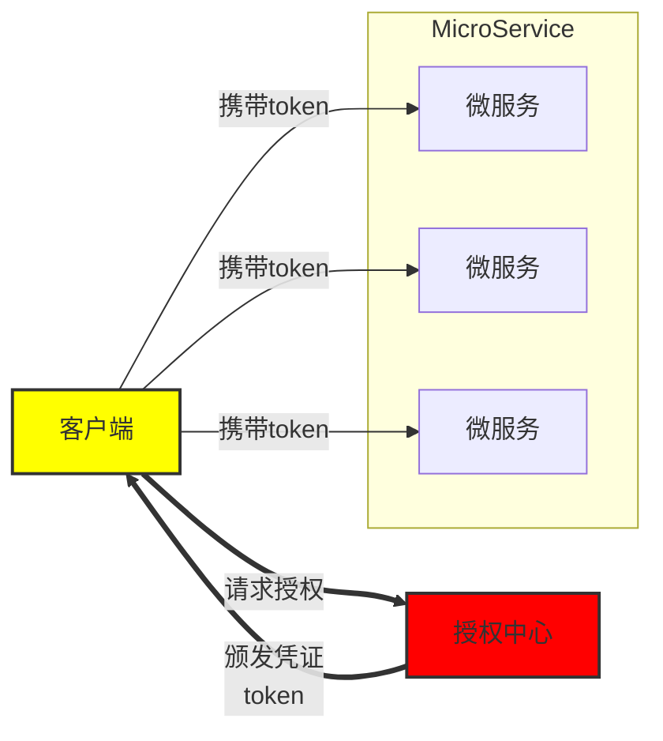

# JWT 类型

| 模式类型                       | 是否推荐 | 特点说明                  |
| ------------------------------ | -------- | ------------------------- |
| 单 Access Token                | 不推荐   | 简单但体验差              |
| Access + Refresh Token         | 推荐     | 标准做法，安全 & 用户体验 |
| Sliding Token（滑动会话）      | 可选     | 类似 session 的行为       |
| Access + Refresh + Fingerprint | 高安全   | 适合设备绑定、风控系统    |
| Stateful JWT（带黑名单）       | 高控制   | 可以强制注销 / 多设备踢人 |
| OAuth2 JWT                     | 必须     | 用于第三方授权系统        |

# 为什么要有 Refresh Token

介绍一下为什么有一个 Access Token 还要用 Refresh Token。看图：



授权中心用于生成 Refresh Token 和 Access Token 的，Access Token 过期时间很短，一般只有几分钟，而 Refresh Token 过期时间很长，一般可以设置 7 天，设置 1 个月都可以。授权中心除了在登录完成后返回 Refresh Token 和 Access Token 外，还可以使用 Refresh Token 来重新获取 Access Token。

客户端在拿到 refresh/Access Token 后，就可以使用 Access Token 去访问其他微服务，其他微服务可以独立对 Access Token 进行解码操作，得到用户信息。

如果没有 Refresh Token，并旦把 Access Token 过期时间设置得很长，那么如果我们想让某用户立马下线，面对这么多微服务，几乎是没法实现的。而有了 Refresh Token，我们就只需要在授权中心，将需要下线的用户的 Refresh Token 删除（或者加入黑名单），而 Access Token 的过期时间又很短，在过期后需要使用 Refresh Token 重新获取 acess token,但是现在 Refresh Token 又已经不可用了，那么这个用户就没法再继续操作了。

# 代码实现

<details>
<summary>settings/__init__.py</summary>

```python
from datetime import timedelta

JWT_SECRET_KEY = "fjakldwfjqoweirtjogvnaosdfmaopiwdsf98r23495729034utakdjt28598"
JWT_ACCESS_TOKEN_EXPIRES = timedelta(minutes=2)
JWT_REFRESH_TOKEN_EXPIRES = timedelta(days=15)
```

</details>

<details>
<summary>utils/auth.py</summary>

```python
import jwt
from fastapi import HTTPException, Security
from fastapi.security import HTTPAuthorizationCredentials, HTTPBearer
from datetime import datetime
from enum import Enum
import settings
from .single import SingletonMeta
from starlette.status import HTTP_401_UNAUTHORIZED, HTTP_403_FORBIDDEN

# pyjwt: pip install pyjwt==2.9.0


class TokenTypeEnum(Enum):
    ACCESS_TOKEN = 1
    REFRESH_TOKEN = 2


class AuthHandler(metaclass=SingletonMeta):
    security = HTTPBearer()
    # Authorization: Bearer {token}

    secret = settings.JWT_SECRET_KEY

    def _encode_token(self, user_id: int, type: TokenTypeEnum):
        payload = dict(
            iss=user_id,
            sub=int(type.value)
        )
        to_encode = payload.copy()
        if type == TokenTypeEnum.ACCESS_TOKEN:
            exp = datetime.now() + settings.JWT_ACCESS_TOKEN_EXPIRES
        else:
            exp = datetime.now() + settings.JWT_REFRESH_TOKEN_EXPIRES
        to_encode.update({"exp": int(exp.timestamp())})
        return jwt.encode(to_encode, self.secret, algorithm='HS256')

    def encode_login_token(self, user_id: int):
        access_token = self._encode_token(user_id, TokenTypeEnum.ACCESS_TOKEN)
        refresh_token = self._encode_token(user_id, TokenTypeEnum.REFRESH_TOKEN)
        login_token = dict(
            access_token=f"{access_token}",
            refresh_token=f"{refresh_token}"
        )
        return login_token

    def encode_update_token(self, user_id):
        access_token = self._encode_token(user_id, TokenTypeEnum.ACCESS_TOKEN)

        update_token = dict(
            access_token=f"{access_token}"
        )
        return update_token

    def decode_access_token(self, token):
        # ACCESS TOKEN：不可用（过期，或有问题），都用403错误
        try:
            payload = jwt.decode(token, self.secret, algorithms=['HS256'])
            if payload['sub'] != int(TokenTypeEnum.ACCESS_TOKEN.value):
                raise HTTPException(status_code=HTTP_403_FORBIDDEN, detail='Token类型错误！')
            return payload['iss']
        except jwt.ExpiredSignatureError:
            raise HTTPException(status_code=HTTP_403_FORBIDDEN, detail='Access Token已过期！')
        except jwt.InvalidTokenError as e:
            raise HTTPException(status_code=HTTP_403_FORBIDDEN, detail='Access Token不可用！')

    def decode_refresh_token(self, token):
        # REFRESH TOKEN：不可用（过期，或有问题），都用401错误
        try:
            payload = jwt.decode(token, self.secret, algorithms=['HS256'])
            if payload['sub'] != int(TokenTypeEnum.REFRESH_TOKEN.value):
                raise HTTPException(status_code=HTTP_401_UNAUTHORIZED, detail='Token类型错误！')
            return payload['iss']
        except jwt.ExpiredSignatureError:
            raise HTTPException(status_code=HTTP_401_UNAUTHORIZED, detail='Refresh Token已过期！')
        except jwt.InvalidTokenError as e:
            raise HTTPException(status_code=HTTP_401_UNAUTHORIZED, detail='Refresh Token不可用！')

    def auth_access_dependency(self, auth: HTTPAuthorizationCredentials = Security(security)):
        return self.decode_access_token(auth.credentials)

    def auth_refresh_dependency(self, auth: HTTPAuthorizationCredentials = Security(security)):
        return self.decode_refresh_token(auth.credentials)
```

</details>

<details>
<summary>routers/user.py</summary>

```python
from fastapi import APIRouter, HTTPException
import string
import random
from utils.alysms import AliyunSMSSender
from schemas.response import ResultModel, LoginedModel, UserModel, UpdatedAvatarModel
from utils.cache import TLLRedis
from schemas.request import LoginModel, UpdateUsernameModel, UpdatePasswordModel
from utils.auth import AuthHandler
from fastapi import Depends, UploadFile
from services.user import UserServiceClient
from utils.alyoss import oss_upload_image
from fastapi import status

router = APIRouter(prefix='/user')

sms_sender = AliyunSMSSender()
tll_redis = TLLRedis()
auth_handler = AuthHandler()
user_service_client = UserServiceClient()

@router.post('/login', response_model=LoginedModel)
async def login(data: LoginModel):
    mobile = data.mobile
    code = data.code
    cached_code = await tll_redis.get_sms_code(mobile)
    if code != cached_code:
        raise HTTPException(status_code=400, detail='验证码错误！')
    user = await user_service_client.get_or_create_user_by_mobile(mobile)
    tokens = auth_handler.encode_login_token(user.id)
    return {
        'user': user,
        'access_token': tokens['access_token'],
        'refresh_token': tokens['refresh_token']
    }

@router.get('/access/token')
async def access_token_view(user_id: int=Depends(auth_handler.auth_access_dependency)):
    return {"detail": "access token验证成功！", 'user_id': user_id}

@router.get('/refresh/token')
async def refresh_token_view(user_id: int=Depends(auth_handler.auth_refresh_dependency)):
    # 调用/user/refresh/token，如果refresh token没有过期
    # 那么就重新返回一个access token
    access_token = auth_handler.encode_update_token(user_id)
    return access_token

@router.put('/update/username', response_model=ResultModel)
async def update_username(data: UpdateUsernameModel, user_id: int=Depends(auth_handler.auth_access_dependency)):
    username = data.username
    await user_service_client.update_username(user_id, username)
    return ResultModel()
    
@router.put('/update/password', response_model=ResultModel)
async def update_password(data: UpdatePasswordModel,user_id: int=Depends(auth_handler.auth_access_dependency)):
    password = data.password
    await user_service_client.update_password(user_id, password)
    return ResultModel()


@router.post('/update/avatar', response_model=UpdatedAvatarModel)
async def update_avatar(
        file: UploadFile,
        user_id: int=Depends(auth_handler.auth_access_dependency)
):
    file_url = await oss_upload_image(file)
    if file_url:
        await user_service_client.update_avatar(user_id, file_url)
        return {'file_url': file_url}
    else:
        raise HTTPException(status_code=status.HTTP_500_INTERNAL_SERVER_ERROR, detail='头像上传失败！')

# 产品设计：当前登录的用户，不能查看其他用户的信息
@router.get('/mine', response_model=UserModel)
async def get_mine_info(user_id: int=Depends(auth_handler.auth_access_dependency)):
    user = user_service_client.get_user_by_id(user_id)
    return user
```

</details>
