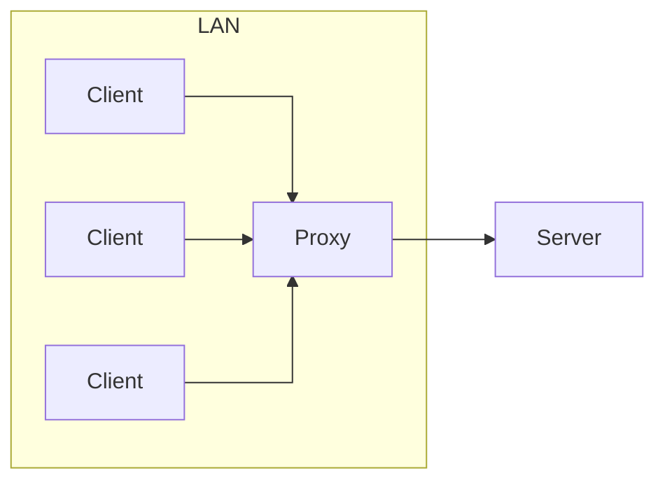
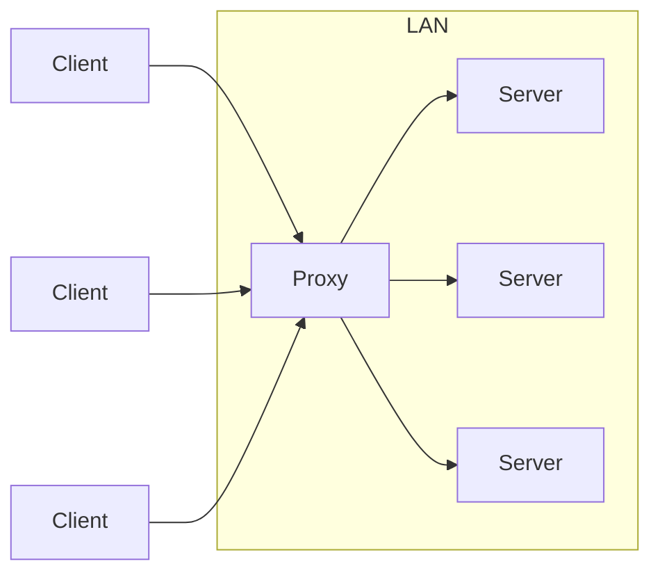

# 正向代理（前置代理）与反向代理

图 1：正向代理

图 2：反向代理

正向代理的作用:

1. 访问原来无法访问的资源，如 google
2. 可以做缓存，加速访问资源
3. 对客户端访问授权，上网进行认证
4. 代理可以记录用户访问记录（上网行为管理），对外隐藏用户信息

反向代理的作用:

1. 保证内网的安全，阻止 web 攻击，大型网站，通常将反向代理作为公网访问地址，Web 服务器是内网。
2. 负载均衡，通过反向代理服务器来优化网站的负载。
