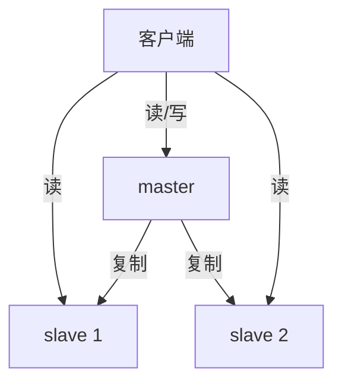

# 基本操作

<details>
<summary>Debian 安装</summary>

```bash
# 安装 redis
apt install redis

# 安装 redis 哨兵
apt install redis-sentinel
```

</details>

```bash
# python异步版本 redis-py
pip install redis[hiredis]
```

# 主从复制模式

## 简介

主从复制结构：在并发量稍微大一点的网站，而且要考虑数据安全性的时候，可以使用主从复制，即有一个 master 节点和多个 slave 节点。结构如下：



主从复制有以下几个特点：

1. 数据复制：主节点（Master）上的数据会被复制到一个或多个从节点（Slave），确保从节点拥有主节点数据的副本

2. 读写分离：在主从复制架构中，通常主节点负责处理写操作，而从节点负责处理读操作。这种读写分离的模式可以减轻主节点的压力，提高整体性能

3. 数据冗余：通过将数据复制到多个从节点，增加了数据的冗余性，从而提高了数据的可靠性。即使某个从节点发生故障，其他从节点仍然可以提供服务

4. 故障转移：虽然主从复制本身不提供自动故障转移功能，但当主节点发生故障时，可以通过手动的方式将一个从节点提升为新的主节点，继续提供服务

5. 扩展性：可以通过添加更多的从节点来扩展读取能力，从而提高系统的水平扩展性

6. 同步和部分同步：Redis 支持全量同步（同步所有数据）和部分同步（同步自上次同步以来的数据变化）。全量同步通常在从节点初次连接主节点时发生，而部分同步用于后续的数据同步

## 配置

<details>
<summary>Master 配置</summary>

如果想要让其他机器能够访问当前机器，那么必须设置 bind 为当前机器的 IP 地址，以及设置密码

```bash
# redis.conf
# 1.监听 IP
bind 127.0.0.1 -::1
# 修改为
bind 127.0.0.1 192.168.0.110 -::1
# 这里 192.168.0.110 是 Master 主机的 IP

# 2.设置 Master 主机的密码
requirepass MASTER_PASSWORD
```

</details>

<details>
<summary>Slave 配置</summary>

Slave主机由于也承担“读”的功能，因此也要设置 bind 为当前机器的 IP 地址，以及设置密码，还要设置 replicaof 以及 Master 主机的 IP 地址

```bash
# slave1.conf
mkdir master-slave-copy
cp /etc/redis/redis.conf ./
mv redis.conf slave1.conf

# 1.监听 IP
bind 127.0.0.1 -::1
# 修改为
bind 127.0.0.1 192.168.0.111 -::1
# 这里 192.168.0.110 是 Slave 主机的 IP

# 2.端口
port 6380

# 3.Master 主机的 IP 和 PORT
replicaof 192.168.0.110 6379

# 4.Master 主机的密码
masterauth MASTER_PASSWORD

# 5.设置 Slave 主机的密码
requirepass SLAVE_PASSWORD

# pidfile 和 logfile
pidfile /run/redis/redis-server-slave-1.pid
logfile /var/log/redis/redis-server-slave-1.log
```

```bash
# slave2.conf
mkdir master-slave-copy
cp /etc/redis/redis.conf ./
mv redis.conf slave2.conf

# 1.监听 IP
bind 127.0.0.1 -::1
# 修改为
bind 127.0.0.1 192.168.0.111 -::1
# 这里 192.168.0.110 是 Slave 主机的 IP

# 2.端口
port 6381

# 3.Master 主机的 IP 和 PORT
replicaof 192.168.0.110 6379

# 4.Master 主机的密码
masterauth MASTER_PASSWORD

# 5.设置 Slave 主机的密码
requirepass SLAVE_PASSWORD

# pidfile 和 logfile
pidfile /run/redis/redis-server-slave-2.pid
logfile /var/log/redis/redis-server-slave-2.log
```

</details>

先运行 Master 主机，然后再运行 Slave 主机，在 Master 主机中添加一个 key，然后在 Slave 主机中能够通过 get 命令获取对应的值。

<details>
<summary>启动</summary>

```bash
# 启动 Master Redis
redis-server /etc/redis/redis.conf
ps aux | grep redis

# 启动 Slave Redis
redis-server slave1.conf
redis-server slave2.conf
ps aux | grep redis
```

</details>

<details>
<summary>测试</summary>

Master

```bash
redis-cli
127.0.0.1:6379> auth MASTER_PASSWORD
127.0.0.1:6379> set username zhiliao ex 1000
127.0.0.1:6379> get username
127.0.0.1:6379> 
127.0.0.1:6379> info replication
# Replication
role:master
connected_slaves:2
slave0:ip=192.168.5.15,port=6381,state=online,offset=266,lag=0
slave1:ip=192.168.5.15,port=6380,state=online,offset=266,lag=0
master_failover_state:no-failover
master_replid:19f42c37c14ebfab03efdfae6772fa73c193d164
master_replid2:9823200d42a40c94bafa71151757aff1a9a891ba
master_repl_offset:280
second_repl_offset:15
repl_backlog_active:1
repl_backlog_size:1048576
repl_backlog_first_byte_offset:15
repl_backlog_histlen:266
127.0.0.1:6379> 
127.0.0.1:6379> exit
```

Slave

```bash
redis-cli -p 6380
127.0.0.1:6380> auth SLAVE_PASSWORD
127.0.0.1:6380> get username
127.0.0.1:6380> exit

redis-cli -p 6381
127.0.0.1:6381> auth SLAVE_PASSWORD
127.0.0.1:6381> get username
127.0.0.1:6381> 
127.0.0.1:6381> info replication
# Replication
role:slave
master_host:192.168.5.26
master_port:6379
master_link_status:up
master_last_io_seconds_ago:10
master_sync_in_progress:0
slave_read_repl_offset:350
slave_repl_offset:350
slave_priority:100
slave_read_only:1
replica_announced:1
connected_slaves:0
master_failover_state:no-failover
master_replid:19f42c37c14ebfab03efdfae6772fa73c193d164
master_replid2:9823200d42a40c94bafa71151757aff1a9a891ba
master_repl_offset:350
second_repl_offset:15
repl_backlog_active:1
repl_backlog_size:1048576
repl_backlog_first_byte_offset:1
repl_backlog_histlen:350
127.0.0.1:6381> 
127.0.0.1:6381> exit
```

</details>

## Python 操作主从

使用 Python Redis 库操作 Redis 主从，

```python
from redis import Redis
from settings import REDIS_MASTER, REDIS_MASTER_PORT, REDIS_MASTER_PWD
from settings import REDIS_SLAVE, REDIS_SLAVE_PORT, REDIS_SLAVE_PWD

master = Redis(host=REDIS_MASTER, port=REDIS_MASTER_PORT, password=REDIS_MASTER_PWD)
slave = Redis(host=REDIS_SLAVE, port=REDIS_SLAVE_PORT, password=REDIS_SLAVE_PWD)

# master 中设置值
master.set('username', 'hello world', ex=1000)

# slave 中读取值
value = slave.get('username')

print(f'value: {value.decode('utf-8')}')
```

# 哨兵模式

## 简介

前面提到的主从复制，虽然提高了 redis 操作的性能，但是在高可用性方面却存在很大的问题，一旦 master 节点挂掉后，整个 redis 将无法使用，必须通过人工的方式重启 master 节点。而哨兵模式正是为了解决这个问题出现的。

哨兵模式在 redis 主从复制的基础上，加一个哨兵集群，哨兵集群的作用是用来监控真正存储数据的 redis 集群，一旦检测到 redis 集群中 master 节点出现问题，那么就会自动的在 redis 集群中重新选举一个新的节点作为 master 节点，全程无须人工干涉。


---

**主库下线判定**

- 主观下线：哨兵判断 Master 节点下线
- 客观下线：哨兵集群共同判断 Master 节点下线

当某个哨兵判断主库“主观下线”后，就会给其他哨兵发送 is-master-down-by-addr 命令。接着，其他哨兵会根据自己和主库的连接情况，做出 Y 或 N 的响应，Y 相当于 赞成票，N 相当于反对票。如果赞成票数（这里是2）是大于等于哨兵配置文件中的 quorum 配置项（比如这里如果是 quorum=2）,则可以判定主库客观下线。

---

**新 Master 选举**

在 Master 节点因为某种原因离线后，哨兵需要重新选举新的 Master 节点。选举算法采用的是 Raft 算法，只有选举的票数大于等于 N/2+1（这里 N 是哨兵的数量）时，这个节点才会成为新的 Master 节点。

## 集群配置

- 第 1 台主机上配置 Master 节点（与上面的主从复制里的配置相同）
- 第 2 台主机上配置 2 个 Slave 节点（与上面的主从复制里的配置相同）
- 第 3 台主机上配置 3 个哨兵

<details>
<summary>哨兵集群配置</summary>

```bash
# sentinel1.conf
# 1.哨兵 1 监听端口号
port 23679

# 2.监听的 redis 集群的 IP, PORT，末尾数字 2 表示 quorum 值
# mymaster 是自己命名的
sentinel monitor mymaster MASTER_IP MASTER_PORT 2

# 3.Master Password
sentinel auth-pass mymaster MASTER_PWD

# 4.pidfile and logfile
logfile "/var/log/redis/redis-sentinel-1.log"
pidfile "/run/sentinel/redis-sentinel-1.pid"

# 5.作为守护进程
daemonize yes

# 6.当监听到 Master 节点失去连接后多长时间认为是已经下线
sentinel down-after-milliseconds mymaster 4000
```

```bash
# sentinel1.conf
# 1.哨兵 2 监听端口号
port 23680

# 2.监听的 redis 集群的 IP, PORT，末尾数字 2 表示 quorum 值
# mymaster 是自己命名的
sentinel monitor mymaster MASTER_IP MASTER_PORT 2

# 3.Master Password
sentinel auth-pass mymaster MASTER_PWD

# 4.pidfile and logfile
logfile "/var/log/redis/redis-sentinel-2.log"
pidfile "/run/sentinel/redis-sentinel-2.pid"

# 5.作为守护进程
daemonize yes

# 6.当监听到 Master 节点失去连接后多长时间认为是已经下线
sentinel down-after-milliseconds mymaster 4000
```

```bash
# sentinel1.conf
# 1.哨兵 2 监听端口号
port 23681

# 2.监听的 redis 集群的 IP, PORT，末尾数字 2 表示 quorum 值
# mymaster 是自己命名的
sentinel monitor mymaster MASTER_IP MASTER_PORT 2

# 3.Master Password
sentinel auth-pass mymaster MASTER_PWD

# 4.pidfile and logfile
logfile "/var/log/redis/redis-sentinel-3.log"
pidfile "/run/sentinel/redis-sentinel-3.pid"

# 5.作为守护进程
daemonize yes

# 6.当监听到 Master 节点失去连接后多长时间认为是已经下线
sentinel down-after-milliseconds mymaster 4000
```

</details>

<details>
<summary>哨兵启动</summary>

```bash
redis-server sentinel_1.conf --sentinel
redis-server sentinel_2.conf --sentinel
redis-server sentinel_3.conf --sentinel

ps aux | grep redis
```

</details>

## Python 操作哨兵

```python
from redis.sentinel import Sentinel
from settings import REDIS_MASTER_PWD, REDIS_SLAVE_PWD

sentinel_nodes = [
    ('192.168.0.112', 26379),
    ('192.168.0.112', 26380),
    ('192.168.0.112', 26381),
]

# 创建哨兵连接
sentinel = Sentinel(sentinel_nodes)

# 配置服务的名称，在哨兵配置文件中自定义的
service_name = "mymaster"

# 获取主节点信息
master = sentinel.discover_master(service_name)
print(f"Master Node: {master}")

# 获取从节点信息
slaves = sentinel.discover_slaves(service_name)
print(f"Slave Node: {slaves}")

# 使用哨兵获取主节点的连接
master_client = sentinel.master_for(service_name, password=REDIS_MASTER_PWD)

# 使用哨兵获取从节点的连接
slave_client = sentinel.slave_for(service_name, password=REDIS_SLAVE_PWD)

# 现在可以使用这些客户端来执行 Redis 命令
master_client.set("username", "helloworld")

# 从 从节点获取值，可以避免对主节点的读取压力
value = slave_client.get("username")
print(f"获取到: {value.decode('utf-8')}")
```

# Cluster 模式（分布式）

## 简介

哨兵模式虽然可以保证 Master 节点挂掉后能够自动重启，但是由于只有一个主节点对外提供服务，所以无法支持高并发，且单个主节点内存也不宜设置得过大（一般建议不超过 10 GB），否则会导致持久化文件过大，影响数据恢复或主从同步的效率。


Redis Cluster 模式是一个由多个主从节点群组成的分布式服务器群，它具有复制，高可用和分片的特性。Redis Cluster 不需要哨兵也能完成节点移除和故障转移，Cluster 模式没有中心节点，可水平扩展，据官方文档称可以线性扩展到上万个节点（官方推荐不超过 10000 个节点）。Redis 集群的性能和高可用性均优于之前版本的哨兵模式，且集群配置非常简单。

---

数据分片：

Redis Cluster 总共有 16384 个槽位，槽位从 0 开始，Redis Cluster 会将这 16384 个槽位平均分配给每个主从集群，比如现在我们有三个主从，那么槽位分配分别为：0-5460、5461-10922、10923-16383。

槽位的作用是什么呢？这里详细解释下：当客户端存入一个 key 到 Redis Cluster 中时，Cluster 会使用 CRC16 算法计算 key 的哈希值，这个哈希值是一个 0-65535 之间的整数，然后 Cluster 会将这个整数与 16384 进行取模，得到一个 0-16383 之间的数值，用公式表示就是：hash_slot = CRC16(key) mod 16384，接着 Cluster 再将这个 key 存入对应的主从集群中。也就是说，Redis Cluster 存储数据才是真正分布式的，每个主从复制集群只存储一部分的 key。

## Redis Cluster 搭建

<details>
<summary>结构</summary>

Redis Cluster 最少需要三个 Master 节点。这里每台主机一个 Master 一个 Slave。

```bash
192.168.0.110 (master:7000, slave:7001)
192.168.0.111 (master:8000, slave:8001)
192.168.0.112 (master:9000, slave:9001)
```

</details>

<details>
<summary>配置文件：第 1 台主机</summary>

```bash
# master.conf
daemonize yes

bind 127.0.0.1 192.168.0.110 -::1

port 7000

# 设置数据文件存放路径
dir "home/xxx/cluster/master"

pidfile "/run/redis/redis-server-master.pid"
logfile "/var/log/redis/redis-server-master.log"

requirepas "MASTER_PWD"

# 启动集群模式
cluster-enabled yes

# cluster 自动生成的配置文件名称
cluster-config-file cluster-master.conf

# 集群节点超时时间
cluster-node-timeout 10000
```

```bash
# slave.conf
daemonize yes

bind 127.0.0.1 192.168.0.110 -::1

port 7001

# 设置数据文件存放路径
dir "home/xxx/cluster/slave"

pidfile "/run/redis/redis-server-slave.pid"
logfile "/var/log/redis/redis-server-slave.log"

requirepas SLAVE_PWD
masterauth "MASTER_PWD"

# 启动集群模式
cluster-enabled yes

# cluster 自动生成的配置文件名称
cluster-config-file cluster-slave.conf

# 集群节点超时时间
cluster-node-timeout 10000
```

</details>

<details>
<summary>配置文件：第 2 台主机</summary>

```bash
# master.conf
daemonize yes

bind 127.0.0.1 192.168.0.111 -::1

port 8000

# 设置数据文件存放路径
dir "home/xxx/cluster/master"

pidfile "/run/redis/redis-server-master.pid"
logfile "/var/log/redis/redis-server-master.log"

requirepas "MASTER_PWD"

# 启动集群模式
cluster-enabled yes

# cluster 自动生成的配置文件名称
cluster-config-file cluster-master.conf

# 集群节点超时时间
cluster-node-timeout 10000
```

```bash
# slave.conf
daemonize yes

bind 127.0.0.1 192.168.0.111 -::1

port 8001

# 设置数据文件存放路径
dir "home/xxx/cluster/slave"

pidfile "/run/redis/redis-server-slave.pid"
logfile "/var/log/redis/redis-server-slave.log"

requirepas SLAVE_PWD
masterauth "MASTER_PWD"

# 启动集群模式
cluster-enabled yes

# cluster 自动生成的配置文件名称
cluster-config-file cluster-slave.conf

# 集群节点超时时间
cluster-node-timeout 10000
```

</details>

<details>
<summary>配置文件：第 3 台主机</summary>

```bash
# master.conf
daemonize yes

bind 127.0.0.1 192.168.0.112 -::1

port 9000

# 设置数据文件存放路径
dir "home/xxx/cluster/master"

pidfile "/run/redis/redis-server-master.pid"
logfile "/var/log/redis/redis-server-master.log"

requirepas SLAVE_PWD
masterauth "MASTER_PWD"

# 启动集群模式
cluster-enabled yes

# cluster 自动生成的配置文件名称
cluster-config-file cluster-master.conf

# 集群节点超时时间
cluster-node-timeout 10000
```

```bash
# slave.conf
daemonize yes

bind 127.0.0.1 192.168.0.112 -::1

port 9001

# 设置数据文件存放路径
dir "home/xxx/cluster/slave"

pidfile "/run/redis/redis-server-slave.pid"
logfile "/var/log/redis/redis-server-slave.log"

requirepas "MASTER_PWD"

# 启动集群模式
cluster-enabled yes

# cluster 自动生成的配置文件名称
cluster-config-file cluster-slave.conf

# 集群节点超时时间
cluster-node-timeout 10000
```

</details>

<details>
<summary>启动集群</summary>

```bash
# 在每台机器上启动 master 和 slave
redis-server master.conf
redis-server slave.conf

# 在任意一台机器上启动 cluster
# -a 指定 master 节点密码
# --cluster create 创建集群
# --cluster-replicas 1 每个 master 节点有一个 slave 节点
# 前面 3 个 IP 表示 master 节点的 IP
# 后面 3 个 IP 表示 slave 节点的 IP
redis-cli -a MASTER_PWD \
    --cluster create \
    --cluster-replicas 1 \
    192.168.0.110:7000 192.168.0.111:8000 192.168.0.112:9000 \
    192.168.0.110:7001 192.168.0.111:8001 192.168.0.112:9001 

# 查看集群信息
cluster info

# 查看集群节点信息
cluster nodes
```

</details>

## Python 操作 Redis Cluster

```python
from redis.cluster import RedisCluster, ClusterNode
from settings import REDIS_CLUSTER_MASTER_PWD

# 定义 Redis Cluster 的启动节点和端口列表
startup_nodes = [
    ClusterNode(host='192.168.0.110', port=7000),
    ClusterNode(host='192.168.0.111', port=8000),
    ClusterNode(host='192.168.0.112', port=9000),
]

# 创建 Redis Cluster 连接
redis_cluster = RedisCluster(
    startup_nodes=startup_nodes,
    decode_responses=True,
    password=REDIS_CLUSTER_MASTER_PWD
)

redis_cluster.set("username", "helloworld", ex=1000)

value = redis_cluster.get("username")
print(f"Value: {value}")

redis_cluster.close()
```
