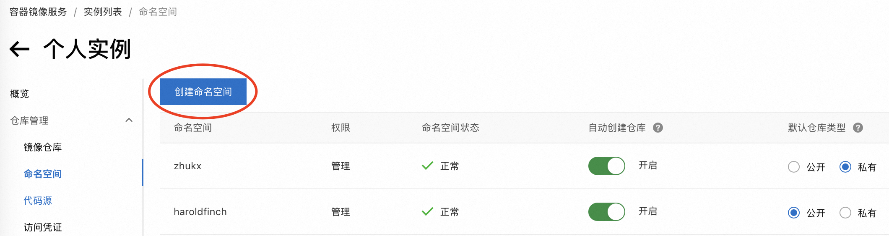
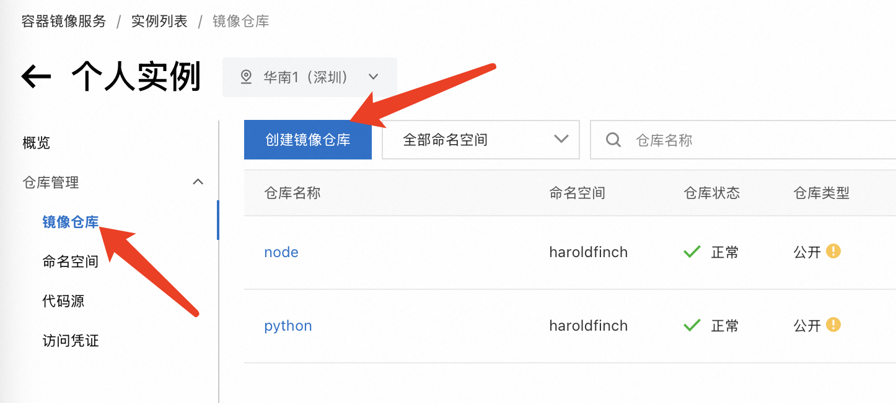
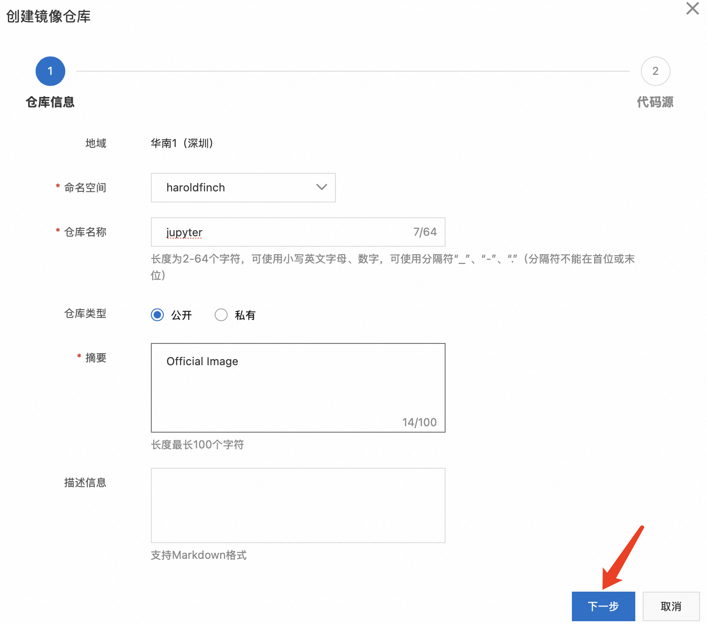
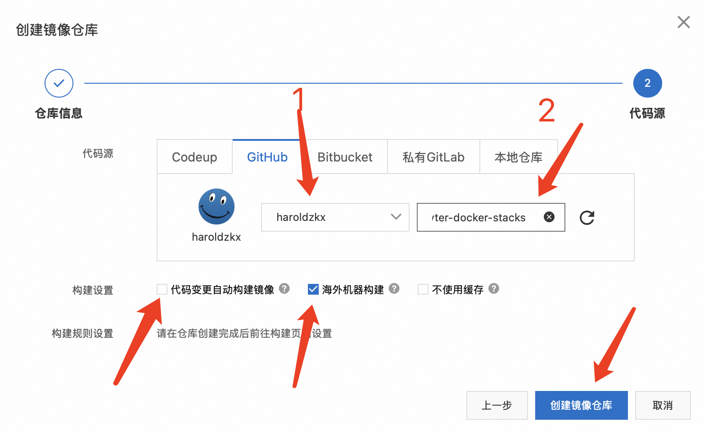
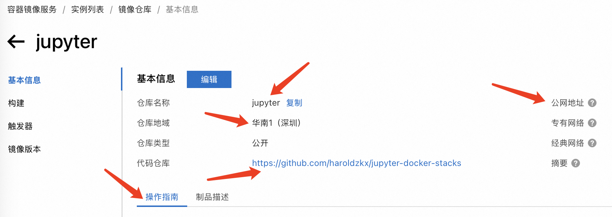
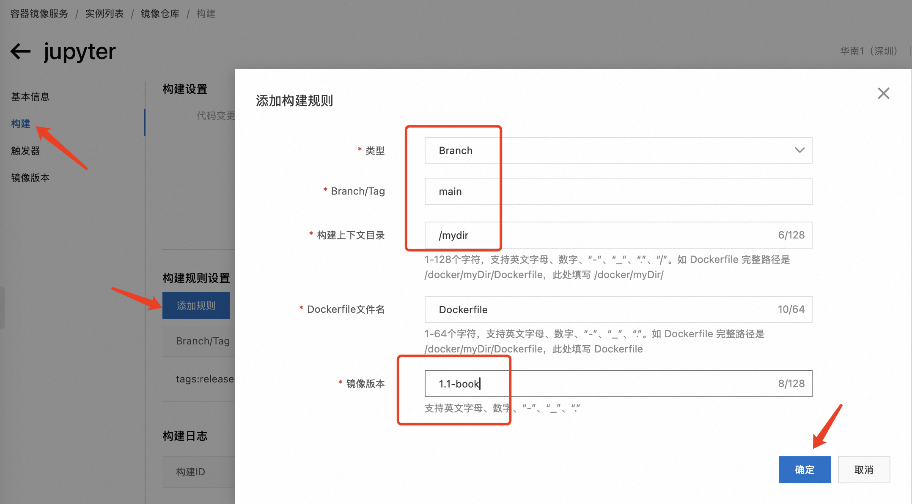
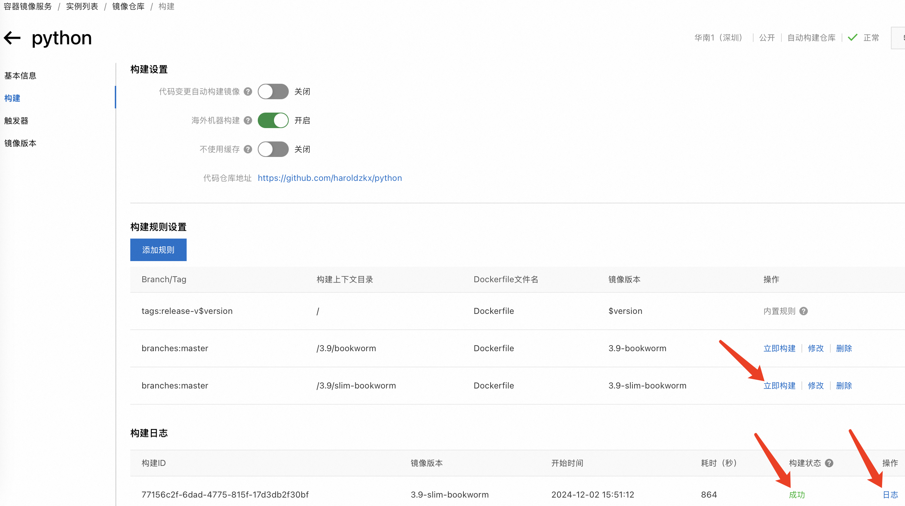

# 【阿里云镜像仓库】

[容器镜像服务-阿里云](https://www.aliyun.com/product/acr)

| Docker Hub          | 阿里云镜像中心                     |
| ------------------- | ---------------------------------- |
| 用户名              | 命名空间                           |
| 镜像名              | 镜像仓库                           |
| tag                 | tag                                |
| `用户名/镜像名:tag` | `服务器地址/命名空间/镜像仓库:tag` |

# GitHub 仓库构建镜像

1. 容器镜像服务中使用“个人实例”

[https://cr.console.aliyun.com/cn-shenzhen/instances](https://cr.console.aliyun.com/cn-shenzhen/instances)


2. 创建命名空间



3. 创建镜像仓库





先关联 GitHub 账号，然后选择仓库

> GitHub 仓库自己去 Fork 官方的 GitHub 或者别人项目的 GitHub 就行
>
> 关联的是自己的 GitHub 账户





4. 构建规则



5. 构建镜像并查看构建日志



# Skopeo 同步镜像

首先安装 skopeo

```bash
apt install skopeo -y
```

```bash
#!/bin/bash
# nginx.skopeo.sh
IMAGE="nginx"
TAGS=(
  "1.27.3"
  "1.27.3-perl"
  "1.27.3-otel"
  "1.27.3-alpine"
  "1.27.3-alpine-perl"
  "1.27.3-alpine-slim"
  "1.27.3-alpine-otel"
  "1.26.2"
  "1.26.2-perl"
  "1.26.2-otel"
  "1.26.2-alpine"
  "1.26.2-alpine-perl"
  "1.26.2-alpine-slim"
  "1.26.2-alpine-otel"
)

for TAG in "${TAGS[@]}"; do
  skopeo copy --src-tls-verify=false docker://m.daocloud.io/docker.io/library/$IMAGE:$TAG docker://registry.cn-shenzhen.aliyuncs.com/haroldfinch/$IMAGE:$TAG
done
```

```bash
chmod +x nginx.skopeo.sh
./nginx.skopeo.sh
```

# 使用

## 登录 Registry

本地登录阿里云 Docker Registry

```bash
docker login --username=happyhammer registry.cn-shenzhen.aliyuncs.com
```

## 拉取镜像

本地拉取镜像如下所示

```bash
docker pull registry.cn-shenzhen.aliyuncs.com/haroldfinch/python:[镜像版本号]
```

这里名称太长可以在 `.bashrc`或 `.zshrc` 中添加如下内容，然后 `source .bashrc`

```bash
export ali=registry.cn-shenzhen.aliyuncs.com/haroldfinch
```

本地使用时就可以如下所示

```bash
docker pull $ali/[镜像名]:[镜像版本号]
```

## 推送镜像

```bash
docker tag [ImageId / Image Name] registry.cn-shenzhen.aliyuncs.com/haroldfinch/[镜像名]:[镜像版本号]
docker push registry.cn-shenzhen.aliyuncs.com/haroldfinch/[镜像名]:[镜像版本号]
```

# haroldfinch

```bash
# arm 版本的在 tag 后面加上-arm 就可以了
docker pull $ali/ubuntu:18.04-arm
```

## 操作系统

【ubuntu】18.04, 20.04, 22.04, 24.04

【debian】

- bookworm, bookworm-backports, bookworm-slim,
- bullseye, bullseye-backports, bullseye-slim

【centos】5, 6, 7, 8

【ubi (RHEL)】

- 9.5, 9.5-init, 9.5-micro, 9.5-minimal,
- 8.10, 8.10-init, 8.10-micro, 8.10-minimal

【busybox】1.36.1, 1.36.1-musl, 1.36.1-uclibc, 1.36.1-glibc

【alpine】3.17, 3.18, 3.19, 3.20

## 编程语言

【python】

- 3.13.1-bookworm, 3.13.1-slim-bookworm, 3.13.1-bullseye, 3.13.1-slim-bullseye, 3.13.1-alpine3.20, 3.13.1-alpine3.19
- 3.12.8-bookworm, 3.12.8-slim-bookworm, 3.12.8-bullseye, 3.12.8-slim-bullseye, 3.12.8-alpine3.20, 3.12.8-alpine3.19
- 3.11.11-bookworm, 3.11.11-slim-bookworm, 3.11.11-bullseye, 3.11.11-slim-bullseye, 3.11.11-alpine3.20, 3.11.11-alpine3.19
- 3.10.16-bookworm, 3.10.16-slim-bookworm, 3.10.16-bullseye, 3.10.16-slim-bullseye, 3.10.16-alpine3.20, 3.10.16-alpine3.19
- 3.9.21-bookworm, 3.9.21-slim-bookworm, 3.9.21-bullseye, 3.9.21-slim-bullseye, 3.9.21-alpine3.20, 3.9.21-alpine3.19
- 3.8.20-bookworm, 3.8.20-slim-bookworm, 3.8.20-bullseye, 3.8.20-slim-bullseye, 3.8.20-alpine3.20, 3.8.20-alpine3.19

【jupyter】

- 3.12.8-init, 3.12.8-base, 3.12.8-minimal
- 3.11.10-init, 3.11.10-base, 3.11.10-minimal
- 3.10.11-init, 3.10.11-base, 3.10.11-minimal
- 3.9.13-base, 3.9.13-minimal
- 3.8.13-base, 3.8.13-minimal
- 3.7.12-base, 3.7.12-minimal
- 3.9-foundation, 3.9-base, 3.9-minimal
- 3.8-foundation, 3.8-base, 3.8-minimal

【gcc】7, 8, 9, 10, 11, 12, 13, 14

【node】

- 23.3.0-bullseye-slim, 23.3.0-bullseye, 23.3.0-bookworm-slim, 23.3.0-bookworm, 23.3.0-alpine3.20, 23.3.0-alpine3.19
- 22.12.0-bullseye-slim, 22.12.0-bullseye, 22.12.0-bookworm-slim, 22.12.0-bookworm, 22.12.0-alpine3.20, 22.12.0-alpine3.19
- 20.18.1-bullseye-slim, 20.18.1-bullseye, 20.18.1-bookworm-slim, 20.18.1-bookworm, 20.18.1-alpine3.20, 20.18.1-alpine3.19
- 18.20.5-bullseye-slim, 18.20.5-bullseye, 18.20.5-bookworm-slim, 18.20.5-bookworm, 18.20.5-alpine3.20, 18.20.5-alpine3.19

【golang】

- 1.23.4-bookworm, 1.23.4-bullseye, 1.23.4-alpine3.20, 1.23.4-alpine3.19
- 1.22.10-bookworm, 1.22.10-bullseye, 1.22.10-alpine3.20, 1.22.10-alpine3.19

【php】

- 8.2.27-zts-bookworm, 8.2.27-fpm-bookworm, 8.2.27-cli-bookworm, 8.2.27-apache-bookworm
- 8.1.31-zts-bookworm, 8.1.31-fpm-bookworm, 8.1.31-cli-bookworm, 8.1.31-apache-bookworm
- 8.0.30-zts-bullseye, 8.0.30-fpm-bullseye, 8.0.30-cli-bullseye, 8.0.30-apache-bullseye
- 7.4.33-zts-alpine3.16, 7.4.33-zts-alpine3.15, 7.4.33-zts-bullseye
- 7.4.33-fpm-bullseye, 7.4.33-cli-bullseye, 7.4.33-apache-bullseye

【wordpress】

- 6.7.1-php8.3-fpm, 6.7.1-php8.3-fpm-alpine, 6.7.1-php8.3-apache
- 6.7.1-php8.2-fpm, 6.7.1-php8.2-fpm-alpine, 6.7.1-php8.2-apache
- 6.7.1-php8.1-fpm, 6.7.1-php8.1-fpm-alpine, 6.7.1-php8.1-apache
- cli-2.11.0-php8.3, cli-2.11.0-php8.2, cli-2.11.0-php8.1

## 数据库

【redis】

- 7.4.1, 7.4.1-alpine
- 7.2.6, 7.2.6-alpine
- 6.2.16, 6.2.16-alpine

【mysql】

- 9.1.0
- 8.4.3
- 8.0.40, 8.0.40-bookworm
- 5.5.62, 5.7.44

【mariadb】

- 11.6.2-noble
- 11.4.4-noble, 11.4.4-ubi9,
- 11.2.6-jammy,
- 10.11.10-jammy, 10.11.10-noble,
- 10.6.20-focal, 10.6.20-ubi9,
- 10.5.27-focal

## WebServer

【nginx】

- 1.27.3, 1.27.3-perl, 1.27.3-otel, 1.27.3-alpine, 1.27.3-alpine-perl, 1.27.3-alpine-slim, 1.27.3-alpine-otel
- 1.26.2, 1.26.2-perl, 1.26.2-otel, 1.26.2-alpine, 1.26.2-alpine-perl, 1.26.2-alpine-slim, 1.26.2-alpine-otel

【httpd(Apache)】

- 2.4.62, 2.4.62-alpine,
- 2.4.56, 2.4.56-alpine
