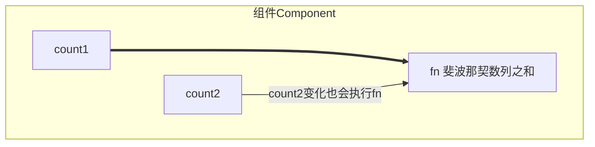
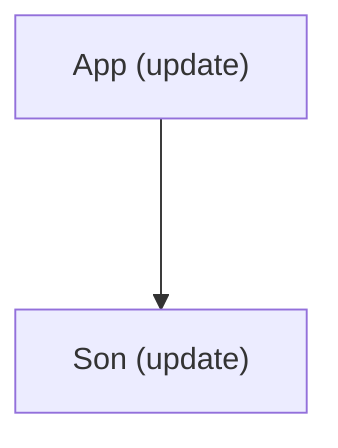

React 和 TypeScript 集合使用的重点集中在 和存储数据/状态有关的Hook函数以及 组件接口的位置，这些地方最需要数据类型校验

# useState

<details>
<summary>自动类型推导</summary>

简单场景下，可以使用TS的自动推断机制，不用特殊编写类型注解，运行良好

```tsx
// react + ts

// 根据初始值自动推断
// 场景：明确的初始值

import { useState } from 'react'

function App() {
  const [value, toggle] = useState(false)

  const [list, setList] = useState([1, 2, 3])

  const changeValue = () => {
    toggle(true)
  }

  const changeList = () => {
    setList([4])
  }

  return <>this is app {value}</>
}

export default App
```

</details>

<details>
<summary>传递范型参数</summary>

复杂数据类型，useState支持通过 泛型参数指定初始参数类型以及 setter 函数的入参类型

usestate本身是一个泛型函数，可以传入具体的自定义类型

```tsx
type User = {
  name: string
  age: number
}
const [user, setUser] = useState<User>()
```

说明：
1. 限制useState函数参数的初始值必须满足类型为：User | () => User
2. 限制setUser函数的参数必须满足类型为：User | () => User | undefined
3. user状态数据具备 User 类型相关的类型提示

```tsx
// react + ts

import { useState } from 'react'

type User = {
  name: string
  age: number
}

function App() {
  // 1. 限制初始值的类型
  // const [user, setUser] = useState<User>({
  //   name: 'jack',
  //   age: 18,
  // })
  // const [user, setUser] = useState<User>(() => {
  //   return {
  //     name: 'jack',
  //     age: 18,
  //   }
  // })

  const [user, setUser] = useState<User>({
    name: 'jack',
    age: 18,
  })

  const changeUser = () => {
    setUser(() => ({
      name: 'john',
      age: 28,
    }))
  }

  return <>this is app {user.name}</>
}

export default App
```

</details>

<details>
<summary>初始值为 null</summary>

实际开发时，有些时候useState的初始值可能为null或者undefined，按照泛型的写法是不能通过类型校验的，此时可以通过完整的类型联合null或者undefined类型即可

当我们不知道状态的初始值是什么，将 useState 的初始值为 null 是一个常见的做法，可以通过具体类型联合 null 来做显式注解

```tsx
type User = {
  name: string
  age: number
}
const [user, setUser] = useState<User | null>(null)
```

说明：
1. 限制 useState 函数参数的初始值可以是 User | null
2. 限制 setUser 函数的参数类型可以是 User | null

```tsx
// react + ts

import { useState } from 'react'

type User = {
  name: string
  age: number
}

function App() {
  const [user, setUser] = useState<User | null>(null)

  const changeUser = () => {
    setUser(null)
    setUser({
      name: 'jack',
      age: 18,
    })
  }
  // 为了类型安全  可选链做类型守卫
  // 只有user不为null（不为空值）的时候才进行点运算
  return <>this is app {user?.age}</>
}

export default App
```

</details>

# Props

<details>
<summary>基础使用</summary>

为组件 prop 添加类型，本质是给函数的参数做类型注解，可以使用type对象类型或者interface接口来做注解

```tsx
type Props = {
  className: string
}
function Button(props: Props) {
  const { className } = props
  return <button className={className}>click me</button>
}
```

说明：Button组件只能传入名称为 className 的 prop 参数，类型为string, 且为必填

```tsx
// props + ts

// type Props = {
//   className: string
// }

interface Props {
  className: string
  title?: string
}

function Button(props: Props) {
  const { className } = props
  return <button className={className}>click me </button>
}

function App() {
  return (
    <>
      <Button className="test" title="this is title" />
    </>
  )
}

export default App
```

</details>

<details>
<summary>为 children 添加类型</summary>

children是一个比较特殊的prop,支持多种不同类型数据的传入，需要通过一个内置的 ReactNode 类型来做注解

```tsx
type Props = {
  className: string,
  children: React.ReactNode
}
function Button(props: Props) {
  const { className, children } = props
  return <button className={className}>{children}</button>
}
```

说明：注解之后，children可以是多种类型，包括：React.ReactElement, string, number, React.ReactFragment, React.ReactPortal, boolean, null, undefined

```tsx
// props + ts

type Props = {
  className: string
  children: React.ReactNode
}

function Button(props: Props) {
  const { className, children } = props
  return <button className={className}>{children} </button>
}

function App() {
  return (
    <>
      <Button className="test">click me!</Button>
      <Button className="test">
        <span>this is span</span>
      </Button>
    </>
  )
}

export default App
```

</details>

<details>
<summary>为事件 prop 添加类型</summary>

组件经常执行类型为函数的prop实现子传父，这类prop重点在于函数参数类型的注解

说明：
1. 在组件内部调用时需要遵守类型的约束，参数传递需要满足要求
2. 绑定prop时如果绑定内联函数直接可以推断出参数类型，否则需要单独注解匹配的参数类型

```tsx
// props + ts

type Props = {
  onGetMsg?: (msg: string) => void
}

function Son(props: Props) {
  const { onGetMsg } = props
  const clickHandler = () => {
    onGetMsg?.('this is msg')
  }
  return <button onClick={clickHandler}>sendMsg</button>
}

function App() {
  const getMsgHandler = (msg: string) => {
    console.log(msg)
  }
  return (
    <>
      <Son onGetMsg={(msg) => console.log(msg)} />
      <Son onGetMsg={getMsgHandler} />
    </>
  )
}

export default App
```

</details>

# useRef

在TypeScript的环境下，useRef 函数返回一个只读 或者 可变 的引用，只读的场景常见于获取真实dom，可变的场景，常见于缓存一些数据，不跟随组件渲染，下面分俩种情况说明

<details>
<summary>获取dom</summary>

获取dom的场景，可以直接把要获取的dom元素的类型当成泛型参数传递给useRef,可以推导出.current属性的类型

获取DOM时，通过泛型参数指定具体的DOM元素类型即可

```tsx
function Foo() {
  // 尽可能提供一个具体的dom type, 可以帮助我们在用dom属性时有更明确的提示
  // divRef的类型为 RefObject<HTMLDivElement>
  const inputRef = useRef<HTMLDivElement>(null)

  useEffect(() => {
    inputRef.current.focus()
  })

  return <div ref={inputRef}>etc</div>

}
```

如果你可以确保divRef.current 不是null，也可以在传入初始值的位置

```tsx
// 添加非null标记
const divRef = useRef<HTMLDivElement>(null!)
// 不再需要检查`divRef.current` 是否为null
doSomethingWith(divRef.current)
```

</details>

<details>
<summary>稳定引用存储器</summary>

把useRef当成引用稳定的存储器使用的场景可以通过泛型传入联合类型来做，比如定时器的场景：

当做为可变存储容器使用的时候，可以通过泛型参数指定容器存入的数据类型, 在还为存入实际内容时通常把null作为初始值，所以依旧可以通过联合类型做指定

```tsx
interface User {
  age: number
}

function App(){
  const timerRef = useRef<number | undefined>(undefined)
  const userRes = useRef<User | null> (null)
  useEffect(()=>{
    timerRef.current = window.setInterval(()=>{
      console.log('测试')
    },1000)
    
    
    return ()=>clearInterval(timerRef.current)
  })
  return <div> this is app</div>

}
```

```tsx
// useRef + ts

import { useEffect, useRef } from 'react'

// 1. 获取dom
// 2. 稳定引用的存储器（定时器管理）

function App() {
  const domRef = useRef<HTMLInputElement>(null)

  const timerId = useRef<number | undefined>(undefined)

  useEffect(() => {
    // 可选链  前面不为空值（null / undefined）执行点运算
    // 类型守卫 防止出现空值点运算错误
    domRef.current?.focus()

    timerId.current = setInterval(() => {
      console.log('123')
    }, 1000)

    return () => clearInterval(timerId.current)
  }, [])

  return (
    <>
      <input ref={domRef} />
    </>
  )
}

export default App
```

</details>

# useReducer

<details>
<summary>基础用法</summary>

作用：和useState的作用类似，用来管理相对复杂的状态数据

1. 定义一个 reducer 函数（根据不同的 action 返回不同的新状态）
2. 在组件中调用 useReducer, 并传入 reducer 函数和状态的初始值
3. 事件发生时，通过 dispatch 函数分派一个 action 对象（通知 reducer 要返回哪个新状态并渲染 UI）

```jsx
import { useReducer } from "react";

// 1. 定义reducer函数 根据不同的action 返回不同的状态
function reducer(state, action) {
  switch (action.type) {
    case "INC":
      return state + 1;
    case "DEC":
      return state - 1;
    default:
      return state;
  }
}

function App() {
  // 2. 组件中调用 useReducer(reducer, 0) => [state, dispatch]
  const [state, dispatch] = useReducer(reducer, 0);
  return (
    <div className="App">
      this is App <br />
      {/* 3. 调用 dispatch({type: 'INC'}) => 通知reducer产生一个新的状态 使用这个新状态更新UI */}
      <button onClick={() => dispatch({ type: "DEC" })}>-</button>
      {state}
      <button onClick={() => dispatch({ type: "INC" })}>+</button>
    </div>
  );
}

export default App;
```

</details>

<details>
<summary>更新流程</summary>


</details>

<details>
<summary>分派 action 时传参</summary>

```jsx
import { useReducer } from "react";

// 1. 定义reducer函数 根据不同的action 返回不同的状态
function reducer(state, action) {
  switch (action.type) {
    case "INC":
      return state + 1;
    case "DEC":
      return state - 1;
    case "SET":
      return action.payload;
    default:
      return state;
  }
}

function App() {
  // 2. 组件中调用 useReducer(reducer, 0) => [state, dispatch]
  const [state, dispatch] = useReducer(reducer, 0);
  return (
    <div className="App">
      this is App <br />
      {/* 3. 调用 dispatch({type: 'INC'}) => 通知reducer产生一个新的状态 使用这个新状态更新UI */}
      <button onClick={() => dispatch({ type: "DEC" })}>-</button>
      {state}
      <button onClick={() => dispatch({ type: "INC" })}>+</button>
      {/* 将这里的 payload: 100 传给 reducer 函数里的 action */}
      <button onClick={() => dispatch({ type: "SET", payload: 100 })}>
        Update
      </button>
    </div>
  );
}

export default App;
```

</details>

<details>
<summary>与 useState 的区别</summary>

useState 是最基础的状态管理 Hook，适用于状态比较简单、更新逻辑不复杂的场景。

- 适用场景：当状态较为简单，只需要存储单一的值，且更新该状态的方式比较直观时，useState 就非常合适。
- 适合的数据类型：单一值（如数字、字符串、布尔值），简单对象或数组

useReducer 通常用于复杂的状态逻辑，特别是在需要根据不同的动作来更新状态时。

- 适合的数据类型：复杂对象，多个相关状态，复杂的更新逻辑
- 使用 reducer 函数来描述状态的更新逻辑。适用于复杂的状态更新，尤其是涉及到多个值和多个操作的情况下。
- 适用于大型组件或复杂的应用，代码更易维护和扩展，尤其是在需要处理多个状态或条件时。

useReducer使用场景：

- 复杂状态管理：当组件状态较为复杂，涉及多个子状态或复杂逻辑时。
- 多个状态值：适用于管理多个相关联的状态值。
- 异步操作：需要处理异步逻辑，如API调用等。

在实际项目中，选择useState还是useReducer需要根据具体场景来决定。

- 简单组件：如一个简单的计数器或开关组件，使用useState即可满足需求。
- 复杂组件：如一个表单组件，涉及多个输入字段和校验逻辑，使用useReducer可以更好地管理和维护状态。

</details>

# React.forwardRef

子组件使用 ref 暴露 DOM 节点给父组件

<details>
<summary>代码</summary>

```jsx
// forwardRef

import { forwardRef, useRef } from "react";

// function Son() {
//   return <input type="text" />;
// }

const Son = forwardRef((props, ref) => {
  return <input type="text" ref={ref} />;
});

function App() {
  const sonRef = useRef(null);
  const showRef = () => {
    console.log(sonRef);
    sonRef.current.focus();
  };
  return (
    <div>
      <Son ref={sonRef} />
      <button onClick={showRef}>focus</button>
    </div>
  );
}

export default App;
```

</details>

# React.useImperativeHandle

子组件使用 ref 暴露子组件内部的方法给父组件

核心就是父组件操纵子组件中的函数

<details>
<summary>代码</summary>

```jsx
// forwardRef
import { forwardRef, useImperativeHandle, useRef } from "react";

const Son = forwardRef((props, ref) => {
  // 实现聚焦逻辑
  const inputRef = useRef(null);
  const focusHandler = () => {
    inputRef.current.focus();
  };
  // 把聚焦方法暴露给父组件
  useImperativeHandle(ref, () => {
    return {
      // 暴露的方法
      focusHandler,
    };
  });
  return <input type="text" ref={inputRef} />;
});

function App() {
  const sonRef = useRef(null);
  const focusHandler = () => {
    console.log(sonRef.current);
    sonRef.current.focusHandler();
  };
  return (
    <div>
      <Son ref={sonRef} />
      <button onClick={focusHandler}>focus</button>
    </div>
  );
}

export default App;
```

</details>

# 渲染性能优化

## useMemo

作用：在组件每次重新渲染的时候缓存计算的结果

说明：使用useMemo做缓存之后可以保证只有count1依赖项发生变化时才会重新计算



<details>
<summary>代码</summary>

```jsx
// useMemo
// 作用：在组件渲染时缓存计算的结果

import { useMemo, useState } from "react";

function fib(n) {
  console.log("斐波那契函数执行了");
  if (n < 3) {
    return 1;
  }
  return fib(n - 1) + fib(n - 2);
}

function App() {
  const [count1, setCount1] = useState(0);

  const result = useMemo(() => {
    return fib(count1);
  }, [count1]);

  const [count2, setCount2] = useState(0);
  console.log("App组件渲染了");

  // 计算斐波那契之和
  return (
    <div className="App">
      this is App
      <button onClick={() => setCount1(count1 + 1)}>
        Change Count 1:{count1}
      </button>
      <button onClick={() => setCount2(count2 + 1)}>
        Change Count 2:{count2}
      </button>
      {result}
    </div>
  );
}

export default App;
```

</details>

## React.memo

作用：允许组件在 Props 没有改变的情况下跳过渲染

React 组件默认的渲染机制：只要父组件重新渲染子组件就会重新渲染



思考：如果 Son 组件本身并不需要做渲染更新，是不是存在浪费？

```tsx
const MemoComponent = memo(function SomeComponent (props) {
    // ...
})
```

说明：经过memo函数包裹生成的缓存组件只有在props发生变化的时候才会重新渲染

<details>
<summary>代码</summary>

```jsx
// memo
// 作用：允许组件在props没有改变的情况下跳过重新渲染

import { memo, useState } from "react";

const MemoSon = memo(function Son() {
  console.log("子组件被重新渲染了");
  return <div>this is son</div>;
});

function App() {
  const [count, setCount] = useState(0);
  console.log("父组件重新渲染了");
  return (
    <div>
      <MemoSon />
      {/* <Son /> */}
      <button onClick={() => setCount(count + 1)}>update {count}</button>
    </div>
  );
}

export default App;
```

</details>

### 比较机制

机制：在使用memo缓存组件之后，react会对每一个prop使用 Object.is 比较新值和老值，返回 true, 表示没有变化

prop是简单类型

Object.is(3,3) => true 没有变化

prop 是引用类型（对象/数组）

object([],[]) => false 有变化，React 只关心引用是否变化

<details>
<summary>代码</summary>

```jsx
// React.memo props比较机制

// 1.比较一个简单类型的prop，prop变化时组件重新渲染

import { memo, useState } from "react";

const MemoSon = memo(function Son({ count }) {
  console.log("子组件被重新渲染了");
  return <div>this is son, {count}</div>;
});

function App() {
  const [count, setCount] = useState(0);
  console.log("父组件重新渲染了");
  const num = 100;
  return (
    <div>
      <MemoSon count={count} />
      {/* <Son /> */}
      <button onClick={() => setCount(count + 1)}>update {count}</button>
    </div>
  );
}

export default App;
```

</details>

<details>
<summary>代码</summary>

```jsx
// React.memo props比较机制

// 1.传递一个简单类型的prop，prop变化时组件重新渲染

// 2.传递一个引用类型的prop，比较的是新值和旧值的引用是否相等
//   当父组件的函数重新执行时，实际上形成的是新的数组引用

import { memo, useState } from "react";

const MemoSon = memo(function Son({ list }) {
  console.log("子组件被重新渲染了");
  return <div>this is son, {list}</div>;
});

function App() {
  const [count, setCount] = useState(0);
  console.log("父组件重新渲染了");
  const num = 100;
  const list = [1, 2, 3];
  return (
    <div>
      <MemoSon count={list} />
      {/* <Son /> */}
      <button onClick={() => setCount(count + 1)}>update {count}</button>
    </div>
  );
}

export default App;
```

</details>

不想通过引用来比较，而是完全比较数组的成员是否完全一致，则可以通过自定义比较函数来实现

<details>
<summary>代码</summary>

```jsx
// React.memo props比较机制

// 1.传递一个简单类型的prop，prop变化时组件重新渲染

// 2.传递一个引用类型的prop，比较的是新值和旧值的引用是否相等
//   当父组件的函数重新执行时，实际上形成的是新的数组引用

// 3.保证引用稳定 -> useMemo 组件渲染的过程中缓存一个值

import { memo, useMemo, useState } from "react";

const MemoSon = memo(function Son({ list }) {
  console.log("子组件被重新渲染了");
  return <div>this is son, {list}</div>;
});

function App() {
  const [count, setCount] = useState(0);
  console.log("父组件重新渲染了");
  const num = 100;
  const list = useMemo(() => {
    return [1, 2, 3];
  }, []);
  return (
    <div>
      <MemoSon count={list} />
      {/* <Son /> */}
      <button onClick={() => setCount(count + 1)}>update {count}</button>
    </div>
  );
}

export default App;
```

</details>

<details>
<summary>自定义比较函数</summary>

```jsx
import React, { useState } from 'react'

// 自定义比较函数
function arePropsEqual(oldProps, newProps) {
  console.log(oldProps, newProps)
  return (
    oldProps.list.length === newProps.list.length &&
    oldProps.list.every((oldItem, index) => {
      const newItem = newProps.list[index]
      console.log(newItem, oldItem)
      return oldItem === newItem
    })
  )
}

const MemoSon = React.memo(function Son() {
  console.log('子组件被重新渲染了')
  return <div>this is span</div>
}, arePropsEqual)

function App() {
  console.log('父组件重新渲染了')
  const [list, setList] = useState([1, 2, 3])
  return (
    <>
      <MemoSon list={list} />
      <button onClick={() => setList([1, 2, 3])}>
        内容一样{JSON.stringify(list)}
      </button>
      <button onClick={() => setList([4, 5, 6])}>
        内容不一样{JSON.stringify(list)}
      </button>
    </>
  )
}

export default App
```

</details>

## useCallback

当给子组件传递一个 引用类型prop的时候，即使我们使用了 memo函数依旧无法阻止子组件的渲染，其实传递prop的时候，往往传递一个回调函数更为常见，比如实现子传父，此时如果想要避免子组件渲染，可以使用 useCallback缓存回调函数

作用：在组件多次重新渲染的时候缓存函数

说明：使用useCallback包裹函数之后，函数可以保证在App重新渲染时保持引用稳定

<details>
<summary>代码</summary>

```jsx
// useCallback

import { memo, useCallback, useState } from "react";

const Input = memo(function Son({ onChange }) {
  console.log("子组件被重新渲染了");
  return <input type="text" onChange={(e) => onChange(e.target.value)} />;
});

function App() {
  // 传给子组件的函数
  const changeHandler = useCallback((value) => {
    console.log(value);
  }, []);
  // 触发父组件重新渲染的函数
  const [count, setCount] = useState(0);
  return (
    <div>
      {/* 把函数作为prop传给子组件 */}
      <Input onChange={changeHandler} />
      <button onClick={() => setCount(count + 1)}> {count}</button>
    </div>
  );
}

export default App;
```

</details>

