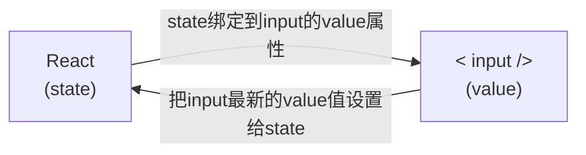

# React 18 语法

官方文档: [https://18.react.dev/reference/react](https://18.react.dev/reference/react)

React 中使用 JS 表达式

1. 使用引号传递字符串
2. 使用 javascript 变量
3. 函数调用和方法调用
4. 使用 javascript 对象

## 事件

事件绑定: [https://18.react.dev/learn/responding-to-events](https://18.react.dev/learn/responding-to-events)

1. 基础事件绑定: [https://18.react.dev/learn/responding-to-events#adding-event-handlers](https://18.react.dev/learn/responding-to-events#adding-event-handlers)
2. 使用事件对象参数: 在事件回调函数中设置形参 e [https://18.react.dev/learn/responding-to-events#capture-phase-events](https://18.react.dev/learn/responding-to-events#capture-phase-events)
3. 传递自定义参数: [https://18.react.dev/learn/responding-to-events#reading-props-in-event-handlers](https://18.react.dev/learn/responding-to-events#reading-props-in-event-handlers)
4. 同时传递事件对象 e 和自定义参数: 在事件绑定的位置传递事件实参 e 和自定义参数，clickHandler 中声明形参，注意顺序对应

## JSX

条件渲染: [https://18.react.dev/learn/conditional-rendering](https://18.react.dev/learn/conditional-rendering)

复杂条件渲染: 自定义函数 + if 判断语句

列表渲染: [https://18.react.dev/learn/rendering-lists](https://18.react.dev/learn/rendering-lists)

## 样式

行内样式（不推荐）: [https://18.react.dev/learn/javascript-in-jsx-with-curly-braces#using-double-curlies-css-and-other-objects-in-jsx](https://18.react.dev/learn/javascript-in-jsx-with-curly-braces#using-double-curlies-css-and-other-objects-in-jsx)

class 类名控制样式: [https://18.react.dev/learn#adding-styles](https://18.react.dev/learn#adding-styles)

## Hooks

自定义 Hook: [https://18.react.dev/learn/reusing-logic-with-custom-hooks](https://18.react.dev/learn/reusing-logic-with-custom-hooks)

Hooks 使用规则: [https://18.react.dev/reference/rules/rules-of-hooks](https://18.react.dev/reference/rules/rules-of-hooks)

useState: [https://18.react.dev/reference/react/useState](https://18.react.dev/reference/react/useState)

useRef: [https://18.react.dev/reference/react/useRef](https://18.react.dev/reference/react/useRef)

useEffect

<details>
<summary>基础使用</summary>

useEffect是一个React Hook函数，用于在React组件中创建不是由事件引起而是由渲染本身引起的操作（副作用）, 比 如发送AJAX请求，更改DOM等等 


说明：上面的组件中没有发生任何的用户事件，组件渲染完毕之后就需要和服务器要数据，整个过程属于“只由渲染引起的操作”

```bash
// 1.参数1是一个函数，可以把它叫做副作用函数，在函数内部可以放置要执行的操作
// 2.参数2是一个数组（可选参），在数组里放置依赖项，不同依赖项会影响第一个参数函数的执行，
//   当是一个空数组的时候，副作用函数只会在组件渲染完毕之后执行一次
useEffect(() => { }, []);
```

```jsx
import { useEffect, useState } from "react";

const URL = "http://geek.itheima.net/v1_0/channels";

function App() {
  // 创建一个状态数据
  const [list, setList] = useState([]);
  useEffect(() => {
    // 额外的操作，获取频道列表
    async function getList() {
      const res = await fetch(URL);
      const jsonRes = await res.json();
      console.log(jsonRes);
      setList(jsonRes.data.channels);
    }
    getList();
  }, []);
  return (
    <div className="App">
      this is App
      <ul>
        {list.map((item) => (
          <li key={item.id}>{item.name}</li>
        ))}
      </ul>
    </div>
  );
}

export default App;
```

</details>

<details>
<summary>依赖说明</summary>

useEffect 副作用函数的执行时机存在多种情况，根据传入依赖项的不同，会有不同的执行表现

|依赖项|	副作用功函数的执行时机|
|-|-|
|没有依赖项|	组件初始渲染 + 组件更新时执行|
|空数组依赖|	只在初始渲染时执行一次|
|添加特定依赖项|	组件初始渲染 + 依赖项变化时执行|

```jsx
import { useEffect, useState } from "react";

function App() {
  // 1.没有依赖项 初始 + 组件更新
  const [count, setCount] = useState(0);
  // useEffect(() => {
  //   console.log("副作用函数执行了");
  // });

  // 2.传入空数组依赖 初始执行1次
  // useEffect(() => {
  //   console.log("副作用函数执行了");
  // }, []);

  // 3.传入特定依赖项 初始 + 依赖项变化时
  useEffect(() => {
    console.log("副作用函数执行了");
  }, [count]);
  return (
    <div>
      this is App
      <button onClick={() => setCount(count + 1)}>++++{count}</button>
    </div>
  );
}

export default App;
```

</details>

<details>
<summary>清除副作用</summary>

概念：在 useEffect 中编写的由渲染本身引起的对接组件外部的操作，社区也经常把它叫做副作用操作，比如在 useEffect 中开启了一个定时器，我们想在组件卸载时把这个定时器再清理掉，这个过程就是清理副作用

```bash
useEffect(() => {
  // 实现副作用操作逻辑
  return () => {
    // 清除副作用逻辑
  }
}, []);
```

说明：清除副作用的函数最常见的执行时机是在组件卸载时自动执行

```jsx
import { useEffect, useState } from "react";

function Son() {
  // 渲染时开启一个定时器
  useEffect(() => {
    const timer = setInterval(() => {
      console.log("定时器执行中...");
    }, 1000);
    return () => {
      // 清除副作用（组件卸载时）
      clearInterval(timer);
    };
  }, []);
  return <div>this is son</div>;
}
function App() {
  // 通过条件渲染模拟组件卸载
  const [show, setShow] = useState(true);
  return (
    <div>
      {show && <Son />}
      <button onClick={() => setShow(false)}>卸载Son组件</button>
    </div>
  );
}

export default App;
```

</details>

## Components

自定义 Component: [https://18.react.dev/learn/your-first-component](https://18.react.dev/learn/your-first-component)

## 组件通信

组件通信就是组件之间的数据传递，根据组件嵌套关系的不同，有不同的通信方法

props: [https://18.react.dev/learn/passing-props-to-a-component](https://18.react.dev/learn/passing-props-to-a-component)

- 父子通信:
- 兄弟通信: 子传父，父传子。借助“状态提升”机制，通过父组件进行兄弟组件之间的数据传递。[https://18.react.dev/learn/sharing-state-between-components](https://18.react.dev/learn/sharing-state-between-components)
- 跨层通信: Context 机制 [https://18.react.dev/learn/passing-data-deeply-with-context](https://18.react.dev/learn/passing-data-deeply-with-context)

<details>
<summary>父传子</summary>

```jsx
// 1.父组件传递数据：在子组件标签上绑定属性
// 2.子组件接收数据：子组件通过 props 参数接收数据
function Son(props) {
  // props：对象，包含了父组件传的所有数据
  console.log(props);
  return <div>this is son... {props.name}</div>;
}

function App() {
  const name = "this is app name";
  return (
    <div className="App">
      <Son name={name} />
    </div>
  );
}

export default App;
```

</details>

<details>
<summary>子传父</summary>

```jsx
// 核心思路：在子组件中调用父组件中的函数并传递参数
import { useState } from "react";

function Son({ onGetSonMsg }) {
  const sonMsg = "this is son message";
  return (
    <div>
      this is son
      <button onClick={() => onGetSonMsg(sonMsg)}>sendMessage</button>
    </div>
  );
}

function App() {
  const [msg, setMsg] = useState("");
  const getMsg = (msg) => {
    console.log(msg);
    setMsg(msg);
  };
  return (
    <div className="App">
      this is App, {msg}
      <Son onGetSonMsg={getMsg} />
    </div>
  );
}

export default App;
```

</details>

## 受控表单绑定

使用 React 组件的状态（useState）控制表单的状态



<details>
<summary>受控表单绑定 - 代码实现</summary>

```jsx
import { useState } from "react";

function App() {
  // 1.声明一个react状态
  const [value, setValue] = useState("");
  // 2.核心绑定流程
  // 2.1 通过value属性绑定react状态
  // 2.2 绑定onChange事件 通过事件参数event拿到输入框的最新值，反向修改react状态
  return (
    <div className="App">
      <input
        value={value}
        onChange={(event) => {
          setValue(event.target.value);
        }}
        type="text"
      />
    </div>
  );
}

export default App;
```

</details>

# 环境

npm: [npm](./react/npm.md)

# 状态管理

## zustand

zustand: [https://zustand.docs.pmnd.rs/getting-started/introduction](https://zustand.docs.pmnd.rs/getting-started/introduction)

## Redux

Redux: [Redux](./redux.md)

# 路由 React Router

React Router 官方文档: [https://reactrouter.com/home](https://reactrouter.com/home)

# 第三方库

优化类名控制:

- classnames: 通过条件动态控制 class 类名的显示。[https://github.com/JedWatson/classnames#readme](https://github.com/JedWatson/classnames#readme)

生成唯一 id:

- uuid: [https://github.com/uuidjs/uuid#readme](https://github.com/uuidjs/uuid#readme)

- nanoid: [https://github.com/ai/nanoid#readme](https://github.com/ai/nanoid#readme)

时间格式化:

- dayjs: [https://day.js.org/docs/en/installation/installation](https://day.js.org/docs/en/installation/installation)

生成模拟数据:

- json-server:

发送请求:

<details>
<summary>1.axios</summary>

```jsx
// 自定义Hook封装数据请求逻辑
function useGetList() {
  // 获取接口数据渲染
  const [commentList, setCommentList] = useState([]);

  useEffect(() => {
    // 请求数据
    async function getList() {
      // axios请求数据
      const res = await axios.get("http://localhost:3004/list");
      setCommentList(res.data);
    }
    getlist();
  }, []);

  return {
    commentList,
    setCommentList,
  };
}

// 调用自定义数据请求Hook
const { commentList, setCommentList } = useGetList();
```

</details>

# 项目目录结构

项目的渲染路径

```bash
App -> index.js -> public/index.html(root)
```

```bash
project_name/
  node_modules/
    ...
  public/
    favicon.ico
    index.html
    logo.png
    manifest.json
    robots.txt
  src/
    compoents/
      FilterButton.js
      Form.js
      Todo.js
      xxx.js
      ...
    store/
      modules/
        channelStore.js
        counterStore.js
        xxx.js
        ...
      index.js
    App.js
    index.css
    index.js
  .gitignore
  package-lock.json
  package.json
  README.md
```

# 项目打包

```bash
# 项目打包
# 指的是将项目中的源代码和资源文件进行处理，
# 生成可在生产环境中运行的静态文件的过程
npm run build

# 本地预览（模拟服务器运行项目）
# 指在本地通过静态服务器模拟生产服务器运行项目的过程
## 安装本地服务包
npm install -g serve
## 启动服务
serve -s ./build

# 本地访问
# 访问 http://localhost:3000/
```

打包优化

<details>
<summary>路由懒加载</summary>

路由懒加载: 路由的 JS 资源只有在被访问时才会动态获取，目的是为了优化项目首次打开的时间

如何进行配置？
1. 把路由修改为由 react 提供的 lazy 函数进行动态导入
2. 使用 react 内置的 Suspense 组件包裹路由中 element 选项对应的组件

```jsx
// src/router/index.js
import Layout from "@/pages/Layout";
import Login from "@/pages/Login";
import { AuthRoute } from "@/components/AuthRoute";

import { createBrowserRouter } from "react-router-dom";
import { lazy, Suspense } from "react";
// import Home from "@/pages/Home";
// import Article from "@/pages/Article";
// import Publish from "@/pages/Publish";

// 1.lazy函数对组件进行导入
const Home = lazy(() => import("@/pages/Home"));
const Article = lazy(() => import("@/pages/Article"));
const Publish = lazy(() => import("@/pages/Publish"));

const router = createBrowserRouter([
  {
    path: "/",
    element: (
      <AuthRoute>
        <Layout />
      </AuthRoute>
    ),
    children: [
      {
        // path: "home",
        index: true,
        element: (
          <Suspense fallback="加载中...">
            <Home />
          </Suspense>
        ),
      },
      {
        path: "article",
        element: (
          <Suspense fallback="加载中...">
            <Article />
          </Suspense>
        ),
      },
      {
        path: "publish",
        element: (
          <Suspense fallback="加载中...">
            <Publish />
          </Suspense>
        ),
      },
    ],
  },
  {
    path: "/login",
    element: <Login />,
  },
]);

export default router;
```

</details>

<details>
<summary>包体积分析</summary>

包体积分析：通过可视化的方式，直观的体现项目中各种包打包之后的体积大小，方便做优化

使用步骤

1. 安装分析打包体积的包

```bash
npm install source-map-explorer
```

2. 在 package.json 中的 scripts 标签中，添加分析打包体积的命令（配置命令指定要分析的 js 文件）

```json
...
"scripts": {
  "start": "craco start",
  "build": "craco build",
  "test": "craco test",
  "eject": "react-scripts eject",
  "analyze": "source-map-explorer 'build/static/js/*.js'"
},
...
```

3. 对项目打包：npm run build（如果已经打过包，可省略这一步）
4. 运行分析命令：npm run analyze
5. 通过浏览器打开的页面，分析图表中的包体积

</details>

<details>
<summary>CDN 优化</summary>

哪些资源可以放到 CDN 服务器？【体积较大的非业务 JS 文件，比如react、react-dom】

1. 体积较大，需要利用 CDN 文件在浏览器的缓存特性，加快加载时间
2. 非业务 JS 文件，不需要经常做变动，CDN 不用频繁更新缓存

项目中怎么做？

1. 把需要做 CDN 缓存的文件排除在打包之外（react、react-dom）
2. 以 CDN 的方式重新引入资源（react、react-dom）

通过 craco 来修改 webpack 配置，从而实现 CDN 优化

<details>
<summary>&emsp;&emsp; craco.config.js</summary>

```jsx
// 添加自定义对于webpack的配置

const path = require("path");
const { whenProd, getPlugin, pluginByName } = require("@craco/craco");

module.exports = {
  // webpack 配置
  webpack: {
    // 配置别名
    alias: {
      // 约定：使用 @ 表示 src 文件所在路径
      "@": path.resolve(__dirname, "src"),
    },
    // 配置webpack
    // 配置CDN
    configure: (webpackConfig) => {
      let cdn = {
        js: [],
      };
      whenProd(() => {
        // key: 不参与打包的包(由dependencies依赖项中的key决定)
        // value: cdn文件中 挂载于全局的变量名称 为了替换之前在开发环境下
        webpackConfig.externals = {
          react: "React",
          "react-dom": "ReactDOM",
        };
        // 配置现成的cdn资源地址
        // 实际开发的时候 用公司自己花钱买的cdn服务器
        cdn = {
          js: [
            "https://cdnjs.cloudflare.com/ajax/libs/react/18.3.1/umd/react.production.min.js",
            "https://cdnjs.cloudflare.com/ajax/libs/react-dom/18.3.1/umd/react-dom.production.min.js",
          ],
        };
      });

      // 通过 htmlWebpackPlugin插件 在public/index.html注入cdn资源url
      const { isFound, match } = getPlugin(
        webpackConfig,
        pluginByName("HtmlWebpackPlugin")
      );

      if (isFound) {
        // 找到了HtmlWebpackPlugin的插件
        // match.userOptions.files = cdn;
        match.options.files = cdn;
      }

      return webpackConfig;
    },
  },
};
```

</details>

<details>
<summary>&emsp;&emsp; public/index.html</summary>

```jsx
<body>
  <div id="root"></div>
  <!-- 加载第三发包的 CDN 链接 -->
  <% htmlWebpackPlugin.options.files.js.forEach(cdnURL => { %>
    <script src="<%= cdnURL %>"></script>
  <% }) %>
</body>
```

</details>

</details>
