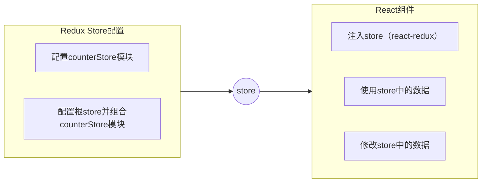
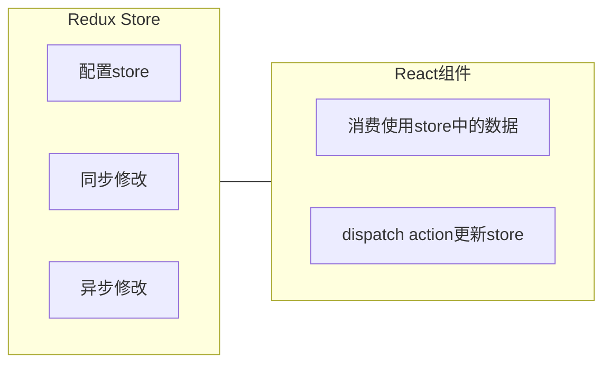

Redux 与 React 环境配置:

Redux Toolkit（RTK）- 官方推荐编写 Redux 逻辑的方式，是一套工具的集合集，简化书写方式

react-redux - 用来 链接 Redux 和 React 组件 的中间件

安装 Redux: [https://cn.redux.js.org/tutorials/quick-start#%E5%AE%89%E8%A3%85-redux-toolkit-%E5%92%8C-react-redux](https://cn.redux.js.org/tutorials/quick-start#%E5%AE%89%E8%A3%85-redux-toolkit-%E5%92%8C-react-redux)


# 快速体验

## 实现计数器

需求：不和任何框架绑定，不使用任何构建工具，使用纯Redux实现计数器

使用步骤：

1. 定义一个 reducer 函数 （根据当前想要做的修改返回一个新的状态）
2. 使用createStore方法传入 reducer函数 生成一个store实例对象
3. 使用store实例的 subscribe方法 订阅数据的变化（数据一旦变化，可以得到通知）
4. 使用store实例的 dispatch方法提交action对象 触发数据变化（告诉reducer你想怎么改数据）
5. 使用store实例的 getState方法 获取最新的状态数据更新到视图中

<details>
<summary>代码实现 test.html</summary>

```html
<button id="decrement">-</button>

<span id="count">0</span>

<button id="increment">+</button>

<script src="https://unpkg.com/redux@latest/dist/redux.min.js"></script>

<script>
  // 定义reducer函数 
  // 内部主要的工作是根据不同的action 返回不同的state
  function counterReducer (state = { count: 0 }, action) {
    switch (action.type) {
      case 'INCREMENT':
        return { count: state.count + 1 }
      case 'DECREMENT':
        return { count: state.count - 1 }
      default:
        return state
    }
  }
  // 使用reducer函数生成store实例
  const store = Redux.createStore(counterReducer)

  // 订阅数据变化
  store.subscribe(() => {
    console.log(store.getState())
    document.getElementById('count').innerText = store.getState().count

  })
  // 增
  const inBtn = document.getElementById('increment')
  inBtn.addEventListener('click', () => {
    store.dispatch({
      type: 'INCREMENT'
    })
  })
  // 减
  const dBtn = document.getElementById('decrement')
  dBtn.addEventListener('click', () => {
    store.dispatch({
      type: 'DECREMENT'
    })
  })
</script>
```

</details>

## 数据流架构

Redux的难点是理解它对于数据修改的规则, 下图动态展示了在整个数据的修改中，数据的流向


为了职责清晰，Redux代码被分为三个核心的概念，我们学redux，其实就是学这三个核心概念之间的配合，三个概念分别是:

1. state:  一个对象 存放着我们管理的数据
2. action:  一个对象 用来描述你想怎么改数据
3. reducer:  一个函数 根据action的描述更新state

# 环境配置

store目录结构设计

在 src 目录下创建 store 目录

```bash
store/modules/channelStore.js
store/modules/counterStore.js
store/index.js
```

1. 通常集中状态管理的部分都会单独创建一个单独的 store 目录
2. 应用通常会有很多个子store模块，所以创建一个 modules 目录，在内部编写业务分类的子store
3. store中的入口文件 index.js 的作用是组合modules中所有的子模块，并导出store

# Redux 与 React 结合使用

## 实现counter

<details>
<summary>1. 整体路径熟悉</summary>



</details>

<details>
<summary>2. 使用React Toolkit 创建 counterStore</summary>

```jsx
// counterStore.js
import { createSlice } from '@reduxjs/toolkit'

const counterStore = createSlice({
  // 模块名称独一无二
  name: 'counter',
  // 初始数据
  initialState: {
    count: 1
  },
  // 修改数据的同步方法
  reducers: {
    increment (state) {
      state.count++
    },
    decrement(state){
      state.count--
    }
  }
})
// 解构出actionCreater
const { increment,decrement } = counterStore.actions

// 获取reducer函数
const counterReducer = counterStore.reducer

// 导出
export { increment, decrement }
export default counterReducer
```

```jsx
// store/index.js
import { configureStore } from '@reduxjs/toolkit'

import counterReducer from './modules/counterStore'

export default configureStore({
  reducer: {
    // 注册子模块
    counter: counterReducer
  }
})
```

</details>

<details>
<summary>3. 为React注入store</summary>

react-redux负责把Redux和React 链接 起来，内置 Provider组件 通过 store 参数把创建好的store实例注入到应用中，链接正式建立

```jsx
// index.js
import React from 'react'
import ReactDOM from 'react-dom/client'
import App from './App'
// 导入store
import store from './store'
// 导入store提供组件Provider
import { Provider } from 'react-redux'

ReactDOM.createRoot(document.getElementById('root')).render(
  // 提供store数据
  <Provider store={store}>
    <App />
  </Provider>
)
```

</details>

<details>
<summary>4. React组件使用store中的数据</summary>

在React组件中使用store中的数据，需要用到一个钩子函数 - useSelector，它的作用是把store中的数据映射到组件中，使用样例如下：

```jsx
import { configureStore } from "@reduxjs/toolkit"

import counterReducer from "./modules/counterStore"

// 创建根store组合子模块
const store = configureStore({
  reducer: {
    counter: counterReducer
  }
})

export default store
```

```jsx
// 这里的 state.counter 就是 reducer 里的 counter
const { count } = useSelector(state => state.counter)
```

</details>

<details>
<summary>5. React组件修改store中的数据</summary>

React组件中修改store中的数据需要借助另外一个hook函数 - useDispatch，它的作用是生成提交action对象的dispatch函数，使用样例如下：

```jsx
// App.js
import { useDispatch, useSelector } from "react-redux"
  
// 导入创建action对象的方法
import { decrement, increment } from "./store/modules/counterstore"

function App() {
  const { count } = useSelector(state => state.counter);
  //得到dispatch函数
  const dispatch = useDispatch();
  return (
    <div className="App"
      {/* 调用dispatch提交action对象 */}
      <button onClick={() => dispatch(decrement())}>-</button>
      <span>{count}</span>
      <button onClick={() => dispatch(increment())}>+</button>
    </div>
  )
}
```

</details>

## 提交 action 传参

需求：组件中有俩个按钮 add to 10 和 add to 20 可以直接把count值修改到对应的数字，目标count值是在组件中传递过去的，需要在提交action的时候传递参数

实现方式：在reducers的同步修改方法中添加action对象参数，在调用actionCreater的时候传递参数，参数会被传递到action对象payload属性上

<details>
<summary>counterStore.js</summary>

```jsx
import { createSlice } from '@reduxjs/toolkit'

const counterStore = createSlice({
  // 模块名称独一无二
  name: 'counter',
  // 初始数据
  initialState: {
    count: 1
  },
  // 修改数据的同步方法
  reducers: {
    increment (state) {
      state.count++
    },
    decrement(state){
      state.count--
    },
    addToNum (state, action) {
        state.count = action.payload
    }
  }
})
// 解构出actionCreater
const { increment,decrement, addToNum } = counterStore.actions

// 获取reducer函数
const counterReducer = counterStore.reducer

// 导出
export { increment, decrement, addToNum }
export default counterReducer
```

</details>

<details>
<summary>App.js</summary>

```jsx
import { useDispatch, useSelector } from "react-redux"
  
// 导入创建action对象的方法
import { decrement, increment, addToNum } from "./store/modules/counterstore"

function App() {
  const { count } = useSelector(state => state.counter);
  //得到dispatch函数
  const dispatch = useDispatch();
  return (
    <div className="App"
      {/* 调用dispatch提交action对象 */}
      <button onClick={() => dispatch(decrement())}>-</button>
      <span>{count}</span>
      <button onClick={() => dispatch(increment())}>+</button>
      <button onClick={() => dispatch(addToNum(10))}>add To 10</button>
      <button onClick={() => dispatch(addToNum(20))}>add To 20</button>
    </div>
  )
}

export default App
```

</details>

## 异步action处理

<details>
<summary>需求理解</summary>



</details>

<details>
<summary>实现步骤</summary>

1. 创建store的写法保持不变，配置好同步修改状态的方法
2. 单独封装一个函数，在函数内部return一个新函数，在新函数中

    2.1 封装异步请求获取数据

    2.2 调用同步actionCreater传入异步数据生成一个action对象，并使用dispatch提交

3. 组件中dispatch的写法保持不变

```jsx

```

</details>

<details>
<summary>代码实现</summary>

测试接口地址：  http://geek.itheima.net/v1_0/channels

```jsx
import { createSlice } from '@reduxjs/toolkit'
import axios from 'axios'

const channelStore = createSlice({
  name: 'channel',
  initialState: {
    channelList: []
  },
  reducers: {
    setChannelList (state, action) {
      state.channelList = action.payload
    }
  }
})

// 创建异步
const { setChannelList } = channelStore.actions
const url = 'http://geek.itheima.net/v1_0/channels'
// 封装一个函数 在函数中return一个新函数 在新函数中封装异步
// 得到数据之后通过dispatch函数 触发修改
const fetchChannelList = () => {
  return async (dispatch) => {
    const res = await axios.get(url)
    dispatch(setChannelList(res.data.data.channels))
  }
}

export { fetchChannelList }

const channelReducer = channelStore.reducer
export default channelReducer
```

```jsx
import { useEffect } from 'react'
import { useSelector, useDispatch } from 'react-redux'
import { fetchChannelList } from './store/channelStore'

function App () {
  // 使用数据
  const { channelList } = useSelector(state => state.channel)
  const dispatch = useDispatch()
  useEffect(() => {
    dispatch(fetchChannelList())
  }, [dispatch])

  return (
    <div className="App">
      <ul>
        {channelList.map(task => <li key={task.id}>{task.name}</li>)}
      </ul>

    </div>

  )
}

export default App
```

</details>

# Redux调试 - devtools

Redux官方提供了针对于Redux的调试工具，支持实时state信息展示，action提交信息查看等
