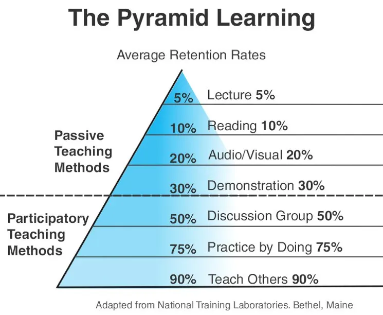

# 【学什么？怎么学？】

# 通过实践（解决问题）学习

如何学东西：通过实践来学习是最快的方法，去完成一个作品，通过完成一个作品来学习

我的责编作为一位物理系的学生，曾经的教材是一本清华影印版全英文的（物理学原理）  
让人印象深刻的是，不同于初中高中的物理课程这本书分成了好几个章节。  
每一个章节的标题都是一个特定的任务。  
例如第一章的标题是，移民去火星。  
开篇的任务就是我们现在需要移民去火星，该怎么做？  
由浅入深地介绍了牛顿力学，流体力学和空气动力学。  
让人在设定的环境中思考如何用物理知识解决实际问题。

# 主动学习和被动学习

- 被动学习：如听讲、阅读、视听、演示，学习内容的平均留存率为 5%、10%、20% 和 30%。
- 主动学习：如通过讨论、实践、教授给他人，会将原来被动学习的内容留存率从 5% 提升到 50%、75% 和 90%。

只有你开始自己思考，开始自己总结和归纳，开始找人交流讨论，开始践行，并开始对外输出，你才会掌握到真正的学习能力。

学习不是努力读更多的书，盲目追求阅读的速度和数量，这会让人产生低层次的勤奋和成长的感觉，这只是在使蛮力。要思辨，要践行，要总结和归纳，否则，你只是在机械地重复某件事，而不会有质的成长的。

# 如何快速地学

行动力不足的真正原因是选择模糊，太多的选择并不是好事

# 学什么?怎么学?

学习要系统地学，总结出体系，使用知识图来学习

要看透一件事物的本质，以不变应万变，学习也是一样，新技术一定有不变的基础内核，不要在学习各种技术的路上疲于奔命

学习的三步骤

1. 获取高质量的输入，找到信息的源头，多获取一手信息
2. 形成体系
3. 技能转换，将知识转变为自己的技能

不要浮躁，要深度学习，不要沉迷于浅度学习

# 系统地学习

在学习某个技术的时候，我除了会用到上篇文章中提到的知识图，还会问自己很多个为什么。于是，我形成了一个更高层的知识脑图。下面我把这这个方法分享出来。当然学习一门技术时，Go 语言也好，Docker 也好，我都有一个学习模板。只有把这个学习模板中的内容都填实了，我才罢休。这个模板如下。

1. 这个技术出现的背景、初衷和要达到什么样的目标或是要解决什么样的问题。这个问题非常关键，也就是说，你在学习一个技术的时候，需要知道这个技术的成因和目标，也就是这个技术的灵魂。如果不知道这些的话，那么你会看不懂这个技术的一些设计理念。
2. 这个技术的优势和劣势分别是什么，或者说，这个技术的 trade-off 是什么。任何技术都有其好坏，在解决一个问题的时候，也会带来新的问题。另外，一般来说，任何设计都有 trade-off（要什么和不要什么），所以，你要清楚这个技术的优势和劣势，以及带来的挑战。
3. 这个技术适用的场景。任何技术都有其适用的场景，离开了这个场景，这个技术可能会有很多槽点，所以学习技术不但要知道这个技术是什么，还要知道其适用的场景。没有任何一个技术是普适的。注意，所谓场景一般分别两个，一个是业务场景，一个是技术场景。
4. 技术的组成部分和关键点。这是技术的核心思想和核心组件了，也是这个技术的灵魂所在了。学习技术的核心部分是快速掌握的关键。
5. 技术的底层原理和关键实现。任何一个技术都有其底层的关键基础技术，这些关键技术很有可能也是其它技术的关键基础技术。所以，学习这些关键的基础底层技术，可以让你未来很快地掌握其它技术。可以参看我在 CoolShell 上写的 Docker 底层技术那一系列文章。
6. 已有的实现和它之间的对比。一般来说，任何一个技术都会有不同的实现，不同的实现都会有不同的侧重。学习不同的实现，可以让你得到不同的想法和思路，对于开阔思维，深入细节是非常重要的。
