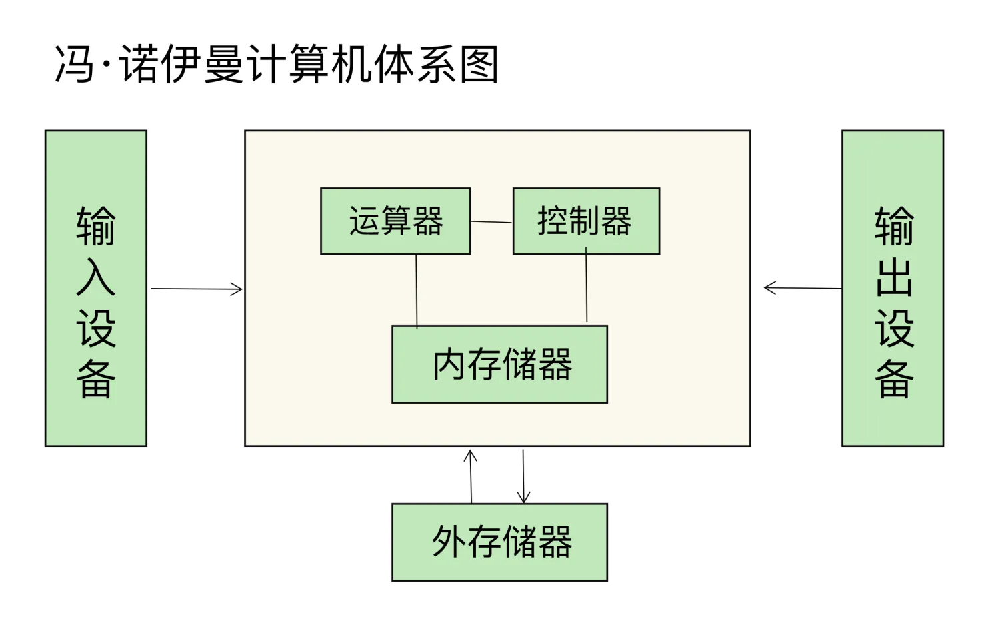
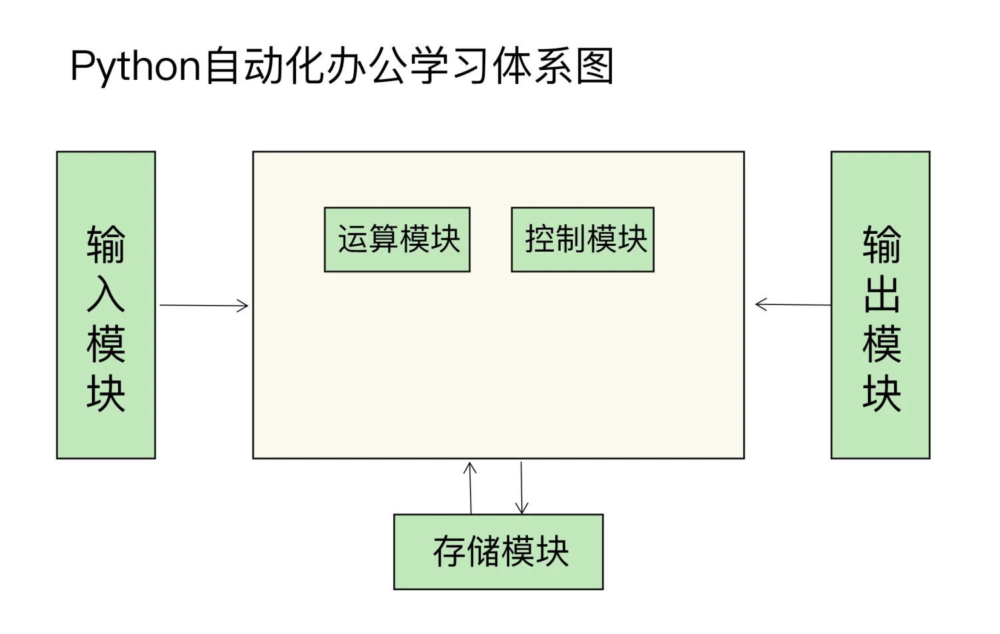

# 自动化办公的思路

# 解决这些低效问题，我的思路是什么？

**代码封装得越“高级”，解决的问题就越具体；越深入计算机底层，解决的问题就越通用。**

如果你暂时不理解这句话的意思也没关系，只需要明白这样一点就可以：**要想快速提高办公效率，解决方法不在各种小技巧和小软件，而在于理解底层逻辑，以及加快人和计算机的交互过程**，能够高效地解决输入（格式转换）、输出（格式统一）、控制（内容处理）、运算（查找、替换）、存储（文件保存和绘图），自然就能解决大部分的效率问题。

说到这里，我可以给你分享一段我的工作经历。我曾经维护过日活超过 3 亿用户的微博私信平台，你可以看看我是怎么用计算机的思维，来提高自己和团队的工作效率的。

我们在一个业务模块中，需要批量替换 200 台服务器中的软件配置，而且每个服务器都有一个文件，需要将第五行内容，由原有的接口版本 v1 统一替换成 v2。

面对这样的需求，其实有很多挑战在里面。第一个是替换的实效性，如果手动替换接口版本，由于服务器过多，用户就有可能访问到还没来得及替换的接口上，如后就有可能看到自己的消息是已读状态，一刷新页面，又变成了消息未读。第二个就是服务器数量很多，手动替换还没做完，下一个需求就接着来了。第三，手动替换这么多服务，非常容易出现拼写错误，也就是我们常说的手误，导致你要再花更多的时间来排捉 Bug。

这样很低效对不对？如果使用 Python 的话，我们就可以从 3 个方面来提升效率。

1. 用 Python 程序代替一个个的手动操作，实现文字内容的替换，这样就会解放人力，你的工作压力会减轻很多。
2. 我可以通过 Python 批量控制服务器，让服务器自动完成这些工作。
3. 然后就是灵活性方面的优化了，我们可以让这段程序定时运行，又可以让它们能够同时运行，从一个一个执行，到五个五个执行。

# 自动化办公框架

在开头的时候我也说了，要用计算机的思维去解决办公自动化工具和技巧的问题，所以我就把常见的 30 个机械、重复的工作场景，按照任务类型划分成了输入、运算、控制、存储和输出这 5 个模块。

1. “输入”模块：解决不同文件类型的批量合并和拆分问题

   这类任务往往包含了格式相似的大量文件，比如 Word、Excel、Txt 文件，我会带着你用 Python 去进行批量合并和拆分。

2. “运算”模块：扩展常用的统计、搜索和排序功能

   很多软件自带的统计、搜索和排序功能，都很好用，但不支持在多个文件或者跨类型文件中使用。所以，在这个模块我们要学习的就是，怎么通过 Python 进行扩展，让这些好用、常用的功能，可以支持多个文件或不同类型的文件。

3. “控制”模块：通过插件的方式增强办公软件以及周边软件、硬件的交互能力

   办公软件的核心功能，通常是支持文字和表格等内容的相关操作，对控制外部设备相对较薄弱。例如，Word 本身是不支持批量打印 Word 文件的，但批量打印又是一个常见的需求。这个需求，就可以通过脚本化来实现，达到打印自动化的目的。

4. “存储”模块：和文件相关的很多常用操作部分

   在工作中，我们经常会面对这么几种需求：需要对大量文件进行重命名；需要通过网络批量下载视频和图片；需要在海量文件中快速找到自己想要的文件；等等。

   这些需求最大的问题，就是我们需要手工重复操作，或者自带工具不好用。那么利用 Python 和文件、网络功能相结合，就完全可以实现目录下的批量改名、文件的批量下载，免去了手工重复操作的问题。

   对于系统自带的文件查找工具来说，速度慢而且不够简洁，那我们可以使用 Python 根据自己定义的目录搜索，加快搜索文件的效率。

5. “输出”模块：智能化输出自己的工作成果

   在这一部分，我要教你更直观和更智能地输出自己的工作成果。比如说你交付给同事的数据，可以通过 Python 一键转为图形，也可以根据你的需要将图形采用图片或网页的形式展示给你的同事，提高工作汇报的效率，更直观地展示自己的工作成果。
