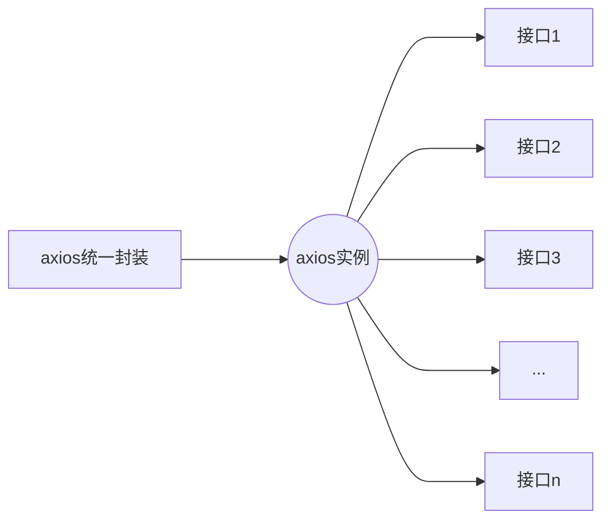
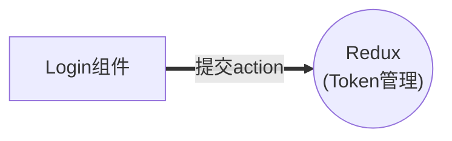
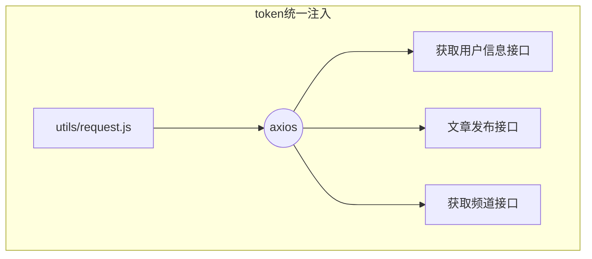
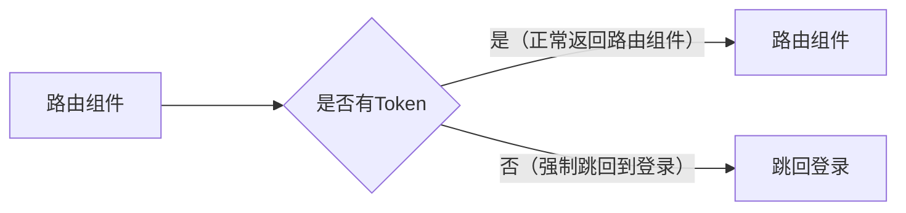
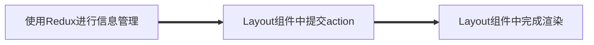
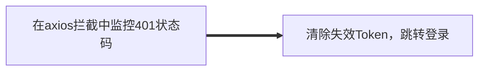
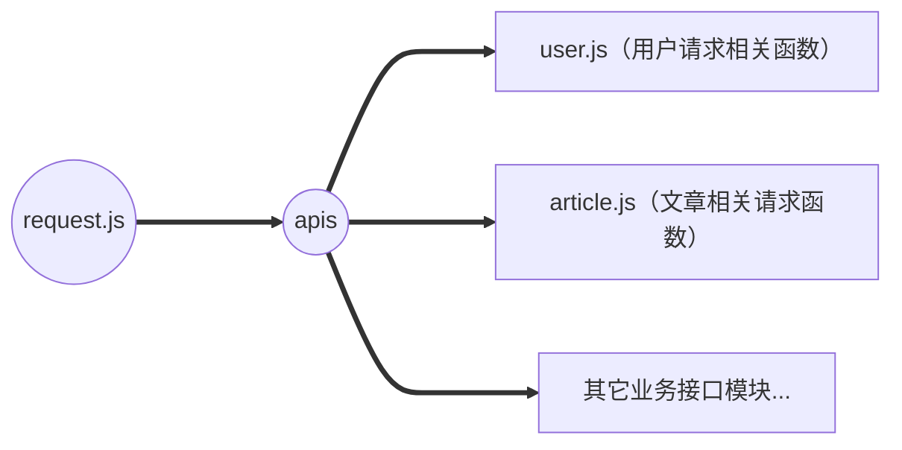

[https://gitee.com/haroldzkx/react-jike](https://gitee.com/haroldzkx/react-jike)

# 项目前置准备

<details>
<summary>项目结构搭建</summary>

<details>
<summary>&emsp; 1. 使用CRA脚手架创建项目</summary>

```bash
npx create-react-app react-jike
cd react-jike
npm install react@18 react-dom@18 web-vitals
npm install @testing-library/jest-dom @testing-library/react @testing-library/user-event
```

</details>

<details>
<summary>&emsp; 2. 按照业务规范整理项目目录（src 目录）</summary>

```bash
public/

src/apis/       # 项目接口函数
src/assets/     # 项目资源文件，比如图片等
src/components/ # 通用组件
src/pages/      # 页面组件
src/router/     # 路由Router
src/store/      # 集中状态管理Redux/Zustand
src/utils/      # 工具函数，例如token, axios的封装
src/App.js      # 根组件
src/index.js    # 项目入口
src/index.scss  # 全局样式

.gitignore
package-lock.json
package.json
README.md
```

</details>

<details>
<summary>&emsp; App.js</summary>

```jsx
function App() {
  return <div className="App">this is app</div>;
}

export default App;
```

</details>

<details>
<summary>&emsp; index.js</summary>

```jsx
import React from "react";
import ReactDOM from "react-dom/client";
import "./index.scss";
import App from "./App";

const root = ReactDOM.createRoot(document.getElementById("root"));
root.render(
  <React.StrictMode>
    <App />
  </React.StrictMode>
);
```

</details>

<details>
<summary>&emsp; index.scss</summary>

```sass
body {
  margin: 0;
  div {
    color: blue;
  }
}
```

</details>

</details>

<details>
<summary>安装依赖</summary>

```bash
# 使用 scss 预处理器
npm install -D sass

# 使用 antd 组件库
npm install antd --save

# 使用路由
npm install react-router-dom

# 发送请求
npm install axios

# redux状态管理
npm install react-redux @reduxjs/toolkit

# 样式重置
npm install normalize.css

# 图表渲染
npm install echarts
```

</details>

<details>
<summary>配置基础路由</summary>

1. 安装路由包react-router-dom

2. 准备俩个基础路由组件 Layout 和 Login

3. 在 router/index.js 文件中引入组件进行路由配置，导出router实例

<details>
<summary>&emsp;&emsp; router/index.js</summary>

```jsx
import Layout from "../pages/Layout";
import Login from "../pages/Login";

import { createBrowserRouter } from "react-router-dom";

const router = createBrowserRouter([
  {
    path: "/",
    element: <Layout />,
  },
  {
    path: "/login",
    element: <Login />,
  },
]);

export default router;
```

</details>

4. 在入口文件中渲染`<RouterProvider />`，传入router实例

<details>
<summary>&emsp;&emsp; index.js</summary>

```jsx
import React from "react";
import ReactDOM from "react-dom/client";
import "./index.scss";
import { RouterProvider } from "react-router-dom";
import router from "./router";

const root = ReactDOM.createRoot(document.getElementById("root"));
root.render(
  <React.StrictMode>
    <RouterProvider router={router} />
  </React.StrictMode>
);
```

</details>

</details>

<details>
<summary>配置别名路径</summary>

<details>
<summary>&emsp; 1. 路径解析配置（webpack），把 @/ 解析为 src/ </summary>

```bash
# 1.安装craco
npm install -D @craco/craco

# 2.项目根目录下创建配置文件
touch craco.config.js

# 3.配置文件中添加路径解析配置
const path = require("path");

module.exports = {
  webpack: {
    alias: {
      "@": path.resolve(__dirname, "src"),
    },
  },
};

# 4.包文件中配置启动和打包命令
"scripts": {
    "start": "craco start",
    "build": "craco build",
    "test": "craco test",
    "eject": "react-scripts eject"
},
```

</details>

<details>
<summary>&emsp; 2. 路径联想配置（VSCode），VsCode 在输入 @/ 时，自动联想出来对应的  src/ 下的子级目录</summary>

```bash
# 1.根目录下新增配置文件
touch jsconfig.json

# 2.添加路径提示配置
{
  "compilerOptions":{
    "baseUrl":"./",
    "paths":{
      "@/*":[
        "src/*"
      ]
    }
  }
}
```

</details>

</details>


<details>
<summary>后端接口</summary>

```bash
https://apifox.com/apidoc/shared-fa9274ac-362e-4905-806b-6135df6aa90e/
```

</details>

# 登录模块

<details>
<summary>基本结构搭建 实现步骤</summary>

1. 在 `Login/index.js` 中创建登录页面基本结构
2. 在 Login 目录中创建 index.scss 文件，指定组件样式
3. 准备 `logo.png` 文件，放到 assets 目录中

```javascript
import "./index.scss";
import { Card, Form, Input, Button } from "antd";
import logo from "@/assets/logo.png";

const Login = () => {
  return (
    <div className="login">
      <Card className="login-container">
        
        {/* 登录表单 */}
        <Form>
          <Form.Item>
            <Input size="large" placeholder="请输入手机号" />
          </Form.Item>
          <Form.Item>
            <Input size="large" placeholder="请输入验证码" />
          </Form.Item>
          <Form.Item>
            <Button type="primary" htmlType="submit" size="large" block>
              登录
            </Button>
          </Form.Item>
        </Form>
      </Card>
    </div>
  );
};

export default Login;
```

```css
.login {
  width: 100%;
  height: 100%;
  position: absolute;
  left: 0;
  top: 0;
  background: center/cover url('~@/assets/login.png');

  .login-logo {
    width: 200px;
    height: 60px;
    display: block;
    margin: 0 auto 20px;
  }

  .login-container {
    width: 440px;
    height: 360px;
    position: absolute;
    left: 50%;
    top: 50%;
    transform: translate(-50%, -50%);
    box-shadow: 0 0 50px rgb(0 0 0 / 10%);
  }

  .login-checkbox-label {
    color: #1890ff;
  }
}
```

</details>

<details>
<summary>表单校验实现</summary>

```jsx
import "./index.scss";
import { Card, Form, Input, Button } from "antd";
import logo from "@/assets/logo.png";

const Login = () => {
  return (
    <div className="login">
      <Card className="login-container">
        
        {/* 登录表单 */}
        <Form validateTrigger="onBlur">
          <Form.Item
            name="mobile"
            // 多条校验逻辑，串行校验
            rules={[
              {
                required: true,
                message: "请输入手机号",
              },
              {
                pattern: /^1[3-9]\d{9}$/,
                message: "手机号格式不正确",
              },
            ]}
          >
            <Input size="large" placeholder="请输入手机号" />
          </Form.Item>
          <Form.Item
            name="code"
            rules={[
              {
                required: true,
                message: "请输入验证码",
              },
            ]}
          >
            <Input size="large" placeholder="请输入验证码" />
          </Form.Item>
          <Form.Item>
            <Button type="primary" htmlType="submit" size="large" block>
              登录
            </Button>
          </Form.Item>
        </Form>
      </Card>
    </div>
  );
};

export default Login;
```

</details>

<details>
<summary>获取表单数据</summary>

1. 为 Form 组件添加 `onFinish` 属性，该事件会在点击登录按钮时触发
2. 创建 onFinish 函数，通过函数参数 values 拿到表单值
3. Form 组件添加 `initialValues` 属性，来初始化表单值

```jsx
import "./index.scss";
import { Card, Form, Input, Button } from "antd";
import logo from "@/assets/logo.png";

const Login = () => {
  const onFinish = (values) => {
    console.log("Received values of form: ", values);
  };
  return (
    <div className="login">
      <Card className="login-container">
        
        {/* 登录表单 */}
        <Form onFinish={onFinish} validateTrigger="onBlur">
          <Form.Item
            name="mobile"
            // 多条校验逻辑，串行校验
            rules={[
              {
                required: true,
                message: "请输入手机号",
              },
              {
                pattern: /^1[3-9]\d{9}$/,
                message: "手机号格式不正确",
              },
            ]}
          >
            <Input size="large" placeholder="请输入手机号" />
          </Form.Item>
          <Form.Item
            name="code"
            rules={[
              {
                required: true,
                message: "请输入验证码",
              },
            ]}
          >
            <Input size="large" placeholder="请输入验证码" />
          </Form.Item>
          <Form.Item>
            <Button type="primary" htmlType="submit" size="large" block>
              登录
            </Button>
          </Form.Item>
        </Form>
      </Card>
    </div>
  );
};

export default Login;
```

</details>


<details>
<summary>封装 request 请求模块</summary>

<details>
<summary>&emsp; 业务背景: </summary>

1. 几乎所有的接口都是一样的接口域名
2. 几乎所有的接口都需要设置一样的超时时间
3. 几乎所有的接口都需要做token权限处理

---

1. 前端需要和后端拉取接口数据，axios是使用最广的工具插件，针对于项目中的使用，我们需要做一些简单的封装
2. 在整个项目中会发送很多网络请求，使用 axios 三方库做好统一封装，方便统一管理和复用



</details>

---

实现步骤

<details>
<summary>&emsp; 1. 安装 axios 到项目</summary>

```bash
npm install axios
```

</details>

<details>
<summary>&emsp; 2. 创建 utils/request.js 文件</summary>

</details>

<details>
<summary>&emsp; 3. 创建 axios 实例，配置 baseURL，请求拦截器，响应拦截器</summary>

```jsx
// axios的封装处理
import axios from "axios";

// 1.根域名配置：根域名就是后端接口域名/IP
// 2.超时时间配置
const request = axios.create({
  baseURL: "http://geek.itheima.net/v1_0",
  timeout: 5000,
});

// 3.请求拦截器 / 响应拦截器
// 添加请求拦截器
// 在请求发送之前 拦截 做一些自定义配置【参数的处理】
request.interceptors.request.use(
  (config) => {
    return config;
  },
  (error) => {
    return Promise.reject(error);
  }
);

// 添加响应拦截器
// 在响应返回到客户端之前 拦截 重点处理返回的数据
request.interceptors.response.use(
  (response) => {
    // 2xx 范围内的状态码都会触发该函数。
    // 对响应数据做点什么
    return response.data;
  },
  (error) => {
    // 超出 2xx 范围的状态码都会触发该函数。
    // 对响应错误做点什么
    return Promise.reject(error);
  }
);

export { request };
```

</details>

<details>
<summary>&emsp; 4. 在 utils/index.js 中，统一导出request</summary>

```jsx
// 统一中转工具模块函数
// import {request} from "@/utils";

import { request } from "./request";

export { request };
```

</details>

</details>

<details>
<summary>使用Redux管理token</summary>

```bash
npm install react-redux @reduxjs/toolkit
```



1. Redux 中编写获取 Token 的异步获取和同步修改
2. Login 组件负责提交 action 并且把表单数据传递过来


<details>
<summary>&emsp; 编写样板代码</summary>

```jsx
// 和用户相关的状态管理
import { createSlice } from "@reduxjs/toolkit";

const userStore = createSlice({
  name: "user",
  // 数据状态
  initialState: {
    token: "",
  },
  // 同步修改方法
  reducers: {
    setToken(state, action) {
      state.token = action.payload;
    },
  },
});

// 解构出actionCreater
const { setToken } = userStore.actions;

// 获取reducer函数
const userReducer = userStore.reducer;

export { setToken };

export default userReducer;
```

```jsx
// 组合redux子模块 + 导出 store 实例
import { configureStore } from "@reduxjs/toolkit";
import userReducer from "./modules/user";

const store = configureStore({
  reducer: {
    // 注册子模块
    user: userReducer,
  },
});

export default store;
```

```jsx
import React from "react";
import ReactDOM from "react-dom/client";
import "./index.scss";
import { RouterProvider } from "react-router-dom";
import router from "./router";
import { Provider } from "react-redux";
import store from "./store";

const root = ReactDOM.createRoot(document.getElementById("root"));
root.render(
  <React.StrictMode>
    <Provider store={store}>
      <RouterProvider router={router} />
    </Provider>
  </React.StrictMode>
);
```

</details>

<details>
<summary>&emsp; 实现 Token 异步获取</summary>

```jsx
// 和用户相关的状态管理
import { createSlice } from "@reduxjs/toolkit";
import { request } from "@/utils";

const userStore = createSlice({
  name: "user",
  // 数据状态
  initialState: {
    token: "",
  },
  // 同步修改方法
  reducers: {
    setToken(state, action) {
      state.token = action.payload;
    },
  },
});

// 解构出actionCreater
const { setToken } = userStore.actions;

// 获取reducer函数
const userReducer = userStore.reducer;

// 异步方法 完成登录获取Token
const fetchLogin = (loginForm) => {
  return async (dispatch) => {
    // 1.发送异步请求
    const res = await request.post("/authorizations", loginForm);
    // 2.提交同步action进行token的存入
    dispatch(setToken(res.data.token));
  };
};

export { fetchLogin, setToken };

export default userReducer;
```

```jsx
import "./index.scss";
import { Card, Form, Input, Button } from "antd";
import logo from "@/assets/logo.png";
import { useDispatch } from "react-redux";
import { fetchLogin } from "@/store/modules/user";

const Login = () => {
  const dispatch = useDispatch();
  const onFinish = (values) => {
    console.log("Received values of form: ", values);
    // 触发异步action
    dispatch(fetchLogin(values));
  };
  return (
    ...
  );
};

export default Login;
```

</details>

</details>

<details>
<summary>登录后续逻辑</summary>

```jsx
import "./index.scss";
import { Card, Form, Input, Button, message } from "antd";
import logo from "@/assets/logo.png";
import { useDispatch } from "react-redux";
import { useNavigate } from "react-router-dom";
import { fetchLogin } from "@/store/modules/user";

const Login = () => {
  const dispatch = useDispatch();
  const navigate = useNavigate();
  const onFinish = async (values) => {
    // console.log("Received values of form: ", values);
    // 触发异步action
    await dispatch(fetchLogin(values));
    // values: { mobile: '13800000002', code: '246810' }
    // 1.跳转到首页
    navigate("/");
    // 2.提示用户登录成功
    message.success("登录成功");
  };
  return (
    ...
  );
};

export default Login;
```

</details>

<details>
<summary>Token 持久化</summary>

业务背景: Token数据具有一定的时效时间，通常在几个小时，有效时间内无需重新获取，而基于Redux的存储方式又是基于内存的，刷新就会丢失，为了保持持久化，需要单独做处理

技术方案：

- 获取并存Token: Redux + LocalStorage
- 初始化Token: LocalStorage ? LocalStorage : 空字符串

```jsx
// 和用户相关的状态管理
import { createSlice } from "@reduxjs/toolkit";
import { request } from "@/utils";
import { setToken as _setToken, getToken } from "@/utils";

const userStore = createSlice({
  name: "user",
  // 数据状态
  initialState: {
    token: getToken() || "",
  },
  // 同步修改方法
  reducers: {
    setToken(state, action) {
      // 将数据存入Redux中
      state.token = action.payload;
      // localStorage中保存token
      _setToken(action.payload);
    },
  },
});
...
```

```jsx
// 封装和token相关的方法
const TOKENKEY = "token_key";

function setToken(token) {
  localStorage.setItem(TOKENKEY, token);
}

function getToken() {
  console.log(localStorage.getItem(TOKENKEY));
  return localStorage.getItem(TOKENKEY);
}

function removeToken() {
  localStorage.removeItem(TOKENKEY);
}

export { setToken, getToken, removeToken };
```

```jsx
// 统一中转工具模块函数
// import {request} from "@/utils";

import { request } from "./request";
import { setToken, getToken, removeToken } from "./token";

export { request, setToken, getToken, removeToken };
```

</details>

<details>
<summary>axios 请求拦截器注入 Token</summary>

业务背景: Token作为用户的数据标识，在接口层面起到了接口权限控制的作用，也就是说后端有很多接口都需要通过查看当前请求头信息中是否含有token数据，来决定是否正常返回数据

Token 作为用户的一个标识数据，后端很多接口都会以它作为接口权限判断的依据；请求拦截器注入 Token 之后，所有用到 axios 实例的接口请求都自动携带了token



```jsx
// axios的封装处理
import axios from "axios";
import { getToken } from "./token";
...

// 3.请求拦截器 / 响应拦截器
// 添加请求拦截器
// 在请求发送之前 拦截 做一些自定义配置【参数的处理】
request.interceptors.request.use(
  (config) => {
    // 操作这个config，注入token数据
    // 1. 获取token
    const token = getToken();
    // 2. 按照后端要求拼接token
    if (token) {
      config.headers.Authorization = `Bearer ${token}`;
    }
    return config;
  },
  (error) => {
    return Promise.reject(error);
  }
);
...
```

```jsx
import { request } from "@/utils";
import { useEffect } from "react";

function Layout() {
  useEffect(() => {
    request.get("/user/profile");
  }, []);
  return (
    <div>
      <h1>Layout</h1>
      <p>Layout</p>
    </div>
  );
}

export default Layout;
```

</details>


<details>
<summary>Token路由权限控制（路由鉴权）</summary>

有些路由页面内的内容信息比较敏感，如果用户没有经过登录获取到有效token，是没有权限跳转的，根据token的有无控制当前路由是否可以跳转就是路由的权限控制

> 业务背景：封装 `AuthRoute` 路由鉴权高阶组件，实现未登录拦截，并跳转到登录页面  
> 实现思路：判断本地是否有token，如果有，就返回子组件，否则就重定向到登录Login

实现步骤

1. 在 components 目录中，创建 `AuthRoute/index.jsx` 文件
2. 登录时，直接渲染相应页面组件
3. 未登录时，重定向到登录页面
4. 将需要鉴权的页面路由配置，替换为 AuthRoute 组件渲染



```jsx
import { getToken } from "@/utils";
import { Navigate } from "react-router-dom";

// 封装高阶组件
export function AuthRoute({ children }) {
  const token = getToken();
  if (token) {
    return <>{children}</>;
  } else {
    return <Navigate to="/login" replace />;
  }
}
```

```jsx
import Layout from "@/pages/Layout";
import Login from "@/pages/Login";
import { AuthRoute } from "@/components/AuthRoute";

import { createBrowserRouter } from "react-router-dom";

const router = createBrowserRouter([
  {
    path: "/",
    element: (
      <AuthRoute>
        <Layout />
      </AuthRoute>
    ),
  },
  {
    path: "/login",
    element: <Login />,
  },
]);

export default router;
```

</details>

# Layout 模块

<details>
<summary>基本结构与样式初始化</summary>

<details>
<summary>&emsp; index.jsx</summary>

```jsx
import { Layout, Menu, Popconfirm } from "antd";
import {
  HomeOutlined,
  DiffOutlined,
  EditOutlined,
  LogoutOutlined,
} from "@ant-design/icons";
import "./index.scss";

const { Header, Sider } = Layout;

const items = [
  {
    label: "首页",
    key: "1",
    icon: <HomeOutlined />,
  },
  {
    label: "文章管理",
    key: "2",
    icon: <DiffOutlined />,
  },
  {
    label: "创建文章",
    key: "3",
    icon: <EditOutlined />,
  },
];

const GeekLayout = () => {
  return (
    <Layout>
      <Header className="header">
        <div className="logo" />
        <div className="user-info">
          <span className="user-name">柴柴老师</span>
          <span className="user-logout">
            <Popconfirm title="是否确认退出？" okText="退出" cancelText="取消">
              <LogoutOutlined /> 退出
            </Popconfirm>
          </span>
        </div>
      </Header>
      <Layout>
        <Sider width={200} className="site-layout-background">
          <Menu
            mode="inline"
            theme="dark"
            defaultSelectedKeys={["1"]}
            items={items}
            style={{ height: "100%", borderRight: 0 }}
          ></Menu>
        </Sider>
        <Layout className="layout-content" style={{ padding: 20 }}>
          内容
        </Layout>
      </Layout>
    </Layout>
  );
};
export default GeekLayout;
```

</details>

<details>
<summary>&emsp; css</summary>

```jsx
.ant-layout {
    height: 100%;
  }
  
  .header {
    padding: 0;
  }
  
  .logo {
    width: 200px;
    height: 60px;
    background: url('~@/assets/logo.png') no-repeat center / 160px auto;
  }
  
  .layout-content {
    overflow-y: auto;
  }
  
  .user-info {
    position: absolute;
    right: 0;
    top: 0;
    padding-right: 20px;
    color: #fff;
    
    .user-name {
      margin-right: 20px;
    }
    
    .user-logout {
      display: inline-block;
      cursor: pointer;
    }
  }
  .ant-layout-header {
    padding: 0 !important;
  }
```

</details>

<details>
<summary>&emsp; 样式重置</summary>

```bash
npm install normalize.css
```

```jsx
...
import "normalize.css";

...
```

```jsx
html,
body {
  margin: 0;
  height: 100%;
}

#root {
  height: 100%;
}
```

</details>

</details>

<details>
<summary>二级路由配置</summary>

使用步骤

1. 在 pages 目录中，分别创建：Home（数据概览）/Article（内容管理）/Publish（发布文章）页面文件夹
2. 分别在三个文件夹中创建 index.jsx 并创建基础组件后导出
3. 在 `router/index.js` 中配置嵌套子路由，在 `Layout`中配置二级路由出口
4. 使用 Link 修改左侧菜单内容，与子路由规则匹配实现路由切换

```jsx
const Home = () => {
  return <div>this is home</div>;
};

export default Home;
```

```jsx
const Article = () => {
  return <div>this is Article</div>;
};

export default Article;
```

```jsx
const Publish = () => {
  return <div>this is Publish</div>;
};

export default Publish;
```

```jsx
import Layout from "@/pages/Layout";
import Login from "@/pages/Login";
import { AuthRoute } from "@/components/AuthRoute";

import { createBrowserRouter } from "react-router-dom";
import Home from "@/pages/Home";
import Article from "@/pages/Article";
import Publish from "@/pages/Publish";

const router = createBrowserRouter([
  {
    path: "/",
    element: (
      <AuthRoute>
        <Layout />
      </AuthRoute>
    ),
    children: [
      {
        // path: "home",
        index: true,//默认二级路由
        element: <Home />,
      },
      {
        path: "article",
        element: <Article />,
      },
      {
        path: "publish",
        element: <Publish />,
      },
    ],
  },
  {
    path: "/login",
    element: <Login />,
  },
]);

export default router;
```

```jsx
const GeekLayout = () => {
  return (
    <Layout>
      ...
      <Layout>
        ...
        <Layout className="layout-content" style={{ padding: 20 }}>
          {/* 二级路由出口 */}
          <Outlet />
        </Layout>
      </Layout>
    </Layout>
  );
};
export default GeekLayout;
```

</details>

<details>
<summary>路由菜单点击交互实现</summary>

实现效果：点击左侧菜单可以跳转到对应的目标路由

思路分析

1. 左侧菜单要和路由形成一一对应的关系（知道点了谁）
2. 点击时拿到路由路径调用路由方法跳转（跳转到对应的路由下面）

具体实现：菜单参数ltem中key属性换成路由的路径地址 $\to$ 点击菜单时通过key获取路由地址跳转

```jsx
import { Layout, Menu, Popconfirm } from "antd";
import {
  HomeOutlined,
  DiffOutlined,
  EditOutlined,
  LogoutOutlined,
} from "@ant-design/icons";
import "./index.scss";
import { Outlet, useNavigate } from "react-router-dom";

const { Header, Sider } = Layout;

const items = [
  {
    label: "首页",
    key: "/",
    icon: <HomeOutlined />,
  },
  {
    label: "文章管理",
    key: "/article",
    icon: <DiffOutlined />,
  },
  {
    label: "创建文章",
    key: "/publish",
    icon: <EditOutlined />,
  },
];

const GeekLayout = () => {
  const navigate = useNavigate();
  const onMenuClick = (route) => {
    const path = route.key;
    navigate(path);
  };
  return (
    <Layout>
      <Header className="header">
        <div className="logo" />
        <div className="user-info">
          <span className="user-name">柴柴老师</span>
          <span className="user-logout">
            <Popconfirm title="是否确认退出？" okText="退出" cancelText="取消">
              <LogoutOutlined /> 退出
            </Popconfirm>
          </span>
        </div>
      </Header>
      <Layout>
        <Sider width={200} className="site-layout-background">
          <Menu
            mode="inline"
            theme="dark"
            defaultSelectedKeys={["1"]}
            onClick={onMenuClick}
            items={items}
            style={{ height: "100%", borderRight: 0 }}
          ></Menu>
        </Sider>
        <Layout className="layout-content" style={{ padding: 20 }}>
          {/* 二级路由出口 */}
          <Outlet />
        </Layout>
      </Layout>
    </Layout>
  );
};
export default GeekLayout;
```

</details>

<details>
<summary>根据当前路由路径高亮菜单</summary>

实现效果：页面在刷新时可以根据当前的路由路径让对应的左侧菜单高亮显示

思路分析

1. 获取当前url上的路由路径
2. 找到菜单组件负责高亮的属性，绑定当前的路由路径

```jsx
import { Layout, Menu, Popconfirm } from "antd";
import {
  HomeOutlined,
  DiffOutlined,
  EditOutlined,
  LogoutOutlined,
} from "@ant-design/icons";
import "./index.scss";
import { Outlet, useNavigate, useLocation } from "react-router-dom";

...

const GeekLayout = () => {
  const navigate = useNavigate();
  const onMenuClick = (route) => {
    const path = route.key;
    navigate(path);
  };

  // 反向高亮
  // 1.获取当前路由路径
  const location = useLocation();
  const selectedkey = location.pathname;
  return (
    <Layout>
      ...
      <Layout>
        <Sider width={200} className="site-layout-background">
          <Menu
            mode="inline"
            theme="dark"
            // 2.绑定当前的路由路径
            selectedKeys={selectedkey}
            onClick={onMenuClick}
            items={items}
            style={{ height: "100%", borderRight: 0 }}
          ></Menu>
        </Sider>
        <Layout className="layout-content" style={{ padding: 20 }}>
          {/* 二级路由出口 */}
          <Outlet />
        </Layout>
      </Layout>
    </Layout>
  );
};
export default GeekLayout;
```

</details>

<details>
<summary>展示个人信息</summary>

关键问题：用户信息应该放到哪里维护？

和Token令牌类似，用户的信息通常很有可能在多个组件中都需要共享使用，所以同样应该放到Redux中维护

实现步骤



1. 在Redux的store中编写获取用户信息的相关逻辑
2. 在Layout组件中触发action的执行
3. 在Layout组件使用使用store中的数据进行用户名的渲染

```jsx
// 和用户相关的状态管理
import { createSlice } from "@reduxjs/toolkit";
import { request } from "@/utils";
import { setToken as _setToken, getToken } from "@/utils";

const userStore = createSlice({
  name: "user",
  // 数据状态
  initialState: {
    token: getToken() || "",
    userInfo: {},
  },
  // 同步修改方法
  reducers: {
    setToken(state, action) {
      // 将数据存入Redux中
      state.token = action.payload;
      // localStorage中保存token
      _setToken(action.payload);
    },
    setUserInfo(state, action) {
      state.userInfo = action.payload;
    },
  },
});

// 解构出actionCreater
const { setToken, setUserInfo } = userStore.actions;

// 获取reducer函数
const userReducer = userStore.reducer;

// 异步方法 完成登录获取Token
const fetchLogin = (loginForm) => {
  return async (dispatch) => {
    // 1.发送异步请求
    const res = await request.post("/authorizations", loginForm);
    // 2.提交同步action进行token的存入
    dispatch(setToken(res.data.token));
  };
};

// 异步方法 获取个人信息
const fetchUserInfo = () => {
  return async (dispatch) => {
    const res = await request.get("/user/profile");
    dispatch(setUserInfo(res.data));
  };
};

export { fetchLogin, fetchUserInfo, setToken };

export default userReducer;
```

```jsx
...
import { useEffect } from "react";
import { useDispatch, useSelector } from "react-redux";
import { fetchUserInfo } from "@/store/modules/user";

...

const GeekLayout = () => {
  ...
  // 触发个人用户信息action
  const dispatch = useDispatch();
  useEffect(() => {
    dispatch(fetchUserInfo());
  }, [dispatch]);
  // 消费数据
  const name = useSelector((state) => state.user.userInfo.name);
  return (
    <Layout>
      <Header className="header">
        <div className="logo" />
        <div className="user-info">
          <span className="user-name">{name}</span>
          <span className="user-logout">
            <Popconfirm title="是否确认退出？" okText="退出" cancelText="取消">
              <LogoutOutlined /> 退出
            </Popconfirm>
          </span>
        </div>
      </Header>
      ...
    </Layout>
  );
};
export default GeekLayout;
```

</details>

<details>
<summary>退出登录实现</summary>

退出登录是一个通用的业务逻辑，退出登录都要做什么？

1. 提示用户是否确认要退出（危险操作，二次确认）
2. 用户确认之后清除用户信息（Token以及其它个人信息）
3. 跳转到登录页（为下次登录做准备）

实现步骤

+ 为气泡确认框添加确认回调事件
+ 在 `store/userStore.js` 中新增退出登录的action函数，在其中删除token
+ 在回调事件中，调用userStore中的退出action
+ 清除用户信息，返回登录页面

```jsx
// 和用户相关的状态管理
import { createSlice } from "@reduxjs/toolkit";
import { removeToken, request } from "@/utils";
import { setToken as _setToken, getToken } from "@/utils";

const userStore = createSlice({
  name: "user",
  // 数据状态
  initialState: {
    token: getToken() || "",
    userInfo: {},
  },
  // 同步修改方法
  reducers: {
    setToken(state, action) {
      // 将数据存入Redux中
      state.token = action.payload;
      // localStorage中保存token
      _setToken(action.payload);
    },
    setUserInfo(state, action) {
      state.userInfo = action.payload;
    },
    clearUserInfo(state) {
      state.token = "";
      state.userInfo = {};
      removeToken();
    },
  },
});

// 解构出actionCreater
const { setToken, setUserInfo, clearUserInfo } = userStore.actions;

// 获取reducer函数
const userReducer = userStore.reducer;

// 异步方法 完成登录获取Token
const fetchLogin = (loginForm) => {
  return async (dispatch) => {
    // 1.发送异步请求
    const res = await request.post("/authorizations", loginForm);
    // 2.提交同步action进行token的存入
    dispatch(setToken(res.data.token));
  };
};

// 异步方法 获取个人信息
const fetchUserInfo = () => {
  return async (dispatch) => {
    const res = await request.get("/user/profile");
    dispatch(setUserInfo(res.data));
  };
};

export { fetchLogin, fetchUserInfo, clearUserInfo, setToken };

export default userReducer;
```

```jsx
...
import { fetchUserInfo, clearUserInfo } from "@/store/modules/user";

...

const GeekLayout = () => {
  ...
  // 退出登录确认回掉
  const onConfirm = () => {
    dispatch(clearUserInfo());
    navigate("/login");
  };
  // 消费数据
  const name = useSelector((state) => state.user.userInfo.name);
  return (
    <Layout>
      <Header className="header">
        <div className="logo" />
        <div className="user-info">
          <span className="user-name">{name}</span>
          <span className="user-logout">
            <Popconfirm
              title="是否确认退出？"
              okText="退出"
              cancelText="取消"
              onConfirm={onConfirm}
            >
              <LogoutOutlined /> 退出
            </Popconfirm>
          </span>
        </div>
      </Header>
      ...
    </Layout>
  );
};
export default GeekLayout;
```

</details>

<details>
<summary>处理 Token 失效</summary>

什么是Token失效：为了用户的安全和隐私考虑，在用户长时间未在网站中做任何操作且规定的失效时间到达之后，当前的Token就会失效，一旦失效，不能再作为用户令牌标识请求隐私数据

前端如何知道Token已经失效了：通常在Token失效之后再去请求接口，后端会返回401状态码，前端可以监控这个状态做后续的操作

Token失效了前端做什么？



```jsx
// axios的封装处理
import axios from "axios";
import { getToken, removeToken } from "./token";
import router from "@/router";

...

// 添加响应拦截器
// 在响应返回到客户端之前 拦截 重点处理返回的数据
request.interceptors.response.use(
  (response) => {
    // 2xx 范围内的状态码都会触发该函数。
    // 对响应数据做点什么
    return response.data;
  },
  (error) => {
    // 超出 2xx 范围的状态码都会触发该函数。
    // 对响应错误做点什么
    // 监控401 token失效
    // console.dir(error);
    if (error.response.status === 401) {
      removeToken();
      router.navigate("/login");
      window.location.reload();
    }
    return Promise.reject(error);
  }
);
export { request };
```

</details>

<details>
<summary>首页 Home 图表展示</summary>

<details>
<summary>&emsp; 图表基础Demo实现</summary>

图表类业务渲染，我们可以通过下面的顺序来实现

1. 跑通基础DEMO
2. 按照实际业务需求进行修改

注意：

1. 图表的初始化在useEffect中完成
2. 挂载渲染的节点需要有宽高

```bash
npm install echarts
```

```jsx
import * as echarts from "echarts";
import { useEffect, useRef } from "react";

const Home = () => {
  const chartRef = useRef(null);
  useEffect(() => {
    // 保证dom可用，才进行图表的渲染
    // 1.获取渲染图表的dom节点
    const chartDom = chartRef.current;
    // 2.图表初始化生成图表实例对象
    const myChart = echarts.init(chartDom);
    // 3.准备图表参数
    const option = {
      xAxis: {
        type: "category",
        data: ["Mon", "Tue", "Wed", "Thu", "Fri", "Sat", "Sun"],
      },
      yAxis: {
        type: "value",
      },
      series: [
        {
          data: [120, 200, 150, 80, 70, 110, 130],
          type: "bar",
        },
      ],
    };
    // 4.使用参数渲染图表
    option && myChart.setOption(option);
  }, []);
  return (
    <div>
      <div ref={chartRef} style={{ width: 500, height: 400 }}></div>
    </div>
  );
};

export default Home;
```

</details>

<details>
<summary>&emsp; 组件封装</summary>

为什么要做组件封装？组件封装主要解决了复用的问题


```jsx
// 柱状图组件
// 1.把功能代码放到这个组件中
// 2.把可变部分抽象成prop参数
import * as echarts from "echarts";
import { useEffect, useRef } from "react";

const BarChart = ({ title, xData, yData }) => {
  const chartRef = useRef(null);
  useEffect(() => {
    // 保证dom可用，才进行图表的渲染
    // 1.获取渲染图表的dom节点
    const chartDom = chartRef.current;
    // 2.图表初始化生成图表实例对象
    const myChart = echarts.init(chartDom);
    // 3.准备图表参数
    const option = {
      title: {
        text: title,
      },
      xAxis: {
        type: "category",
        data: xData,
      },
      yAxis: {
        type: "value",
      },
      series: [
        {
          data: yData,
          type: "bar",
        },
      ],
    };
    // 4.使用参数渲染图表
    option && myChart.setOption(option);
  }, []);

  return <div ref={chartRef} style={{ width: 500, height: 400 }}></div>;
};

export default BarChart;
```

```jsx
import BarChart from "./components/BarChart";

const Home = () => {
  return (
    <div>
      <BarChart
        title={"三大框架使用度"}
        xData={["Mon", "Tue", "Wed", "Thu", "Fri", "Sat", "Sun"]}
        yData={[120, 200, 150, 80, 70, 110, 130]}
      />
      <BarChart
        title={"前端框架满意度"}
        xData={["Mon", "Tue", "Wed", "Thu", "Fri", "Sat", "Sun"]}
        yData={[300, 100, 150, 50, 70, 190, 10]}
      />
    </div>
  );
};

export default Home;
```

</details>

</details>

<details>
<summary>API 模块封装</summary>

现存问题：当前的接口请求放到了功能实现的位置，没有在固定的模块内维护，后期查找维护困难

解决思路：把项目中的所有接口按照业务模块以函数的形式统一封装到 apis 模块中



```jsx
// 用户相关的所有请求
import { request } from "@/utils";

// 登录请求
export function loginAPI(formData) {
  return request({
    url: "/authorizations",
    method: "POST",
    data: formData,
  });
}

// 获取用户信息
export function getProfileAPI() {
  return request({
    url: "/user/profile",
    method: "GET",
  });
}
```

```jsx
// 和用户相关的状态管理
import { createSlice } from "@reduxjs/toolkit";
import { removeToken } from "@/utils";
import { setToken as _setToken, getToken } from "@/utils";
import { loginAPI, getProfileAPI } from "@/apis/user";

...

// 异步方法 完成登录获取Token
const fetchLogin = (loginForm) => {
  return async (dispatch) => {
    // 1.发送异步请求
    const res = await loginAPI(loginForm);
    // 2.提交同步action进行token的存入
    dispatch(setToken(res.data.token));
  };
};

// 异步方法 获取个人信息
const fetchUserInfo = () => {
  return async (dispatch) => {
    const res = await getProfileAPI();
    dispatch(setUserInfo(res.data));
  };
};

export { fetchLogin, fetchUserInfo, clearUserInfo, setToken };

export default userReducer;
```

</details>

# 发布文章模块

<details>
<summary>基础文章发布</summary>

<details>
<summary>&emsp; 创建基础结构</summary>


```jsx
import {
  Card,
  Breadcrumb,
  Form,
  Button,
  Radio,
  Input,
  Upload,
  Space,
  Select,
} from "antd";
import { PlusOutlined } from "@ant-design/icons";
import { Link } from "react-router-dom";
import "./index.scss";

const { Option } = Select;

const Publish = () => {
  return (
    <div className="publish">
      <Card
        title={
          <Breadcrumb
            items={[
              { title: <Link to={"/"}>首页</Link> },
              { title: "发布文章" },
            ]}
          />
        }
      >
        <Form
          labelCol={{ span: 4 }}
          wrapperCol={{ span: 16 }}
          initialValues={{ type: 1 }}
        >
          <Form.Item
            label="标题"
            name="title"
            rules={[{ required: true, message: "请输入文章标题" }]}
          >
            <Input placeholder="请输入文章标题" style={{ width: 400 }} />
          </Form.Item>
          <Form.Item
            label="频道"
            name="channel_id"
            rules={[{ required: true, message: "请选择文章频道" }]}
          >
            <Select placeholder="请选择文章频道" style={{ width: 400 }}>
              <Option value={0}>推荐</Option>
            </Select>
          </Form.Item>
          <Form.Item
            label="内容"
            name="content"
            rules={[{ required: true, message: "请输入文章内容" }]}
          ></Form.Item>

          <Form.Item wrapperCol={{ offset: 4 }}>
            <Space>
              <Button size="large" type="primary" htmlType="submit">
                发布文章
              </Button>
            </Space>
          </Form.Item>
        </Form>
      </Card>
    </div>
  );
};

export default Publish;
```

```sass
.publish {
    position: relative;
  }
  
  .ant-upload-list {
    .ant-upload-list-picture-card-container,
    .ant-upload-select {
      width: 146px;
      height: 146px;
    }
  }
```

</details>

<details>
<summary>&emsp; 准备富文本编辑器</summary>

1. 安装富文本编辑器
2. 导入富文本编辑器组件以及样式文件
3. 渲染富文本编辑器组件
4. 调整富文本编辑器的样式

```bash
npm install react-quill@2.0.0
```

```jsx
import {
  Card,
  Breadcrumb,
  Form,
  Button,
  Radio,
  Input,
  Upload,
  Space,
  Select,
} from "antd";
import { PlusOutlined } from "@ant-design/icons";
import { Link } from "react-router-dom";
import "./index.scss";

import ReactQuill from "react-quill";
import "react-quill/dist/quill.snow.css";

const { Option } = Select;

const Publish = () => {
  return (
    <div className="publish">
      <Card
        title={
          <Breadcrumb
            items={[
              { title: <Link to={"/"}>首页</Link> },
              { title: "发布文章" },
            ]}
          />
        }
      >
        <Form
          labelCol={{ span: 4 }}
          wrapperCol={{ span: 16 }}
          initialValues={{ type: 1 }}
        >
          <Form.Item
            label="标题"
            name="title"
            rules={[{ required: true, message: "请输入文章标题" }]}
          >
            <Input placeholder="请输入文章标题" style={{ width: 400 }} />
          </Form.Item>
          <Form.Item
            label="频道"
            name="channel_id"
            rules={[{ required: true, message: "请选择文章频道" }]}
          >
            <Select placeholder="请选择文章频道" style={{ width: 400 }}>
              <Option value={0}>推荐</Option>
            </Select>
          </Form.Item>
          <Form.Item
            label="内容"
            name="content"
            rules={[{ required: true, message: "请输入文章内容" }]}
          >
            {/* 富文本编辑器 */}
            <ReactQuill
              className="publish-quill"
              theme="snow"
              placeholder="请输入文章内容"
            />
          </Form.Item>

          <Form.Item wrapperCol={{ offset: 4 }}>
            <Space>
              <Button size="large" type="primary" htmlType="submit">
                发布文章
              </Button>
            </Space>
          </Form.Item>
        </Form>
      </Card>
    </div>
  );
};

export default Publish;
```

```jsx
.publish {
    position: relative;
}

.ant-upload-list {
.ant-upload-list-picture-card-container,
    .ant-upload-select {
        width: 146px;
        height: 146px;
    }
}

.publish-quill {
    .ql-editor {
        min-height: 300px;
    }
}
```

</details>

<details>
<summary>&emsp; 频道数据获取</summary>


1. 使用useState初始化数据和修改数据的方法
2. 在useEffect中调用接口并保存数据
3. 使用数据渲染对应模版

```jsx
// 封装和文章相关的接口
import { request } from "@/utils";

// 获取频道列表
export function getChannelAPI() {
  return request({
    url: "/channels",
    method: "GET",
  });
}
```

```jsx
...
import { getChannelAPI } from "@/apis/article";

...

const Publish = () => {
  // 获取频道接口
  const [channelList, setChannelList] = useState([]);
  useEffect(() => {
    // 1.封装函数，在函数体内调用接口
    const getChannelList = async () => {
      const res = await getChannelAPI();
      setChannelList(res.data.channels);
    };
    // 2.调用函数
    getChannelList();
  }, []);
  return (
    ...
            <Select placeholder="请选择文章频道" style={{ width: 400 }}>
              {channelList.map((item) => (
                <Option key={item.id} value={item.id}>
                  {item.name}
                </Option>
              ))}
            </Select>
    ...
  );
};

export default Publish;
```

</details>

<details>
<summary>&emsp; 收集表单数据提交表单</summary>

- 使用 Form 组件收集表单数据
- 按照接口文档封装接口函数
- 按照接口文档处理表单数据
- 提交接口并验证是否成功

```jsx
// 封装和文章相关的接口
import { request } from "@/utils";

// 获取频道列表
export function getChannelAPI() {
  return request({
    url: "/channels",
    method: "GET",
  });
}

// 提交文章表单
export function createArticleAPI(data) {
  return request({
    url: "/mp/articles?draft=false",
    method: "POST",
    data,
  });
}
```

```jsx
...
import { createArticleAPI, getChannelAPI } from "@/apis/article";

const { Option } = Select;

const Publish = () => {
  ...
  const onFinish = (formValue) => {
    // console.log(formValue);
    const { title, content, channel_id } = formValue;
    // 1.按照接口文档的格式处理收集到的表单数据
    const reqData = {
      title: title,
      content: content,
      cover: {
        type: 0,
        images: [],
      },
      channel_id: channel_id,
    };
    // 2.调用接口提交数据
    createArticleAPI(reqData);
  };
  return (
    <div className="publish">
      ...
        <Form
          labelCol={{ span: 4 }}
          wrapperCol={{ span: 16 }}
          initialValues={{ type: 1 }}
          onFinish={onFinish}
        >
         ...
        </Form>
      </Card>
    </div>
  );
};

export default Publish;
```

</details>

</details>

<details>
<summary>上传封面</summary>

<details>
<summary>&emsp; 上传结构</summary>


```jsx
<Form.Item label="封面">
  <Form.Item name="type">
    <Radio.Group>
      <Radio value={1}>单图</Radio>
      <Radio value={3}>三图</Radio>
      <Radio value={0}>无图</Radio>
    </Radio.Group>
  </Form.Item>
  <Upload
    listType="picture-card"
    showUploadList
  >
    <div style={{ marginTop: 8 }}>
      <PlusOutlined />
    </div>
  </Upload>
</Form.Item>
```

</details>

<details>
<summary>&emsp; 实现基础上传</summary>

1. 为 Upload 组件添加 `action 属性`，配置封面图片上传接口地址
2. 为 Upload组件添加 `name属性`, 接口要求的字段名
3. 为 Upload 添加 `onChange 属性`，在事件中拿到当前图片数据，并存储到React状态中

```jsx
...

const Publish = () => {
  ...
  // 上传回调
  const [imageList, setImageList] = useState([]);
  const onChange = (value) => {
    console.log(value);
    setImageList(value.fileList);
  };
  return (
    <div className="publish">
      ...
            <Upload
              name="image"
              listType="picture-card"
              showUploadList
              action={"http://geek.itheima.net/v1_0/upload"}
              onChange={onChange}
            >
      ...
    </div>
  );
};

export default Publish;
```

</details>

</details>

<details>
<summary>切换封面类型</summary>


```jsx
...

const Publish = () => {
...
  // 切换封面图片类型
  const [imageType, setImageType] = useState(0);
  const onTypeChange = (e) => {
    // console.log("切换封面：", e.target.value);
    setImageType(e.target.value);
  };
  return (
    <div className="publish">
      ...
        <Form
          labelCol={{ span: 4 }}
          wrapperCol={{ span: 16 }}
          initialValues={{ type: 0 }}
          onFinish={onFinish}
        >
          ...
          <Form.Item label="封面">
            <Form.Item name="type">
              <Radio.Group onChange={onTypeChange}>
                <Radio value={1}>单图</Radio>
                <Radio value={3}>三图</Radio>
                <Radio value={0}>无图</Radio>
              </Radio.Group>
            </Form.Item>
            {imageType > 0 && (
              <Upload
                name="image"
                listType="picture-card"
                showUploadList
                action={"http://geek.itheima.net/v1_0/upload"}
                onChange={onChange}
              >
                <div style={{ marginTop: 8 }}>
                  <PlusOutlined />
                </div>
              </Upload>
            )}
          </Form.Item>
          ...
        </Form>
      </Card>
    </div>
  );
};

export default Publish;
```

</details>

<details>
<summary>控制上传图片的数量</summary>

实现的效果：

1. 单图模式时，最多能上传一张图片
2. 三途模式时，最多能上传三张图片

如何实现：

1. 找到限制上传数量的组件属性
2. 使用 imageType 进行绑定控制

通过 maxCount 属性限制图片的上传图片数量

```jsx
{imageType > 0 && (
  <Upload
    name="image"
    listType="picture-card"
    showUploadList
    action={"http://geek.itheima.net/v1_0/upload"}
    onChange={onChange}
    maxCount={imageType}
  >
    <div style={{ marginTop: 8 }}>
      <PlusOutlined />
    </div>
  </Upload>
)}
```

</details>

<details>
<summary>发布带封面的文章</summary>

```jsx
const onFinish = (formValue) => {
    // console.log(formValue);
    // 校验封面类型imageType是否和实际的图片列表imageList的长度一致
    if (imageList.length !== imageType) {
      return message.warning("封面类型和图片数量不匹配");
    }

    const { title, content, channel_id } = formValue;
    // 1.按照接口文档的格式处理收集到的表单数据
    const reqData = {
      title: title,
      content: content,
      cover: {
        type: imageType,
        images: imageList.map((item) => item.response.data.url),
      },
      channel_id: channel_id,
    };
    // 2.调用接口提交数据
    createArticleAPI(reqData);
  };
```

</details>

# 文章列表模块

<details>
<summary>静态结构搭建</summary>

<details>
<summary>&emsp; 筛选区域搭建</summary>

```jsx
import { Link } from "react-router-dom";
import {
  Card,
  Breadcrumb,
  Form,
  Button,
  Radio,
  DatePicker,
  Select,
} from "antd";
// 引入汉化包 时间选择器显示中文
import locale from "antd/es/date-picker/locale/zh_CN";

const { Option } = Select;
const { RangePicker } = DatePicker;

const Article = () => {
  return (
    <div>
      <Card
        title={
          <Breadcrumb
            items={[
              { title: <Link to={"/"}>首页</Link> },
              { title: "文章列表" },
            ]}
          />
        }
        style={{ marginBottom: 20 }}
      >
        <Form initialValues={{ status: "" }}>
          <Form.Item label="状态" name="status">
            <Radio.Group>
              <Radio value={""}>全部</Radio>
              <Radio value={0}>草稿</Radio>
              <Radio value={2}>审核通过</Radio>
            </Radio.Group>
          </Form.Item>

          <Form.Item label="频道" name="channel_id">
            <Select
              placeholder="请选择文章频道"
              defaultValue="lucy"
              style={{ width: 120 }}
            >
              <Option value="jack">Jack</Option>
              <Option value="lucy">Lucy</Option>
            </Select>
          </Form.Item>

          <Form.Item label="日期" name="date">
            {/* 传入locale属性 控制中文显示*/}
            <RangePicker locale={locale}></RangePicker>
          </Form.Item>

          <Form.Item>
            <Button type="primary" htmlType="submit" style={{ marginLeft: 40 }}>
              筛选
            </Button>
          </Form.Item>
        </Form>
      </Card>
    </div>
  );
};

export default Article;
```

</details>

<details>
<summary>&emsp; 表格区域搭建</summary>

```jsx
import { Link } from "react-router-dom";
import {
  Card,
  Breadcrumb,
  Form,
  Button,
  Radio,
  DatePicker,
  Select,
} from "antd";
// 引入汉化包 时间选择器显示中文
import locale from "antd/es/date-picker/locale/zh_CN";

// 导入资源
import { Table, Tag, Space } from "antd";
import { EditOutlined, DeleteOutlined } from "@ant-design/icons";
import img404 from "@/assets/error.png";

const { Option } = Select;
const { RangePicker } = DatePicker;

const Article = () => {
  // 准备列数据
  const columns = [
    {
      title: "封面",
      dataIndex: "cover",
      width: 120,
      render: (cover) => {
        return (
          
        );
      },
    },
    {
      title: "标题",
      dataIndex: "title",
      width: 220,
    },
    {
      title: "状态",
      dataIndex: "status",
      render: (data) => <Tag color="green">审核通过</Tag>,
    },
    {
      title: "发布时间",
      dataIndex: "pubdate",
    },
    {
      title: "阅读数",
      dataIndex: "read_count",
    },
    {
      title: "评论数",
      dataIndex: "comment_count",
    },
    {
      title: "点赞数",
      dataIndex: "like_count",
    },
    {
      title: "操作",
      render: (data) => {
        return (
          <Space size="middle">
            <Button type="primary" shape="circle" icon={<EditOutlined />} />
            <Button
              type="primary"
              danger
              shape="circle"
              icon={<DeleteOutlined />}
            />
          </Space>
        );
      },
    },
  ];
  // 准备表格body数据
  const data = [
    {
      id: "8218",
      comment_count: 0,
      cover: {
        images: [],
      },
      like_count: 0,
      pubdate: "2019-03-11 09:00:00",
      read_count: 2,
      status: 2,
      title: "wkwebview离线化加载h5资源解决方案",
    },
  ];
  return (
    <div>
      <Card
        title={
          <Breadcrumb
            items={[
              { title: <Link to={"/"}>首页</Link> },
              { title: "文章列表" },
            ]}
          />
        }
        style={{ marginBottom: 20 }}
      >
        <Form initialValues={{ status: "" }}>
          <Form.Item label="状态" name="status">
            <Radio.Group>
              <Radio value={""}>全部</Radio>
              <Radio value={0}>草稿</Radio>
              <Radio value={2}>审核通过</Radio>
            </Radio.Group>
          </Form.Item>

          <Form.Item label="频道" name="channel_id">
            <Select
              placeholder="请选择文章频道"
              defaultValue="lucy"
              style={{ width: 120 }}
            >
              <Option value="jack">Jack</Option>
              <Option value="lucy">Lucy</Option>
            </Select>
          </Form.Item>

          <Form.Item label="日期" name="date">
            {/* 传入locale属性 控制中文显示*/}
            <RangePicker locale={locale}></RangePicker>
          </Form.Item>

          <Form.Item>
            <Button type="primary" htmlType="submit" style={{ marginLeft: 40 }}>
              筛选
            </Button>
          </Form.Item>
        </Form>
      </Card>
      {/* 表格区域 */}
      <Card title={`根据筛选条件共查询到 count 条结果：`}>
        <Table rowKey="id" columns={columns} dataSource={data} />
      </Card>
    </div>
  );
};

export default Article;
```

</details>

</details>

<details>
<summary>频道列表渲染-自定义 hook</summary>


```jsx
// 封装获取频道列表的逻辑
import { useState, useEffect } from "react";
import { getChannelAPI } from "@/apis/article";

function useChannel() {
  // 1.获取频道列表所有的逻辑
  // 获取频道接口
  const [channelList, setChannelList] = useState([]);
  useEffect(() => {
    // 1.封装函数，在函数体内调用接口
    const getChannelList = async () => {
      const res = await getChannelAPI();
      setChannelList(res.data.channels);
    };
    // 2.调用函数
    getChannelList();
  }, []);
  // 2.把组件中要用到的数据return出去
  return {
    channelList,
  };
}
export { useChannel };
```

```jsx
import { Link } from "react-router-dom";
import {
  Card,
  Breadcrumb,
  Form,
  Button,
  Radio,
  DatePicker,
  Select,
} from "antd";
// 引入汉化包 时间选择器显示中文
import locale from "antd/es/date-picker/locale/zh_CN";

// 导入资源
import { Table, Tag, Space } from "antd";
import { EditOutlined, DeleteOutlined } from "@ant-design/icons";
import img404 from "@/assets/error.png";
import { useChannel } from "@/hooks/useChannel";

const { Option } = Select;
const { RangePicker } = DatePicker;

const Article = () => {
  const { channelList } = useChannel(); // 获取频道数据
  // 准备列数据
  const columns = [
    {
      title: "封面",
      dataIndex: "cover",
      width: 120,
      render: (cover) => {
        return (
          
        );
      },
    },
    {
      title: "标题",
      dataIndex: "title",
      width: 220,
    },
    {
      title: "状态",
      dataIndex: "status",
      render: (data) => <Tag color="green">审核通过</Tag>,
    },
    {
      title: "发布时间",
      dataIndex: "pubdate",
    },
    {
      title: "阅读数",
      dataIndex: "read_count",
    },
    {
      title: "评论数",
      dataIndex: "comment_count",
    },
    {
      title: "点赞数",
      dataIndex: "like_count",
    },
    {
      title: "操作",
      render: (data) => {
        return (
          <Space size="middle">
            <Button type="primary" shape="circle" icon={<EditOutlined />} />
            <Button
              type="primary"
              danger
              shape="circle"
              icon={<DeleteOutlined />}
            />
          </Space>
        );
      },
    },
  ];
  // 准备表格body数据
  const data = [
    {
      id: "8218",
      comment_count: 0,
      cover: {
        images: [],
      },
      like_count: 0,
      pubdate: "2019-03-11 09:00:00",
      read_count: 2,
      status: 2,
      title: "wkwebview离线化加载h5资源解决方案",
    },
  ];
  return (
    <div>
      <Card
        title={
          <Breadcrumb
            items={[
              { title: <Link to={"/"}>首页</Link> },
              { title: "文章列表" },
            ]}
          />
        }
        style={{ marginBottom: 20 }}
      >
        <Form initialValues={{ status: "" }}>
          <Form.Item label="状态" name="status">
            <Radio.Group>
              <Radio value={""}>全部</Radio>
              <Radio value={0}>草稿</Radio>
              <Radio value={2}>审核通过</Radio>
            </Radio.Group>
          </Form.Item>

          <Form.Item label="频道" name="channel_id">
            <Select
              placeholder="请选择文章频道"
              // defaultValue="lucy"
              style={{ width: 120 }}
            >
              {channelList.map((item) => (
                <Option key={item.id} value={item.id}>
                  {item.name}
                </Option>
              ))}
            </Select>
          </Form.Item>

          <Form.Item label="日期" name="date">
            {/* 传入locale属性 控制中文显示*/}
            <RangePicker locale={locale}></RangePicker>
          </Form.Item>

          <Form.Item>
            <Button type="primary" htmlType="submit" style={{ marginLeft: 40 }}>
              筛选
            </Button>
          </Form.Item>
        </Form>
      </Card>
      {/* 表格区域 */}
      <Card title={`根据筛选条件共查询到 count 条结果：`}>
        <Table rowKey="id" columns={columns} dataSource={data} />
      </Card>
    </div>
  );
};

export default Article;
```

```jsx
import {
  Card,
  Breadcrumb,
  Form,
  Button,
  Radio,
  Input,
  Upload,
  Space,
  Select,
  message,
} from "antd";
import { PlusOutlined } from "@ant-design/icons";
import { Link } from "react-router-dom";
import "./index.scss";

import ReactQuill from "react-quill";
import "react-quill/dist/quill.snow.css";
import { useState } from "react";
import { createArticleAPI } from "@/apis/article";
import { useChannel } from "@/hooks/useChannel";

const { Option } = Select;

const Publish = () => {
  // 获取频道接口
  const { channelList } = useChannel();

  const onFinish = (formValue) => {
    // console.log(formValue);
    // 校验封面类型imageType是否和实际的图片列表imageList的长度一致
    if (imageList.length !== imageType) {
      return message.warning("封面类型和图片数量不匹配");
    }

    const { title, content, channel_id } = formValue;
    // 1.按照接口文档的格式处理收集到的表单数据
    const reqData = {
      title: title,
      content: content,
      cover: {
        type: imageType,
        images: imageList.map((item) => item.response.data.url),
      },
      channel_id: channel_id,
    };
    // 2.调用接口提交数据
    createArticleAPI(reqData);
  };

  // 上传回调
  const [imageList, setImageList] = useState([]);
  const onChange = (value) => {
    console.log(value);
    setImageList(value.fileList);
  };

  // 切换封面图片类型
  const [imageType, setImageType] = useState(0);
  const onTypeChange = (e) => {
    // console.log("切换封面：", e.target.value);
    setImageType(e.target.value);
  };
  return (
    <div className="publish">
      <Card
        title={
          <Breadcrumb
            items={[
              { title: <Link to={"/"}>首页</Link> },
              { title: "发布文章" },
            ]}
          />
        }
      >
        <Form
          labelCol={{ span: 4 }}
          wrapperCol={{ span: 16 }}
          initialValues={{ type: 0 }}
          onFinish={onFinish}
        >
          <Form.Item
            label="标题"
            name="title"
            rules={[{ required: true, message: "请输入文章标题" }]}
          >
            <Input placeholder="请输入文章标题" style={{ width: 400 }} />
          </Form.Item>
          <Form.Item
            label="频道"
            name="channel_id"
            rules={[{ required: true, message: "请选择文章频道" }]}
          >
            <Select placeholder="请选择文章频道" style={{ width: 400 }}>
              {channelList.map((item) => (
                <Option key={item.id} value={item.id}>
                  {item.name}
                </Option>
              ))}
            </Select>
          </Form.Item>
          <Form.Item label="封面">
            <Form.Item name="type">
              <Radio.Group onChange={onTypeChange}>
                <Radio value={1}>单图</Radio>
                <Radio value={3}>三图</Radio>
                <Radio value={0}>无图</Radio>
              </Radio.Group>
            </Form.Item>
            {imageType > 0 && (
              <Upload
                name="image"
                listType="picture-card"
                showUploadList
                action={"http://geek.itheima.net/v1_0/upload"}
                onChange={onChange}
                maxCount={imageType}
              >
                <div style={{ marginTop: 8 }}>
                  <PlusOutlined />
                </div>
              </Upload>
            )}
          </Form.Item>

          <Form.Item
            label="内容"
            name="content"
            rules={[{ required: true, message: "请输入文章内容" }]}
          >
            {/* 富文本编辑器 */}
            <ReactQuill
              className="publish-quill"
              theme="snow"
              placeholder="请输入文章内容"
            />
          </Form.Item>

          <Form.Item wrapperCol={{ offset: 4 }}>
            <Space>
              <Button size="large" type="primary" htmlType="submit">
                发布文章
              </Button>
            </Space>
          </Form.Item>
        </Form>
      </Card>
    </div>
  );
};

export default Publish;
```

</details>

<details>
<summary>渲染文章列表</summary>


1. 封装请求接口
2. 使用 useState 维护状态数据
3. 使用 useEffect 发送请求
4. 在组件身上绑定对应属性完成渲染

```jsx
// 封装和文章相关的接口
import { request } from "@/utils";

// 获取频道列表
export function getChannelAPI() {
  return request({
    url: "/channels",
    method: "GET",
  });
}

// 提交文章表单
export function createArticleAPI(data) {
  return request({
    url: "/mp/articles?draft=false",
    method: "POST",
    data,
  });
}

// 获取文章列表
export function getArticleListAPI(params) {
  return request({
    url: "/mp/articles",
    method: "GET",
    params,
  });
}
```

```jsx
...
const Article = () => {
  ...
  // 获取文章列表数据
  const [articleList, setArticleList] = useState([]);
  const [count, setCount] = useState(0);
  useEffect(() => {
    async function getList() {
      const res = await getArticleListAPI();
      setArticleList(res.data.results);
      setCount(res.data.total_count);
    }
    getList();
  }, []);
  return (
    <div>
      ...
      {/* 表格区域 */}
      <Card title={`根据筛选条件共查询到 ${count} 条结果：`}>
        <Table rowKey="id" columns={columns} dataSource={articleList} />
      </Card>
    </div>
  );
};

export default Article;
```

</details>

<details>
<summary>适配文章状态</summary>


```jsx
const Article = () => {
  const { channelList } = useChannel(); // 获取频道数据

  // 准备列数据
  // 定义状态枚举
  const status = {
    1: <Tag color="warning">待审核</Tag>,
    2: <Tag color="success">审核通过</Tag>,
  };
  const columns = [
    ...
    {
      title: "状态",
      dataIndex: "status",
      // data: 后端返回的状态status 根据它做条件渲染
      render: (data) => status[data],
    },
    ...
  ];
  ...
```

</details>

<details>
<summary>筛选功能</summary>


```jsx
...
const Article = () => {
  const { channelList } = useChannel(); // 获取频道数据
  ...
  // 筛选功能
  // 1.准备参数
  const [reqData, setReqData] = useState({
    status: "",
    channel_id: "",
    begin_pubdate: "",
    end_pubdate: "",
    page: 1,
    per_page: 5,
  });

  // 获取文章列表数据
  const [articleList, setArticleList] = useState([]);
  const [count, setCount] = useState(0);
  useEffect(() => {
    async function getList() {
      const res = await getArticleListAPI(reqData);
      setArticleList(res.data.results);
      setCount(res.data.total_count);
    }
    getList();
  }, [reqData]);

  // 2.获取筛选数据
  const onFinish = (formValue) => {
    // console.log(formValue);
    // 3.把表单收集到的数据放到参数中
    setReqData({
      ...reqData,
      channel_id: formValue.channel_id,
      status: formValue.status,
      begin_pubdate: formValue.date[0].format("YYYY-MM-DD"),
      end_pubdate: formValue.date[1].format("YYYY-MM-DD"),
    });
  };
  // 4.重新拉取文章列表 + 渲染列表逻辑
  // reqData变化，useEffect会重新执行，重新拉取文章列表

  return (
    <div>
        ...
        <Form initialValues={{ status: "" }} onFinish={onFinish}>
          <Form.Item label="状态" name="status">
            <Radio.Group>
              <Radio value={""}>全部</Radio>
              <Radio value={0}>草稿</Radio>
              <Radio value={2}>审核通过</Radio>
            </Radio.Group>
          </Form.Item>
        ...
        </Form>
      </Card>
      {/* 表格区域 */}
      <Card title={`根据筛选条件共查询到 ${count} 条结果：`}>
        <Table rowKey="id" columns={columns} dataSource={articleList} />
      </Card>
    </div>
  );
};

export default Article;
```

</details>

<details>
<summary>分页功能</summary>

实现效果：点击页数，在 Table 中显示当前页的数据列表

1. 实现分页展示（页数 = 总数 / 每页条数）
2. 点击分页拿到当前点击的页数
3. 使用页数作为请求参数重新获取文章列表渲染

```jsx
...
const Article = () => {
...
  // 分页功能
  const onPageChange = (page) => {
    console.log(page);
    // 修改参数依赖项，引发useEffect重新执行，重新拉取文章列表
    setReqData({
      ...reqData,
      page: page,
    });
  };

  return (
    <div>
      ...
      {/* 表格区域 */}
      <Card title={`根据筛选条件共查询到 ${count} 条结果：`}>
        <Table
          rowKey="id"
          columns={columns}
          dataSource={articleList}
          pagination={{
            total: count,
            pageSize: reqData.per_page,
            onChange: onPageChange,
          }}
        />
      </Card>
    </div>
  );
};

export default Article;
```

</details>

<details>
<summary>删除功能</summary>

实现效果：点击删除按钮删除当前文章

1. 点击删除弹出确认框
2. 得到文章id，使用id调用删除接口
3. 更新文章列表

```jsx
// 删除文章列表
export function delArticleAPI(id) {
  return request({
    url: `/mp/articles/${id}`,
    method: "DELETE",
  });
}
```

```jsx
...
import { delArticleAPI, getArticleListAPI } from "@/apis/article";
...
{
      title: "操作",
      render: (data) => {
        return (
          <Space size="middle">
            <Button type="primary" shape="circle" icon={<EditOutlined />} />
            <Popconfirm
              title="删除文章"
              description="确认删除该条文章吗?"
              onConfirm={() => onConfirm(data)}
              okText="确认"
              cancelText="取消"
            >
              <Button
                type="primary"
                danger
                shape="circle"
                icon={<DeleteOutlined />}
              />
            </Popconfirm>
          </Space>
        );
      },
    },
...

  // 删除文章
  const onConfirm = async (data) => {
    // console.log("删除成功", data);
    await delArticleAPI(data.id);
    setReqData({
      ...reqData,
    });
  };
...
```

</details>

<details>
<summary>携带 id 跳转到文章编辑页</summary>

实现效果：点击编辑文章跳转到文章编辑页

1. 获取当前文章id
2. 跳转到创建（编辑）文章的路由

```jsx
...
const navigate = useNavigate();
...
<Button
  type="primary"
  shape="circle"
  icon={<EditOutlined />}
  onClick={() => navigate(`/publish?id=${data.id}`)}
/>
...
  
```

</details>

# 编辑文章

<details>
<summary>回填基础数据</summary>


```jsx
...
// 获取文章详情
export function getArticleById(id) {
  return request({
    url: `/mp/articles/${id}`,
    method: "GET",
  });
}
```

```jsx
...
import { Link, useSearchParams } from "react-router-dom";
...
import { useEffect, useState } from "react";
import { createArticleAPI, getArticleById } from "@/apis/article";
...
  // 回填数据
  const [searchParams] = useSearchParams();
  const articleId = searchParams.get("id");
  // 获取实例
  const [form] = Form.useForm();
  // console.log(articleId);

  useEffect(() => {
    // 1.通过id获取数据
    async function getArticleDetail() {
      const res = await getArticleById(articleId);
      form.setFieldsValue(res.data);
    }
    getArticleDetail();
    // 2.调用实例方法 完成回填
  }, [articleId, form]);
...
<Form
  labelCol={{ span: 4 }}
  wrapperCol={{ span: 16 }}
  initialValues={{ type: 0 }}
  onFinish={onFinish}
  form={form}
>
  <Form.Item
    label="标题"
    name="title"
    rules={[{ required: true, message: "请输入文章标题" }]}
  >
...
```

</details>

<details>
<summary>回填封面信息</summary>


```jsx
...
useEffect(() => {
    // 1.通过id获取数据
    async function getArticleDetail() {
      const res = await getArticleById(articleId);
      const data = res.data;
      const cover = data.cover;
      form.setFieldsValue({
        ...data,
        type: cover.type,
      });
      // 回填图片列表
      setImageType(cover.type);
      // 显示图片
      setImageList(
        cover.images.map((url) => {
          return { url };
        })
      );
    }
    getArticleDetail();
    // 2.调用实例方法 完成回填
  }, [articleId, form]);
...
{imageType > 0 && (
  <Upload
    name="image"
    listType="picture-card"
    showUploadList
    action={"http://geek.itheima.net/v1_0/upload"}
    onChange={onChange}
    maxCount={imageType}
    fileList={imageList}
  >
    <div style={{ marginTop: 8 }}>
      <PlusOutlined />
    </div>
  </Upload>
)}
...
```

</details>

<details>
<summary>根据 id 适配状态</summary>


```jsx
...
useEffect(() => {
  // 1.通过id获取数据
  async function getArticleDetail() {
    const res = await getArticleById(articleId);
    const data = res.data;
    const cover = data.cover;
    form.setFieldsValue({
      ...data,
      type: cover.type,
    });
    // 回填图片列表
    setImageType(cover.type);
    // 显示图片
    setImageList(
      cover.images.map((url) => {
        return { url };
      })
    );
  }
  // 只有存在id才调用此函数做数据回填
  if (articleId) {
    getArticleDetail();
  }
  // 2.调用实例方法 完成回填
}, [articleId, form]);

return (
    <div className="publish">
      <Card
        title={
          <Breadcrumb
            items={[
              { title: <Link to={"/"}>首页</Link> },
              { title: `${articleId ? "编辑" : "新建"}文章` },
            ]}
          />
        }
      >
        ...
```

</details>

<details>
<summary>更新文章</summary>


```jsx
// 更新文章表单
export function updateArticleAPI(data) {
  return request({
    url: `/mp/articles/${data.id}?draft=false`,
    method: "PUT",
    data,
  });
}
...
```

```jsx
...
const navigate = useNavigate();

const onFinish = (formValue) => {
  // console.log(formValue);
  // 校验封面类型imageType是否和实际的图片列表imageList的长度一致
  if (imageList.length !== imageType) {
    return message.warning("封面类型和图片数量不匹配");
  }

  const { title, content, channel_id } = formValue;

  // 1.按照接口文档的格式处理收集到的表单数据
  const reqData = {
    title: title,
    content: content,
    cover: {
      type: imageType,
      images: imageList.map((item) => {
        if (item.response) {
          return item.response.data.url;
        } else {
          return item.url;
        }
      }),
    },
    channel_id: channel_id,
  };
  // 2.调用接口提交数据
  // 处理调用不同的接口
  if (articleId) {
    updateArticleAPI({ ...reqData, id: articleId });
    navigate("/article");
  } else {
    createArticleAPI(reqData);
  }
};
...
```

</details>
