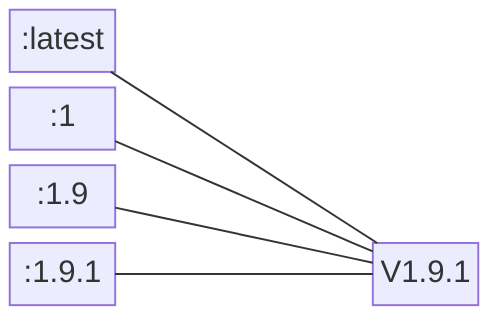
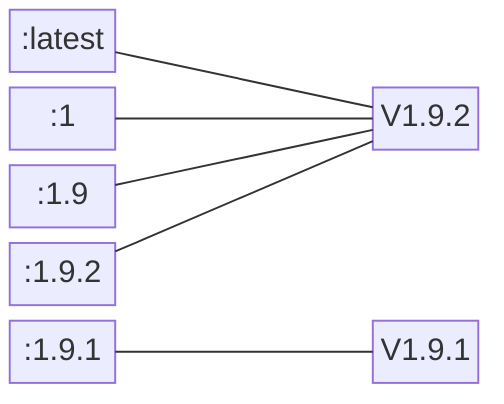
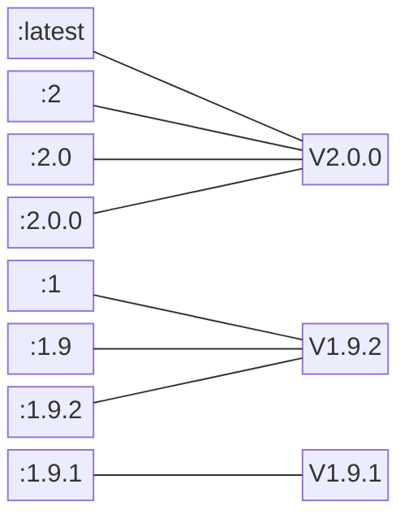

# 【版本控制规范】

这里描述语义化版本控制规范，标准的版本号必须采用 X.Y.Z 的格式：major.minor.patch

# 版本号递增规则说明

- 主版本号：major, 当你做了不兼容的 API 修改

- 次版本号：minor, 当你做了向下兼容的功能性新增

- 修订号：patch, 当你做了向下兼容的问题修正

- 先行版本号：pre-Release, 表示这个版本并非稳定可能无法满足预期的兼容性需求

- 标识符：Identifiers, 用于标识先行版或版本编译信息的优先级

# 语义化版本控制规范细则

- 使用语义化版本控制的软件必须定义公共 API。该 API 可以在代码中被定义或出现于严谨的文件内。无论何种形式都应该力求精确且完整。

- 标准的版本号必须采用 X.Y.Z 的格式，其中 X、Y 和 Z 为非负的整数，且禁止在数字前方补零。X 是主版本号、Y 是次版本号、而 Z 为修订号。每个元素必须以数值来递增。例如：1.9.1、1.10.0、1.11.0。

- 标记版本号的软件发行后，禁止改变该版本软件的内容。任何修改都必须以新版本发行。

- 主版本号为零（0.y.z）的软件处于开发初始阶段，一切都可能随时被改变。这样的公共 API 不应该被视为稳定版。1.0.0 用于界定公共 API 的形成。

- 修订号的变更：x.y.Z, 必须在只做了向下兼容的修正时递增，修正指的是针对不正确的结果而进行的内部修改，如 bugfix。

- 次版本号变更：x.Y.z, 必须在有向下兼容的新功能出现时递增，也可以在内部程序有大量新功能或改进被加入时递增，其中包括修订级别的改变，如某次迭代新增了很多需求实现。

  每当次版本号递增时，修订号必须归零。

- 主版本号变更：X.y.z, 必须在有任何不兼容的修改被加入公共 API 时递增。可以包括此版本号及修订级别的改变。每当主版本号递增时，次版本号和修订号必须归零。

  先行版可以标定在修订版之后，以"-"连接，再以"."加上标识符来修饰，标识符由 ASCII 字符数字和连接号来表示：0-9A-Za-z。如 1.0.0-alpha.1, 1.0.0-0.3.7, 1.0.0-x.7.z.92

  先行版的优先级低于相关联的标准版本。如 1.0.0-alpha < 1.0.0

- 版本编译信息被标定在修订版或先行版本号之后，以"+"连接，再以"."加上标识符来修饰  
  示例：1.0.0-alpha+001, 1.0.0+20130313144700

- 版本优先层级。指的是不同版本排序时如何比较。判断优先层级时，拆分后从左到右依序比较每个标识符。如 1.0.0 < 2.0.0 < 2.1.0 < 2.1.1。  
   标准版本号相同时，比较先行版本号。如 1.0.0-alpha < 1.0.0

  数字标识符比非数字标识符优先级低。如 1.0.0-alpha < 1.0.0-alpha.1 < 1.0.0-alpha.beta

  总之版本优先层级应从左到右比较，由第一个找到的差异值决定

  1.0.0-alpha < 1.0.0-alpha.1 < 1.0.0-alpha.beta < 1.0.0-beta < 1.0.0-beta.2 < 1.0.0-beta.11 < 1.0.0-rc.1 < 1.0.0

# Docker 镜像版本命名方案

给 Docker 镜像打标签`docker tag`

借鉴软件版本命名方式能够让用户很好地使用镜像。

一个高效的版本命名方案可以让用户清楚地知道当前使用的是哪个镜像，同时还可以保持足够的灵活性。

每个 repository 可以有多个 tag，而多个 tag 可能对应的是同一个镜像。

下面通过例子为大家介绍 Docker 社区普遍使用的 tag 方案。

假设我们现在发布了一个镜像 myimage，版本为 v1.9.1，那么我们可以给镜像打上 4 个 tag:`1.9.1`、`1.9`、`1`和`latest`，我们可以通过 docker tag 命令方便地给镜像打 tag。如下所示。



可以看到，4 个 tag 指向同一版本，命令为：

```bash
docker tag myimage-v1.9.1 myimage:1
docker tag myimage-v1.9.1 myimage:1.9
docker tag myimage-v1.9.1 myimage:1.9.1
docker tag myimage-v1.9.1 myimage:latest
```

过了一段时间，我们发布了 v1.9.2。这时可以打上 1.9.2 的 tag，并将 1.9、1 和 latest 从 v1.9.1 移到 v1.9.2，如下所示。



命令为：

```bash
docker tag myimage-v1.9.2 myimage:1
docker tag myimage-v1.9.2 myimage:1.9
docker tag myimage-v1.9.2 myimage:1.9.2
docker tag myimage-v1.9.2 myimage:latest
```

之后，v2.0.0 发布了。这时可以打上 2.0.0、2.0 和 2 的 tag，并将 latest 移到 v2.0.0，如下所示。



命令为：

```bash
docker tag myimage-v2.0.0 myimage:2
docker tag myimage-v2.0.0 myimage:2.0
docker tag myimage-v2.0.0 myimage:2.0.0
docker tag myimage-v2.0.0 myimage:latest
```

这种 tag 方案使镜像的版本很直观，用户在选择时非常灵活：

1. myimage:1 始终指向 1 这个分支中最新的镜像。
2. myimage:1.9 始终指向 1.9.x 中最新的镜像。
3. myimage:latest 始终指向所有版本中最新的镜像。
4. 如果想使用特定版本，可以选择 myimage:1.9.1、myimage:1.9.2 或 myimage:2.0.0。
