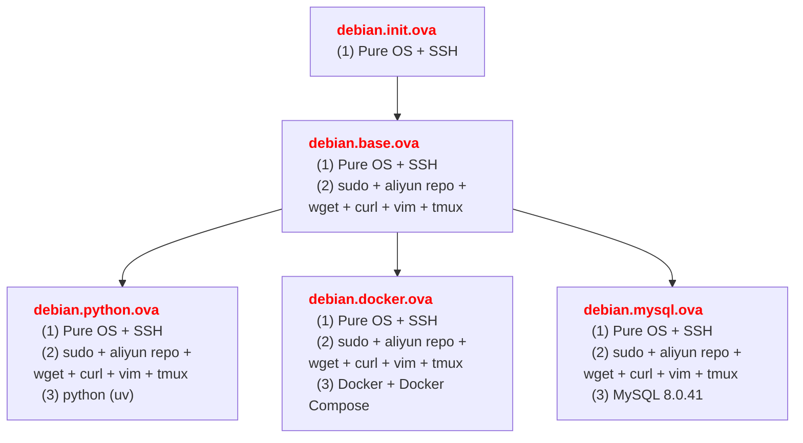

<h1>Debian 12</h1>

<details>
<summary>VirtualBox ova</summary>



</details>

<details>
<summary>一键 配置 / 安装 脚本</summary>

```bash
wget https://gitee.com/haroldzkx/repo/releases/download/debian/debian.base.sh
wget https://gitee.com/haroldzkx/repo/releases/download/debian/debian.docker.sh
wget https://gitee.com/haroldzkx/repo/releases/download/debian/debian.python.sh

su root
chmod +x debian.base.sh debian.docker.sh debian.python.sh

./debian.bash.sh
./debian.docker.sh
./debian.python.sh
```

</details>

# System Config

<details>
<summary>Grant sudo to User</summary>

```bash
su root

# 1.Add auth
ls -l /etc/sudoers && chmod +w /etc/sudoers

# 2.Edit File
vi /etc/sudoers

#   Add Below Content
Username	ALL=(ALL:ALL) ALL

# 3.delete auth after update file
chmod -w /etc/sudoers && ls -l /etc/sudoers

# 4.logout current user and relogin
```

```shell
#!/bin/bash

# Ensure the script is run as the root user
if [ "$EUID" -ne 0 ]; then
  echo "Please run this script as root"
  exit
fi

# 1. Add permissions
echo "Adding write permission to /etc/sudoers"
chmod +w /etc/sudoers

# 2. Modify content
echo "Modifying /etc/sudoers file"
echo "Please enter the username to add sudo permission:"
read Username

# Check if the user already exists in the sudoers file
if grep -q "^$Username" /etc/sudoers; then
  echo "User $Username already exists in the sudoers file."
else
  echo "$Username\tALL=(ALL:ALL) ALL" >> /etc/sudoers
  echo "User $Username has been added to the sudoers file."
fi

# 3. Remove permissions after modification
echo "Removing write permission from /etc/sudoers"
chmod -w /etc/sudoers

# 4. Show the permissions after modification
ls -l /etc/sudoers

echo "Please log out and log back in to apply the changes."
```

</details>

<details>
<summary>Change Source</summary>

<details>
<summary>0.命令脚本</summary>

```shell
#!/bin/bash

# Backup the original sources.list file
cp /etc/apt/sources.list /etc/apt/sources.list.backup

# Comment out all lines in the sources.list file and add the new repositories
sed -i -e 's/^/#/' /etc/apt/sources.list
bash -c 'cat << EOF >> /etc/apt/sources.list
deb https://mirrors.aliyun.com/debian/ bookworm main non-free non-free-firmware contrib
deb-src https://mirrors.aliyun.com/debian/ bookworm main non-free non-free-firmware contrib
deb https://mirrors.aliyun.com/debian-security/ bookworm-security main
deb-src https://mirrors.aliyun.com/debian-security/ bookworm-security main
deb https://mirrors.aliyun.com/debian/ bookworm-updates main non-free non-free-firmware contrib
deb-src https://mirrors.aliyun.com/debian/ bookworm-updates main non-free non-free-firmware contrib
deb https://mirrors.aliyun.com/debian/ bookworm-backports main non-free non-free-firmware contrib
deb-src https://mirrors.aliyun.com/debian/ bookworm-backports main non-free non-free-firmware contrib
EOF'

# Update the package lists
apt update
```

```bash
sudo vi /etc/apt/sources.list

# Comment the file contents and add the following content, you can choose any

sudo apt update
```

</details>

<details>
<summary>1.Aliyun</summary>

```bash
deb https://mirrors.aliyun.com/debian/ bookworm main non-free non-free-firmware contrib
deb-src https://mirrors.aliyun.com/debian/ bookworm main non-free non-free-firmware contrib
deb https://mirrors.aliyun.com/debian-security/ bookworm-security main
deb-src https://mirrors.aliyun.com/debian-security/ bookworm-security main
deb https://mirrors.aliyun.com/debian/ bookworm-updates main non-free non-free-firmware contrib
deb-src https://mirrors.aliyun.com/debian/ bookworm-updates main non-free non-free-firmware contrib
deb https://mirrors.aliyun.com/debian/ bookworm-backports main non-free non-free-firmware contrib
deb-src https://mirrors.aliyun.com/debian/ bookworm-backports main non-free non-free-firmware contrib
```

</details>

<details>
<summary>2.USTC</summary>

```bash
deb https://mirrors.ustc.edu.cn/debian/ bookworm main non-free non-free-firmware contrib
deb-src https://mirrors.ustc.edu.cn/debian/ bookworm main non-free non-free-firmware contrib
deb https://mirrors.ustc.edu.cn/debian-security/ bookworm-security main
deb-src https://mirrors.ustc.edu.cn/debian-security/ bookworm-security main
deb https://mirrors.ustc.edu.cn/debian/ bookworm-updates main non-free non-free-firmware contrib
deb-src https://mirrors.ustc.edu.cn/debian/ bookworm-updates main non-free non-free-firmware contrib
deb https://mirrors.ustc.edu.cn/debian/ bookworm-backports main non-free non-free-firmware contrib
deb-src https://mirrors.ustc.edu.cn/debian/ bookworm-backports main non-free non-free-firmware contrib
```

</details>

<details>
<summary>3.Netease</summary>

```bash
deb https://mirrors.163.com/debian/ bookworm main non-free non-free-firmware contrib
deb-src https://mirrors.163.com/debian/ bookworm main non-free non-free-firmware contrib
deb https://mirrors.163.com/debian-security/ bookworm-security main
deb-src https://mirrors.163.com/debian-security/ bookworm-security main
deb https://mirrors.163.com/debian/ bookworm-updates main non-free non-free-firmware contrib
deb-src https://mirrors.163.com/debian/ bookworm-updates main non-free non-free-firmware contrib
deb https://mirrors.163.com/debian/ bookworm-backports main non-free non-free-firmware contrib
deb-src https://mirrors.163.com/debian/ bookworm-backports main non-free non-free-firmware contrib
```

</details>

<details>
<summary>4.Tencent</summary>

```bash
deb https://mirrors.cloud.tencent.com/debian/ bookworm main non-free non-free-firmware contrib
deb-src https://mirrors.cloud.tencent.com/debian/ bookworm main non-free non-free-firmware contrib
deb https://mirrors.cloud.tencent.com/debian-security/ bookworm-security main
deb-src https://mirrors.cloud.tencent.com/debian-security/ bookworm-security main
deb https://mirrors.cloud.tencent.com/debian/ bookworm-updates main non-free non-free-firmware contrib
deb-src https://mirrors.cloud.tencent.com/debian/ bookworm-updates main non-free non-free-firmware contrib
deb https://mirrors.cloud.tencent.com/debian/ bookworm-backports main non-free non-free-firmware contrib
deb-src https://mirrors.cloud.tencent.com/debian/ bookworm-backports main non-free non-free-firmware contrib
```

</details>

</details>

<details>
<summary>python-pip</summary>

Default with python3.11, But don't have pip tool

```bash
sudo apt install python3-pip

# install complete python environment,
# create virtual env need python3-full
sudo apt install python3-full
python3 -m venv XXX
```

</details>

<details>
<summary>Remote Desktop Access</summary>

```bash
# Install XRDP
sudo apt update
sudo apt install xrdp

# Launch XRDP service and check status
sudo systemctl enable --now xrdp
systemctl status xrdp --no-pager -l

# Add XRDP user to SSL-Cert Group
# Need to add XRDP user to SSL-cert group that can connect successful
# or Will show blank screen When after establish the connection
sudo adduser xrdp ssl-cert

# reboot XRDP service
sudo systemctl restart xrdp

# Pass port in Firewall
sudo ufw allow 3389

# Recommand: create new user for remote desktop login
```

```bash
sudo apt install krdc freerdp2-wayland
```

</details>

<details>
<summary>Change Hostname</summary>

```bash
sudo vim /etc/hostname
sudo vim /etc/hosts
```

</details>

<details>
<summary>Uninstall LibreOffice</summary>

```bash
# don't lose "*" and "?", or can't clear All LibreOffice
sudo apt-get purge libreoffice?
sudo aptitude purge libreoffice?
sudo apt-get remove --purge libreoffice*

# clear the unused package
sudo apt-get clean
sudo apt-get autoremove
```

</details>

<details>
<summary>Install GPU Driver</summary>

```bash
sudo apt install nvidia-detect
sudo nvidia-detect

sudo apt install nvidia-driver
reboot
```

</details>

<details>
<summary>.bashrc</summary>

```bash
# python
alias python='/usr/bin/python3'
alias pip="/usr/bin/pip3"
export pybfsu=https://mirrors.bfsu.edu.cn/pypi/web/simple
export pyustc=https://mirrors.ustc.edu.cn/pypi/simple

# system
alias sb='source /home/pc/.bashrc'

# list directory
alias la='ls -a'
alias ll='ls -l'
alias llh='ls -lh'
alias list='ls -lha'

# docker
alias d='docker'
alias di='docker images'
alias dil='docker images | sed "s|registry.cn-shenzhen.aliyuncs.com/haroldfinch|\$ali|g"'
alias drm='docker rm'
alias drmi='docker rmi'
alias drmf='docker rm -f'
alias dps='docker ps'
alias dpsa='docker ps -a'

export ali=registry.cn-shenzhen.aliyuncs.com/haroldfinch

alias dif='docker images --format "\nRepository: {{.Repository}}\nTag: {{.Tag}}\nImage ID: {{.ID}}\nCreated: {{.CreatedAt}}\nSize: {{.Size}}" | sed "s|registry.cn-shenzhen.aliyuncs.com/haroldfinch|\$ali|g"'

alias dpsal='docker ps -a --format "\nContainer ID: {{.ID}}\nImage: {{.Image}}\nCommand: {{.Command}}\nCreated: {{.CreatedAt}}\nStatus: {{.Status}}\nPorts: {{.Ports}}\nContainer Name: {{.Names}}\n"'
alias dpsl='docker ps --format "\nContainer ID: {{.ID}}\nImage: {{.Image}}\nCommand: {{.Command}}\nCreated: {{.CreatedAt}}\nStatus: {{.Status}}\nPorts: {{.Ports}}\nContainer Name: {{.Names}}\n"'

# **************** Below config can't Verified, Be Careful ***************
# set the terminal colorful
export CLICOLOR=1
export LSCOLORS=Gxfxcxdxcxegedabagacad
export PS1="%n@%10F%m%f:%11F%0~%f \$ "

# custom color
autoload -U colors && colors

# Show Git Branch
function parse_git_branch() {
    git branch 2> /dev/null | sed -n -e 's/^\* \(.*\)/[\1]/p'
}
setopt PROMPT_SUBST

# Config Prompt Color
#export PROMPT='%F{green}%n@%m:%F{cyan}%~%F{green}$(parse_git_branch)%F{white}$ '
export PROMPT='%F{green}%n@%m:%F{cyan}%~%F{green}$(parse_git_branch)%F{white}
$ '
```

</details>

<details>
<summary>locale</summary>

```bash
-bash: warning: setlocale: LC_ALL: cannot change locale (en_US.UTF-8)
```

```bash
# if face the above error, use the below command,
# choose en_US.UTF-8 to regenerate language package
sudo dpkg-reconfigure locales
```

</details>

<details>
<summary>Upgrade OS Version</summary>

Upgrade Minor Version: From 12.10 to 12.11
Upgrade Major Version: From 11 to 12

```bash
sudo apt update
sudo apt upgrade
sudo apt full-upgrade
sudo apt autoremove
sudo apt clean
sudo reboot

# Check Major and Minor Version
cat /etc/debian_version
lsb_release -a
```

</details>

# Software

<details>
<summary>PgyVisitor</summary>

```bash
# download
wget https://pgy.oray.com/softwares/153/download/2156/PgyVisitor_6.2.0_x86_64.deb
mv PgyVisitor_6.2.0_x86_64.deb ~/Downloads/

# install
dpkg -i PgyVisitor_6.2.0_x86_64.deb

# check install and exec status
sudo systemctl status pgyvpn
dpkg -l | grep pgyvpn

# check install path info
find / -name pgyvpn 2>/dev/null
find / -name pgyvisitor 2>/dev/null

# give soft link
sudo ln -s /usr/sbin/pgyvisitor /usr/local/bin/pgyvisitor

# software setting
pgyvisitor login -u ACCOUNT -p PASSWORD
pgyvisitor logininfo
pgyvisitor autologin -y
pgyvisitor showsets
pgyvisitor getmbrs -m
```

</details>

<details>
<summary>Tailscale</summary>

```bash
curl -fsSL https://tailscale.com/install.sh | sh
sudo tailscale up
```

</details>

<details>
<summary>Docker Install</summary>

```bash
# update system package and install necessary tools
sudo apt update
sudo apt upgrade -y
sudo apt install apt-transport-https ca-certificates curl software-properties-common -y

# Add Docker Official GPG Key (Download from Aliyun)
sudo curl -fsSL https://mirrors.aliyun.com/docker-ce/linux/debian/gpg | sudo gpg --dearmor -o /usr/share/keyrings/docker-archive-keyring.gpg

# Add Aliyun Docker Software Source
# echo "deb [arch=amd64 signed-by=/usr/share/keyrings/docker-archive-keyring.gpg] https://mirrors.aliyun.com/docker-ce/linux/debian $(lsb_release -cs) stable" | sudo tee /etc/apt/sources.list.d/docker.list > /dev/null
echo "deb [arch=amd64 signed-by=/usr/share/keyrings/docker-archive-keyring.gpg] https://mirrors.aliyun.com/docker-ce/linux/debian $(lsb_release -cs) stable" | sudo tee /etc/apt/sources.list.d/docker.list

sudo apt update

# install Docker
sudo apt install docker-ce docker-ce-cli containerd.io docker-compose-plugin

# launch and config Docker start at boot
sudo systemctl start docker
sudo systemctl enable docker

# Verify Docker install is success
docker --version

# Add current user to Docker Group (Optional)
sudo usermod -aG docker $USER
# and then logout current user and relogin

# Verify Docker Service
sudo systemctl status docker
```

</details>

<details>
<summary>Docker Uninstall</summary>

```bash
# Uninstall Docker Package and Dependencies
sudo apt purge docker-ce docker-ce-cli containerd.io docker-compose-plugin

# Delete Docker Configure file and data directory
## delete Docker config and data dir
sudo rm -rf /var/lib/docker
sudo rm -rf /etc/docker
## delete Docker configure file
sudo rm -rf /etc/systemd/system/docker.service.d
sudo rm -rf /etc/apt/sources.list.d/docker.list
## delete Docker GPG key
sudo rm -f /usr/share/keyrings/docker-archive-keyring.gpg

# clear unused dependency
sudo apt autoremove --purge
sudo apt clean

# Update apt source
sudo apt-get update

# ensure uninstall Docker competely
docker --version
```

</details>

<details>
<summary>Skopeo</summary>

```bash
sudo apt install skopeo
```

</details>

<details>
<summary>vim</summary>

```shell
set showmatch         " Highlight parentheses

set number            " set line number

set cindent           " C-style indent

set autoindent

set tabstop=4         " set tab width
set softtabstop=4
set shiftwidth=4      " The uniform indentation is 4

syntax on
```

</details>

<details>
<summary>tmux</summary>

```powershell
# set scroll screen like vim
setw -g mode-keys vi

# session index from 1
set -g base-index 1

# pane index from 1, not 0
set -g pane-base-index 1

# vim style to move cursor in pane
bind h select-pane -L
bind j select-pane -D
bind k select-pane -U
bind l select-pane -R
```

```bash
tmux source-file ~/.tmux.conf
```

</details>

<details>
<summary>fcitx5</summary>

```bash
# Uninstall old input method
sudo apt purge fcitx* ibus*

# Install
sudo apt install fcitx5 fcitx5-chinese-addons fcitx5-pinyin

sudo reboot
```

</details>
