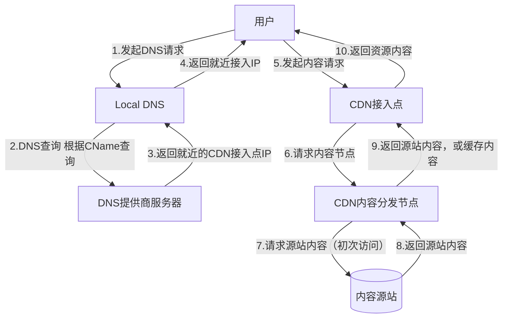
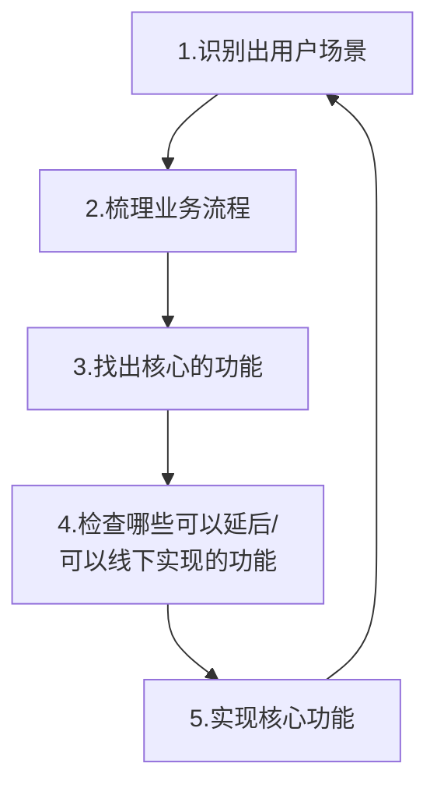
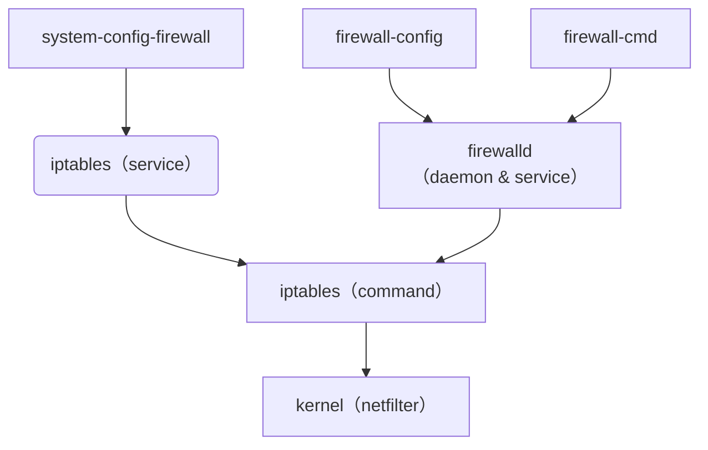

Sentry: 专注于捕捉应用层的错误，异常，性能情况

Prometheus: 系统监控和报警工具

Grafana: 数据可视化

EFK/ELK: 日志管理

Celery: 分布式任务队列，专注于后台任务调度与执行，支持异步任务、定时任务、任务重试、分布式扩展等。(搞清楚 celery 与 Django 异步的区别)

Flower: Real-time Celery web-monitor。实时监控 celery 里的任务执行情况。

缓存: django-redis

单元测试：版本质量评估

# CDN



CDN 访问的两阶段：域名解析、内容请求

CDN 通常不缓存动态内容（或通过特殊规则缓存部分结果）

首次回源目标由资源类型决定：静态资源找 Nginx，动态资源找 Django。

混合架构常见：大型系统中，CDN 可能同时对接静态服务器和动态应用服务器，根据 URL 路径分流（如 /static/ 走 Nginx，/api/ 走 Django）。

混合架构最佳实践

1. 动静分离

- 静态资源域名（如 static.example.com）指向 Nginx。
- 动态 API 域名（如 api.example.com）指向 Django。

2. CDN 配置

- 静态资源：设置长缓存时间（如 1 年），利用 CDN 加速。
- 动态资源：设置短缓存或禁用缓存（Cache-Control: no-store）。

在不采用混合架构的情况下，CDN 的回源目标通常指向统一的入口服务器（如 Nginx 或负载均衡器），由该服务器内部实现动静分离。

非混合架构的回源目标

| 场景           | 回源目标                         | 处理方式                                                                          |
| -------------- | -------------------------------- | --------------------------------------------------------------------------------- |
| 统一入口服务器 | Nginx 或反向代理服务器           | 通过 Nginx 配置将 /static/ 请求映射到本地静态目录，/api/ 转发到 Django 应用服务器 |
| 单一应用服务器 | 直接指向 Django 等动态应用服务器 | 应用服务器自行处理静态文件（如 Django 的 STATIC_ROOT），但生产环境不推荐          |

非混合架构的优缺点

优点: 配置简单，CDN 只需对接一个源站，维护成本较低，适合小型系统

缺点：静态资源处理效率低（若直接由应用服务器响应），动态请求可能受静态资源带宽占用影响，扩展性差，难以应对高并发场景

非混合架构的常见实践：使用 Nginx 作为统一入口，内部实现动静分离（静态资源本地响应，动态请求反向代理到应用服务器）。

生产环境推荐：优先采用混合架构（CDN 直接分流到静态服务器和动态服务器），避免单点性能瓶颈。

# CICD

Continuous Integration, Continuous Deployment

CICD 包含如下流程

- Build & Package
- Test
- Deployment

需要的服务：

- Git 仓库：GitHub, Gitee, GitLab
- Docker 镜像仓库：Docker 官方仓库，阿里云镜像仓库
- Jenkins
- K8s

CICD 工具：Jenkins（推荐这个，把这一个熟练掌握足以），Spinnaker, Harness

Jenkins pipeline

- CICD Pipelien: 包含一些列按照指定顺序执行的脚本
- 包含有用来完成任务的多个阶段（stages）。

CD 阶段不同的部薯策略

- Rolling Upgrade: 滚动更新，多个实例，下线一台升级一台，直至升级完
- Blue/Green Deployment: 蓝绿部署，部署到新集群，部署完切流量到新集群
- Canary Deployment: 金丝雀部署，过程中新老版本共存，持续做灰度验证

# 如何更高效地寻求帮助

1. 判断问题的类别，对于这个问题，只需要快速解决，还需要系统化了解背后的原理
2. 如果是对自己非常重要的领域，先系统化了解相关知识（帮助文档，官方文档，书籍等）
3. 如果不需要系统化了解，只需要快速解决，使用 Google 搜索问题
4. 如果 google 找不到答案，查阅帮助文档，看能否找到（特别是帮助文档中的 FAQ）
5. 仍然找不到答案，社区，群里提问；开源社区，论坛；身边同事朋友，行业内的专家
6. 清晰描述你的问题：什么环境下出现的，贴出来代码，错误信息，期望的结果
7. 问题解决，或者没有解决，都对回复者做一个回复

习惯 Google 带来的问题：不知道使用什么关键词进行搜索（建议减少 Google 的使用）

这种情况是我们对背后的体系不了解，所以需要我们系统化学习领域知识，自己思考问题所在

# hacker 应有的态度

1. 这个世界充满了令人着迷的问题等着我们解决
2. 一个问题不应该被解决两次
3. 无聊和乏味的工作是罪恶
4. 崇尚自由
5. 态度不能替代能力

# Hacker 的成长之路-如何成为 Hacker

To follow the path

- look to the master（寻找大师）
- follow the master（跟随大师）
- walk with the master（与大师同行）
- see through the master（洞察大师）
- become the master（成为大师）

# Hacker 的成长之路-学习之道

刻意练习，做自己用的产品

- 难度合适的目标
- 解决实际问题（有反馈）
- 持续，有意识的练习

黑客与画家的共同点：不断反复地练习，犯错

快速学习：花 20%的时间学习到 80%的知识

使用 5whys 方法，跟自己不断提问，找到本质

在实践中学习，做自己用的产品：

- 不闻不若闻之，闻之不若见之，见之不若知之，知之不若行之；学至于行而止矣
- I hear and I forget. I see and I remember. I do and I understand.

分享-通过教会别人来学习，能够清晰地讲出来，才是真正的掌握

用不同的分享方式

# QA

## Django 有异步处理能力为什么还需要 Celery?

一、Django 异步与 Celery 的定位差异

1. Django 异步的适用场景: Django 的异步视图（如 async def）主要用于优化单次 HTTP 请求的响应效率，通过异步 I/O 操作（如数据库查询、外部 API 调用）减少阻塞，提升单个请求的吞吐量。但它无法处理长时间运行的阻塞任务（如 CPU 密集型计算、耗时数据处理），因为这些任务仍会阻塞事件循环。使用 celery 的分布式能力来处理这些阻塞任务。
2. Celery 的核心功能：Celery 是一个分布式任务队列，专注于后台任务调度与执行，支持异步任务、定时任务、任务重试、分布式扩展等。其核心优势在于：

   - 将耗时任务从 HTTP 请求生命周期中剥离，避免阻塞用户请求。
   - 支持任务持久化与重试机制，确保任务可靠性。
   - 提供定时任务（通过 Celery Beat）和分布式部署能力。

二、需要集成 Celery 的典型场景

1. 耗时任务异步化：将阻塞主进程的操作（如发送邮件、短信、生成报表、音视频转码）放入任务队列，由 Celery Worker 异步执行，避免用户等待。例如：用户注册后异步发送验证邮件，处理上传的大型文件（如视频压缩）。
2. 定时任务调度：使用 Celery Beat 实现周期性任务，如每日数据统计、缓存清理、价格同步等。例如：每日凌晨统计用户活跃数据，每小时同步第三方 API 数据。
3. 高并发与分布式需求：当任务量激增时，可通过横向扩展多个 Worker 节点提升处理能力，适用于电商秒杀、实时日志分析等场景。
4. 任务结果追踪与重试：需要记录任务执行状态（如成功、失败、重试次数）时，Celery 的 Result Backend（如 Redis、数据库）可持久化任务结果，支持后续查询和异常处理。

三、Django 异步与 Celery 的互补性

Django 异步更适合优化单次请求的 I/O 效率（如并发调用多个外部 API），但无法替代 Celery 的以下功能：

- 长时间任务管理：Django 异步视图需在请求周期内完成，而 Celery 任务可运行数小时甚至更久。
- 任务调度与队列：Celery 提供优先级队列、任务链（Chain）、任务组（Group）等高级功能。
- 跨服务通信：Celery Worker 可独立于 Django 部署，甚至运行在不同服务器或容器中。

四、实际案例对比

| 场景                 | Django 异步视图  | Celery             |
| -------------------- | ---------------- | ------------------ |
| 发送单条短信         | True（若耗时短） | True（更可靠）     |
| 批量处理 10 万条数据 | False            | True（分布式执行） |
| 每天凌晨清理过期缓存 | False            | True（定时任务）   |
| 实时聊天消息推送     | True（低延迟）   | False              |

集成 Celery 的必要性取决于业务需求：

- 需要 Celery 的场景：涉及长时间任务、定时调度、任务队列管理、分布式处理或结果追踪时，必须使用 Celery。
- 仅用 Django 异步的场景：优化短耗时 I/O 操作（如并行数据库查询），无需复杂任务管理。

建议将两者结合使用：用 Django 异步优化请求响应速度，用 Celery 处理后台任务，以实现最佳性能与用户体验。

## EFK, ELK, Prometheus, Sentry, Grafana 的区别？以及是否冲突？

EFK/ELK：日志管理。主要用于日志管理和分析，帮助用户集中式收集、查询和分析日志数据。

Prometheus（系统层）：系统监控。主要用于监控系统性能指标、资源消耗和服务状态等，尤其在云原生、容器化环境下非常受欢迎。例如 CPU 使用率、内存使用、请求响应时间等。适合监控微服务架构、大规模的基础设施、应用程序性能等。

Sentry（应用层）：错误追踪。主要用于错误追踪和应用程序监控，关注于捕获和处理应用中的错误和异常。

Grafana：数据可视化。主要用于展示和分析各种监控数据、日志数据和应用程序性能指标。

Grafana 常与 Prometheus 配合使用，但也可以与其他数据源（如 Elasticsearch、InfluxDB、MySQL 等）集成。

这几个方案都不冲突，全部可以配合使用。

# 使用 OOPD 方法识别产品核心功能

OOPD（Online and Offline integrated Product development）产品开发流程



OOPD 快速迭代的原则

- 自助原则：做自己用的产品，自己用自己的产品，吃自己的狗食
- 0day 原则：找到明确的核心问题，拆解目标，抓住核心的问题，忽略掉一切细节，0day 发布
- 时限原则：设定时限，挑战自我。不给自己写 Bug 的时间
- 不完美原则：不做完美的产品（没有完美的产品，不去为了完美而浪费宝贵的资源）
- 谦卑原则：能够看到自己的局限性，获取用户反馈，持续迭代，听取用户声音

# 如何保证交付质量和持续迭代

定义好清晰的产品需求，产品需求从根本上决定了软件的质量

系统有整体上的架构方案的设计，评估，评审；系统设计决定了软件实现的质量

工程的角度持续交付的最佳实践推荐

- Code Review: 每一次提交都有 CR，每次 commit 代码量<200 行，频繁 commit
- 单元测试：项目开始建立好单元测试的机制，在持续集成中自动运行
- 自动化回归：对预发/线上系统做 API/页面自动化测试（postman/Robot Framework)
- 使用 CICD 机制对系统进行自动化的打包，测试，部薯，线上验证

发布过程做到可监控，可回滚

对于大量用户使用的产品，使用灰度机制

架构上对于意外的并发访问进行限流，降级

架构上使用配置开关，对系统功能提供实时的开启/关闭的服务；

对产品建立 A/B Test 机制，通过数据来快速对比不同版本，不同方案的效果

自动化所有事情，代码化所有过程：代码化配置，代码化部署流程，代码化基础设施(声明式 API, CICD Pipeline, K8S, Helm, Terraform)

# 如何做好技术方案设计与工作拆解

做技术方案设计的前提条件

- 有明确的用户场景，用户如何跟产品交互，期望拿到什么样的预期结果
- 有清晰定义的业务流程

技术方案设计流程：

1. 定义用户场景
2. 业务流程
3. 产品范围
4. 梳理核心要解决的问题
5. 调研，对比不同的方案
6. 系统的模块界限、协议

产出的技术方案设计文档要素

- 产品背景（用户场景，产品目标，引用到的业务流程，产品需求文档）
- 要解决的问题列表，系统不解决的问题列表，系统的限制
- 对于问题的不同解决方案的对比，阐述各个主要的问题如何被解决
- 所选整体的流程图（序列图）,模块关系图，重要的接口，实体的概念定义
- 除了功能之外的其它方面的设计，包括安全，性能，可维护性，稳定性，监控，扩展性，易用性等

工作拆解：任何事情，只要把它拆解到足够细，你都能够完成它

工作拆解的原则

- 优先级：主流程上，不确定的工作优先完成（建议提前一个迭代做调研）
- 核心流程优先：核心工作优先，先把主流程跑通
- 依赖：减少不同人之间的工作依赖；并且保持团队工作拆解的透明，预留 20%缓冲
- 拆解粒度：拆解到每项子任务 0.5-1 天的粒度，最长不超过 2 天

# 生产环境中的安全

## 防火墙：把攻击挡在外面，建立安全区

防火墙的作用：建立安全区，把攻击挡在外面

防火墙的类别

- 硬件防火墙
- WAF 防火墙
- 操作系统防火墙

### WAF 防火墙

- WAF: Web Application Firewal，基于预先定义的规则，如预先定义的正则表达式的黑名单，不安全 URL 请求等
- 防止 SQL 注入，XSS，SSRF 等 web 攻击
- 防止 CC 攻击，屏蔽常见的扫描黑客工具，扫描器
- 屏蔽异常的网络请求，屏蔽图片附件类目录 php 执行权限
- 防止 web shell 上传

WAF 组成模块：解析 http 请求（协议解析），规则检测（规则模块），执行防御动作（处理模块），过程记录（日志模块）

### 系统防火墙

常用的 Linux 系统防火墙

1. iptables: Linux 原始自带的防火墙工具
2. ufw: ubuntu 的防火墙工具。uncomplicated firewal 的简称，简单防火墙。

- Linux 原始的防火墙工具 iptables 过于繁琐
- ubuntu 提供了基于 iptables 之上的防火墙 ufw
- ufw 支持图形界面操作

  规则

- 开启 ufw 后，默认是允许所有连接通讯
- 且配置的策略也有先后顺序，每一条策略都有序号
- 服务器上配置，建议先 deny from any，再放开需要开放的访问，让系统允许授权的访问

3. firewalld: centos 的防火墙工具 firewalld



## 应用安全：密码攻击 & 访问限流（防恶意攻击）

放恶意密码攻击策略：在用户连续登录 n 次失败后，要求输入验证码登录

可选方案：使用 simple captcha 插件 [https://django-simple-captcha.readthedocs.io/en/latest/](https://django-simple-captcha.readthedocs.io/en/latest/)

访问限流：防恶意攻击

- REST Framework API 限流（DRF 的限流机制）
- 应用限流：对页面的访问频次进行限流（django-ratelimit 插件[https://django-ratelimit.readthedocs.io/en/stable/](https://django-ratelimit.readthedocs.io/en/stable/)）

## 架构安全：部署架构的安全性，应用架构安全设计

防火墙

XSS（中间件）

CSRF（中间件）

SQL 注入（中间件）

### 应用的部署架构

典型中小型互联网应用部署架构如下图所示。

服务器内部组成私有网络


### 密钥存储原则

基本原则：不把密钥存储在文件中，不把密钥提交到代码库里

基础的用法：

1. 使用环境变量/独立的配置文件，不放在代码库中

   从独立的配置文件中读取配置密钥

   容器环境，启动容器时作为环境变量传入（密钥不落地到容器存储中）

   ```python
   #read secret key from a file
   with open('/etc/secret_key.txt') as f:
      SECRET_KEY = f.read().strip()
   ```

2. 使用 keyserver: 使用开源的 keyserver, 或阿里云/aws 的 kms 服务，例如 vault, keywhiz, knox。

   【管理工具 web/cli】 创建密钥存储到【密钥服务 KMS 】中，
   【Web 应用】从【密钥服务 KMS 】中取出并使用密钥

## 数据安全：SSL，敏感数据加密与日志脱敏

### SSL

Let's Encrypt SSL 证书的使用

- Let's Encrypt 是一家非盈利机构，免费提供 SSL 证书。
- Let's Encrypt 的目标是为了构建一个安全的互联网。
- Let's Encrypt 的证书被各大主流的浏览器和网络服务商支持。
- 提供的证书 90 天过期，需要自动重新申请。有相应的工具可以使用。

Certbot 的两种使用方式

- Webroot 方式：certbot 会利用既有的 web server,在其 web root 目录下创建隐藏文件，Lets Encrypt 服务端会通过域名来访问这些隐藏文件，以确认你的确拥有对应域名的控制权。
- Standalone 方式：certbot 会自己运行一个 web server 来进行验证。如果我们自己的服务器上已经有 web server 正在运行（比如 nginx 或 apache）用 standalone 方式的话需要先关掉它，以免冲突。

### 敏感数据加密

对敏感数据，比如用户提交的内容，财务报告，第三方合同等数据进行加密

使用 Python 的 cryptography 库

### 日志脱敏

在日志记录总，过滤掉敏感信息存储，避免敏感信息泄漏（用户名，密码，手机号，银行卡号，地址等信息）

可以用 sensitive_variables 装饰器阻止错误日志内容包含这些变量的值

具体参考 sensitive_post_parameters

https://docs.djangoproject.com/zh-hans/5.2/howto/error-reporting/#filtering-sensitive-information

## 密码安全与业务安全：权限控制 & 密码安全策略

### 权限控制

- 遵循最小原则，长时间没用自动回收
- 思路：定时任务检查所有用户，找到长时间没有登录的用户，回收相应的权限，或删除账号

### 密码策略

- 密码复杂度策略
- 定期更新策略

# Others

应用层：Controller, Service, Model
安全模块
任务队列模块：用于处理异步任务，尤其是长时间运行的任务
缓存模块
部署与容器化模块：容器，CI/CD
监控与报警模块
中间件模块

web 框架

- 身份认证: 用户名/密码, JWT, OAuth
- 权限管理: ALC, RBAC
- ORM，异步 ORM
- 日志记录
- 缓存系统
- 路由
- RESTFul API
- 接口文档
- API 网关
- 错误处理
- IP 限流
- 分页

---

不一定要用 pybind11 将 python 和 cpp 混合，可以使用 cpp 的 drogon 框架做 API，直接调用 drogon 的 API 就行

---

# 认证 Authentication

1. JWT (JSON Web Token) 认证

- 推荐使用场景：适用于需要用户身份验证和权限管理的电商 API，例如登录、订单管理、支付、用户信息等。
- JWT：适合现代电商网站，尤其是前后端分离的应用。它可以处理大量用户请求，支持分布式架构，也便于跨域认证，能够提供更高的安全性和灵活性。适用于所有需要用户身份验证的场景，如登录、订单管理、购物车等。

2. OAuth 2.0 认证

- 适用场景：适用于需要更复杂的授权和身份验证的电商网站，特别是在需要集成第三方登录（如微信、支付宝、Google 等）时。
- 推荐使用场景：如果需要与第三方支付、社交平台或其他外部服务集成，OAuth 2.0 是一种更灵活、标准的认证方式。例如，允许用户使用微信、支付宝或 Facebook 登录你的电商平台。
