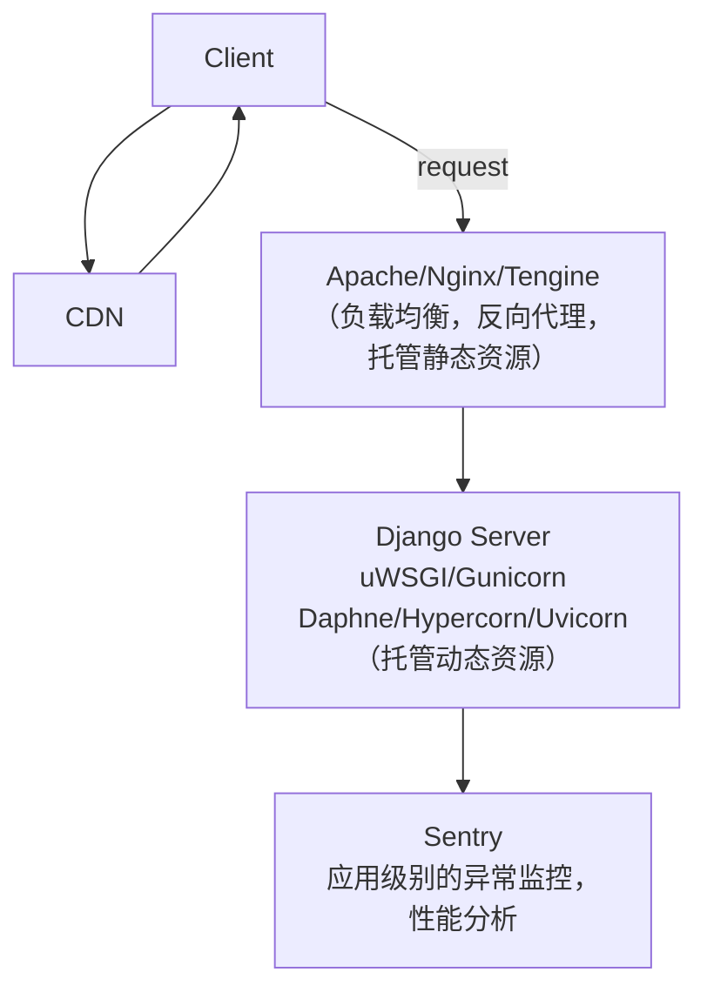

django 做后台管理系统，前台用 fastapi+微服务

# Django 与 DRF

Django+DRF 将后端变成一种声明式的工作流，只要按照 models -> serializers -> views -> urls 的模式去一个个 py 文件去配置，即可生成一个很全面的通用的后端。当然，如果需求不那么通用，这种设计就变成了一个累赘。

同步和异步的 web 部署方式：

- WSGI：同步。通过多进程+多线程的方式实现并发。
- ASGI：异步。通过多进程+主线程（不存在多线程）+协程的方式实现并发。