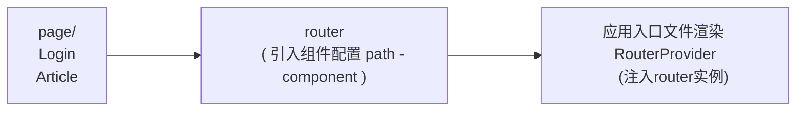
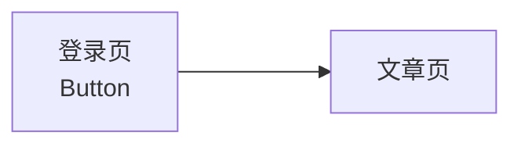

# 路由快速上手

<details>
<summary>1. 什么是前端路由</summary>

一个路径 path 对应一个组件 component 当我们在浏览器中访问一个 path 的时候，path 对应的组件会在页面中进行渲染

```jsx
const routes = [
    {
        path: '/about',
        component: About,
    },
    {
        path: '/article',
        component: Article,
    },
]
```

</details>

<details>
<summary>2. 创建路由开发环境</summary>

```bash
# 使用CRA创建项目
npm create-react-app react-router-pro

# 安装最新的ReactRouter包
npm install react-router-dom

# 启动项目
npm run start
```

</details>

<details>
<summary>3. 快速开始 index.js</summary>

```jsx
import React from "react";
import ReactDOM from "react-dom/client";
import { createBrowserRouter, RouterProvider } from "react-router-dom";

// 1.创建router实例对象并且配置路由对应关系
const router = createBrowserRouter([
  {
    path: "/login",
    element: <div>登录</div>,
  },
  {
    path: "/article",
    element: <div>文章</div>,
  },
]);

const root = ReactDOM.createRoot(document.getElementById("root"));
root.render(
  <React.StrictMode>
    {/* 2.路由绑定 */}
    <RouterProvider router={router}></RouterProvider>
  </React.StrictMode>
);
```

</details>

# 抽象路由模块



<details>
<summary>src/page/Login/index.js</summary>

```jsx
const Login = () => {
  return <div>我是登录页面</div>;
};

export default Login;
```

</details>

<details>
<summary>src/page/Article/index.js</summary>

```jsx
const Article = () => {
  return <div>我是文章页面</div>;
};

export default Article;
```

</details>

<details>
<summary>src/router/index.js</summary>

```jsx
import Login from "../page/Login";
import Article from "../page/Article";

import { createBrowserRouter } from "react-router-dom";

// 1.创建router实例对象并且配置路由对应关系
const router = createBrowserRouter([
  {
    path: "/login",
    element: <Login />,
  },
  {
    path: "/article",
    element: <Article />,
  },
]);

export default router;
```

</details>

<details>
<summary>src/index.js</summary>

```jsx
import React from "react";
import ReactDOM from "react-dom/client";
import router from "./router";
import { RouterProvider } from "react-router-dom";

const root = ReactDOM.createRoot(document.getElementById("root"));
root.render(
  <React.StrictMode>
    {/* 2.路由绑定 */}
    <RouterProvider router={router}></RouterProvider>
  </React.StrictMode>
);
```

</details>

# 路由导航

1. 什么是路由导航

路由系统中的多个路由之间需要进行路由跳转，并且在跳转的同时有可能需要传递参数进行通信



2. 声明式导航

声明式导航是指通过在模版中通过 `<Link/>`  组件描述出要跳转到哪里去，比如后台管理系统的左侧菜单通常使用这种方式进行

<details>
<summary>声明式导航 - 代码</summary>

```jsx
import { Link } from "react-router-dom";

const Login = () => {
  return (
    <div>
      <div>我是【登录】页面</div>
      <Link to="/article">跳转到【文章】页面</Link>
    </div>
  );
};

export default Login;
```

语法说明：通过给组件的to属性指定要跳转到路由path，组件会被渲染为浏览器支持的a链接，如果需要传参直接通过字符串拼接的方式拼接参数即可

</details>

3. 编程式导航

编程式导航是指通过 `useNavigate` 钩子得到导航方法，然后通过调用方法以命令式的形式进行路由跳转，比如想在登录请求完毕之后跳转就可以选择这种方式，更加灵活

<details>
<summary>编程式导航 - 代码</summary>

```jsx
import { Link, useNavigate } from "react-router-dom";

const Login = () => {
  const navigate = useNavigate();
  return (
    <div>
      <div>我是【登录】页面</div>
      {/* 声明式写法 */}
      <Link to="/article">跳转到【文章】页面</Link>
      {/* 编程式写法 */}
      <button onClick={() => navigate("/article")}>跳转到【文章】页面</button>
    </div>
  );
};

export default Login;
```

语法说明：通过调用navigate方法传入地址path实现跳转

</details>

# 导航传参

<details>
<summary>searchParams 传参</summary>

<details>
<summary>&emsp;&emsp; src/page/Login/index.js</summary>

```jsx
import { Link, useNavigate } from "react-router-dom";

const Login = () => {
  const navigate = useNavigate();
  return (
    <div>
      <div>我是【登录】页面</div>
      {/* 声明式写法 */}
      <Link to="/article">跳转到【文章】页面</Link>
      {/* 编程式写法 */}
      <button onClick={() => navigate("/article?id=1001&name=jack")}>
        searchParams传参数
      </button>
    </div>
  );
};

export default Login;
```

</details>

<details>
<summary>&emsp;&emsp; src/page/Article/index.js</summary>

```jsx
import { useSearchParams } from "react-router-dom";

const Article = () => {
  const [params] = useSearchParams();
  const id = params.get("id");
  const name = params.get("name");
  return (
    <div>
      我是文章页面，【{id}-{name}】
    </div>
  );
};

export default Article;
```

</details>

</details>

<details>
<summary>params 传参</summary>

<details>
<summary>&emsp;&emsp; src/page/Login/index.js</summary>

```jsx
import { Link, useNavigate } from "react-router-dom";

const Login = () => {
  const navigate = useNavigate();
  return (
    <div>
      <div>我是【登录】页面</div>
      {/* 声明式写法 */}
      <Link to="/article">跳转到【文章】页面</Link>
      {/* 编程式写法 */}
      <button onClick={() => navigate("/article/1001/jack")}>
        Params传参数
      </button>
    </div>
  );
};

export default Login;
```

</details>

<details>
<summary>&emsp;&emsp; src/page/Article/index.js</summary>

```jsx
import { useParams } from "react-router-dom";

const Article = () => {
  const params = useParams();
  const id = params.id;
  const name = params.name;
  return (
    <div>
      我是文章页面，【{id}-{name}】
    </div>
  );
};

export default Article;
```

</details>

<details>
<summary>&emsp;&emsp; src/router/index.js</summary>

```jsx
import Login from "../page/Login";
import Article from "../page/Article";

import { createBrowserRouter } from "react-router-dom";

// 1.创建router实例对象并且配置路由对应关系
const router = createBrowserRouter([
  {
    path: "/login",
    element: <Login />,
  },
  {
    path: "/article/:id/:name",
    element: <Article />,
  },
]);

export default router;
```

</details>

</details>

# 嵌套路由配置

<details>
<summary>1. 什么是嵌套路由</summary>

在一级路由中又内嵌了其他路由，这种关系就叫做嵌套路由，嵌套至一级路由内的路由又称作二级路由，例如：


</details>

<details>
<summary>2. 嵌套路由配置</summary>

实现步骤

(1) 使用 children属性配置路由嵌套关系  

(2) 使用 <Outlet/> 组件配置二级路由渲染位置

<details>
<summary>&emsp;&emsp; src/page/Layout/index.js</summary>

```jsx
import { Link, Outlet } from "react-router-dom";

const Layout = () => {
  return (
    <div>
      我是一级路由layout组件
      <br />
      <Link to="/board">面板</Link>
      <br />
      <Link to="/about">关于 </Link>
      <br />
      {/* 配置二级路由的出口 */}
      <Outlet />
    </div>
  );
};

export default Layout;
```

</details>

<details>
<summary>&emsp;&emsp; src/page/About/index.js</summary>

```jsx
const About = () => {
  return <div>我是About页面</div>;
};

export default About;
```

</details>

<details>
<summary>&emsp;&emsp; src/page/Board/index.js</summary>

```jsx
const Board = () => {
  return <div>我是Board页面</div>;
};

export default Board;
```

</details>

<details>
<summary>&emsp;&emsp; src/router/index.js</summary>

```jsx
import Login from "../page/Login";
import Article from "../page/Article";
import Layout from "../page/Layout";

import { createBrowserRouter } from "react-router-dom";
import Board from "../page/Board";
import About from "../page/About";

// 1.创建router实例对象并且配置路由对应关系
const router = createBrowserRouter([
  {
    path: "/",
    element: <Layout />,
    children: [
      {
        path: "board",
        element: <Board />,
      },
      {
        path: "about",
        element: <About />,
      },
    ],
  },
  {
    path: "/login",
    element: <Login />,
  },
  {
    path: "/article/:id/:name",
    element: <Article />,
  },
]);

export default router;
```

</details>

</details>

<details>
<summary>3. 默认二级路由</summary>

当访问的是一级路由时，默认的二级路由组件可以得到渲染，只需要在二级路由的位置去掉path，设置index属性为true

<details>
<summary>&emsp;&emsp; src/page/Layout/index.js</summary>

```jsx
import { Link, Outlet } from "react-router-dom";

const Layout = () => {
  return (
    <div>
      我是一级路由layout组件
      <br />
      <Link to="/">面板</Link>
      <br />
      <Link to="/about">关于 </Link>
      <br />
      {/* 配置二级路由的出口 */}
      <Outlet />
    </div>
  );
};

export default Layout;
```

</details>

<details>
<summary>&emsp;&emsp; src/router/index.js</summary>

```jsx
import Login from "../page/Login";
import Article from "../page/Article";
import Layout from "../page/Layout";

import { createBrowserRouter } from "react-router-dom";
import Board from "../page/Board";
import About from "../page/About";

// 1.创建router实例对象并且配置路由对应关系
const router = createBrowserRouter([
  {
    path: "/",
    element: <Layout />,
    children: [
      {
        // path: "board",
        // 设置默认二级路由
        index: true,
        element: <Board />,
      },
      {
        path: "about",
        element: <About />,
      },
    ],
  },
  {
    path: "/login",
    element: <Login />,
  },
  {
    path: "/article/:id/:name",
    element: <Article />,
  },
]);

export default router;
```

</details>

</details>

<details>
<summary>4. 404路由配置</summary>

场景：当浏览器输入url的路径在整个路由配置中都找不到对应的 path，为了用户体验，可以使用 404 兜底组件进行渲染

实现步骤：

1. 准备一个NotFound组件
2. 在路由表数组的末尾，以*号作为路由path配置路由

<details>
<summary>&emsp;&emsp; src/router/index.js</summary>

```jsx
import Login from "../page/Login";
import Article from "../page/Article";
import Layout from "../page/Layout";

import { createBrowserRouter } from "react-router-dom";
import Board from "../page/Board";
import About from "../page/About";
import NotFound from "../page/NotFound";

// 1.创建router实例对象并且配置路由对应关系
const router = createBrowserRouter([
  {
    path: "/",
    element: <Layout />,
    children: [
      {
        // path: "board",
        index: true,
        element: <Board />,
      },
      {
        path: "about",
        element: <About />,
      },
    ],
  },
  {
    path: "/login",
    element: <Login />,
  },
  {
    path: "/article/:id/:name",
    element: <Article />,
  },
  {
    path: "*",
    element: <NotFound />,
  },
]);

export default router;
```

</details>

<details>
<summary>&emsp;&emsp; src/page/NotFound/index.js</summary>

```jsx
const NotFound = () => {
  return <div>页面跑到月球了</div>;
};

export default NotFound;
```

</details>

</details>

<details>
<summary>5. 两种路由模式</summary>

各个主流框架的路由常用的路由模式有俩种，history模式和hash模式, ReactRouter分别由 createBrowerRouter 和 createHashRouter 函数负责创建

|路由模式|	url表现|	底层原理	|是否需要后端支持|
|-|-|-|-|
|history|	url/login|	history对象 + pushState事件|	需要|
|hash	|url/#/login	|监听hashChange事件	|不需要|

将 createBrowerRouter 改为 createHashRouter 就好了，其他的配置不用动

```jsx
import Login from "../page/Login";
import Article from "../page/Article";
import Layout from "../page/Layout";

import { createBrowserRouter, createHashRouter } from "react-router-dom";
import Board from "../page/Board";
import About from "../page/About";
import NotFound from "../page/NotFound";

// 1.创建router实例对象并且配置路由对应关系
// const router = createBrowserRouter([
const router = createHashRouter([
  {
    path: "/",
    element: <Layout />,
    children: [
      {
        // path: "board",
        index: true,
        element: <Board />,
      },
      {
        path: "about",
        element: <About />,
      },
    ],
  },
  {
    path: "/login",
    element: <Login />,
  },
  {
    path: "/article/:id/:name",
    element: <Article />,
  },
  {
    path: "*",
    element: <NotFound />,
  },
]);

export default router;
```

</details>
