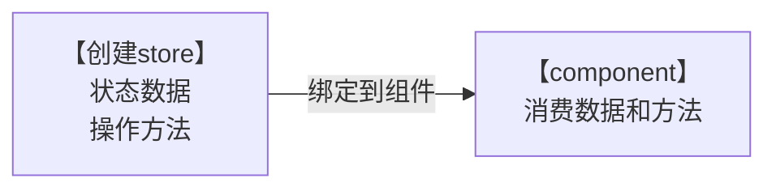
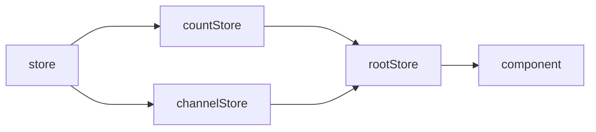

# Zustand

```bash
npm install zustand
```



# 基础使用

<details>
<summary>方式 1</summary>

```jsx
// zustand
import { create } from "zustand";

// 1. 创建store
// 语法容易出错
// 1. 函数参数必须返回一个对象 对象内部编写状态数据和方法
// 2. set是用来修改数据的专门方法必须调用它来修改数据
// 语法1：参数是函数 需要用到老数据的场景
// 语法2：参数直接是一个对象  set({ count: 100 })

const useStore = create((set) => {
  return {
    // 状态数据
    count: 0,
    // 修改状态数据的方法
    inc: () => {
      set((state) => ({ count: state.count + 1 }));
    },
  };
});

// 2. 绑定store到组件
// useStore => { count, inc }

function App() {
  const { count, inc } = useStore();
  return (
    <>
      <button onClick={inc}>{count}</button>
    </>
  );
}

export default App;
```

</details>

<details>
<summary>方式 2</summary>

```jsx
// store/index.js - 创建store
import { create } from 'zustand'

const useStore = create((set) => {
  return {
    count: 0,
    inc: () => {
      set(state => ({ count: state.count + 1 }))
    }
  }
})

export default useStore
```

```jsx
// app.js - 绑定组件
import useStore from './store/useCounterStore.js'

function App() {
  const { count, inc } = useStore()
  return <button onClick={inc}>{count}</button>
}

export default App
```

</details>

# 异步支持

对于异步的支持不需要特殊的操作，直接在函数中编写异步逻辑，最后只需要调用set方法传入新状态即可

<details>
<summary>代码 1</summary>

```jsx
const useStore = create((set) => {
  return {
    // state data
    channelList: [],
    // async method
    fetchChannelList: async () => {
      const res = await fetch(URL)
      const jsonData = await res.json()
      // call set method to update state
      set({
        channelList: jsonData.data.channels
      })
    }
  }
})
```

</details>

<details>
<summary>代码 2</summary>

```jsx
// zustand
import { useEffect } from "react";
import { create } from "zustand";
const URL = "http://geek.itheima.net/v1_0/channels";

// 1. 创建store
// 语法容易出错
// 1. 函数参数必须返回一个对象 对象内部编写状态数据和方法
// 2. set是用来修改数据的专门方法必须调用它来修改数据
// 语法1：参数是函数 需要用到老数据的场景
// 语法2：参数直接是一个对象  set({ count: 100 })

const useStore = create((set) => {
  return {
    // 状态数据
    count: 0,
    // 修改状态数据的方法
    inc: () => {
      set((state) => ({ count: state.count + 1 }));
    },
    channelList: [],
    fetchGetList: async () => {
      const res = await fetch(URL);
      const jsonRes = await res.json();
      console.log(jsonRes);
      set({
        channelList: jsonRes.data.channels,
      });
    },
  };
});

// 2. 绑定store到组件
// useStore => { count, inc }

function App() {
  const { count, inc, fetchGetList, channelList } = useStore();
  useEffect(() => {
    fetchGetList();
  }, [fetchGetList]);
  return (
    <>
      <button onClick={inc}>{count}</button>
      <ul>
        {channelList.map((item) => (
          <li key={item.id}>{item.name}</li>
        ))}
      </ul>
    </>
  );
}

export default App;
```

</details>

<details>
<summary>store/index.js - 创建store</summary>

```jsx
import { create } from 'zustand'

const URL = 'http://geek.itheima.net/v1_0/channels'

const useStore = create((set) => {
  return {
    count: 0,
    ins: () => {
      return set(state => ({ count: state.count + 1 }))
    },
    channelList: [],
    fetchChannelList: async () => {
      const res = await fetch(URL)
      const jsonData = await res.json()
      set({channelList: jsonData.data.channels})
    }
  }
})

export default useStore
```

</details>

<details>
<summary>app.js - 绑定组件</summary>

```jsx
import { useEffect } from 'react'
import useChannelStore from './store/channelStore'

function App() {
  const { channelList, fetchChannelList } = useChannelStore()
 
  useEffect(() => {
    fetchChannelList()
  }, [fetchChannelList])

  return (
    <ul>
      {channelList.map((item) => (
        <li key={item.id}>{item.name}</li>

      ))}
    </ul>

  )
}

export default App
```

</details>

# 切片模式

场景：当单个 store 比较大的时候，可以采用 切片模式 进行模块拆分组合，类似于模块化



<details>
<summary>拆分并组合切片</summary>

```jsx
import { create } from 'zustand'

// 创建counter相关切片
const createCounterStore = (set) => {
  return {
    count: 0,
    setCount: () => {
      set(state => ({ count: state.count + 1 }))
    }
  }
}

// 创建channel相关切片
const createChannelStore = (set) => {
  return {
    channelList: [],
    fetchGetList: async () => {
      const res = await fetch(URL)
      const jsonData = await res.json()
      set({ channelList: jsonData.data.channels })
    }
  }
}

// 组合切片
const useStore = create((...a) => ({
  ...createCounterStore(...a),
  ...createChannelStore(...a)
}))
```

</details>

<details>
<summary>组件使用</summary>

```jsx
function App() {
  const {count, inc, channelList, fetchChannelList } = useStore()
  return (
    <>
      <button onClick={inc}>{count}</button>

      <ul>
        {channelList.map((item) => (
          <li key={item.id}>{item.name}</li>

        ))}
      </ul>

    </>
  )
}

export default App
```

</details>
