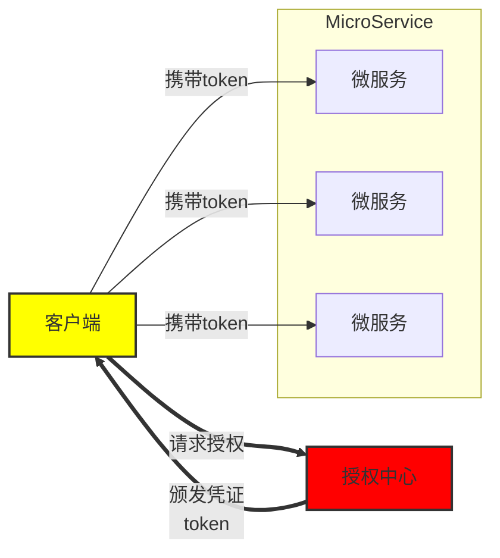

# JWT 类型

| 模式类型                       | 是否推荐 | 特点说明                  |
| ------------------------------ | -------- | ------------------------- |
| 单 Access Token                | 不推荐   | 简单但体验差              |
| Access + Refresh Token         | 推荐     | 标准做法，安全 & 用户体验 |
| Sliding Token（滑动会话）      | 可选     | 类似 session 的行为       |
| Access + Refresh + Fingerprint | 高安全   | 适合设备绑定、风控系统    |
| Stateful JWT（带黑名单）       | 高控制   | 可以强制注销 / 多设备踢人 |
| OAuth2 JWT                     | 必须     | 用于第三方授权系统        |

# 为什么要有 Refresh Token

介绍一下为什么有一个 Access Token 还要用 Refresh Token。看图：

授权中心用于生成 Refresh Token 和 Access Token 的，Access Token 过期时间很短，一般只有几分钟，而 Refresh Token 过期时间很长，一般可以设置 7 天，设置 1 个月都可以。授权中心除了在登录完成后返回 Refresh Token 和 Access Token 外，还可以使用 Refresh Token 来重新获取 Access Token。

客户端在拿到 refresh/Access Token 后，就可以使用 Access Token 去访问其他微服务，其他微服务可以独立对 Access Token 进行解码操作，得到用户信息。

如果没有 Refresh Token，并旦把 Access Token 过期时间设置得很长，那么如果我们想让某用户立马下线，面对这么多微服务，几乎是没法实现的。而有了 Refresh Token，我们就只需要在授权中心，将需要下线的用户的 Refresh Token 删除（或者加入黑名单），而 Access Token 的过期时间又很短，在过期后需要使用 Refresh Token 重新获取 acess token,但是现在 Refresh Token 又已经不可用了，那么这个用户就没法再继续操作了。
