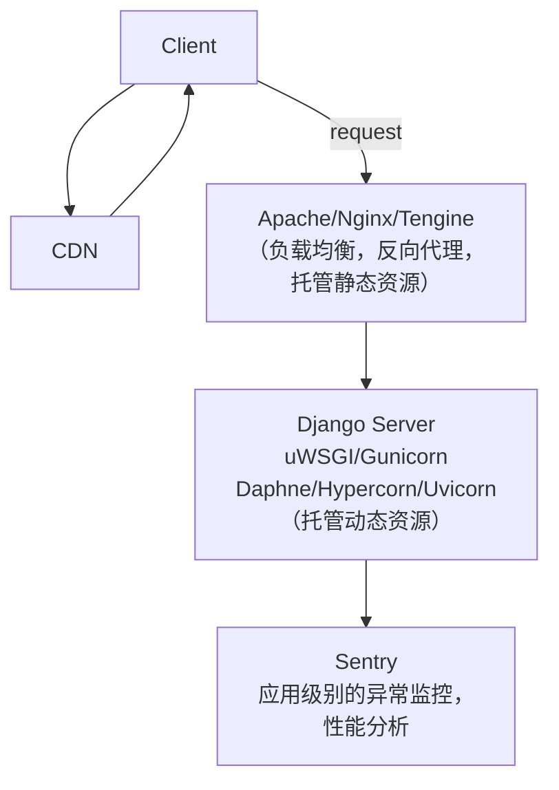

```mermaid
flowchart TB

client["Client"]
CDN["CDN"]
static["`Apache/Nginx/Tengine
（负载均衡，反向代理，
托管静态资源）`"]
ds["`Django Server
uWSGI/Gunicorn
Daphne/Hypercorn/Uvicorn
（托管动态资源）`"]
sentry["`Sentry
应用级别的异常监控，
性能分析`"]

client --> CDN
CDN --> client
client -- request --> static
static --> ds
ds --> sentry
```
