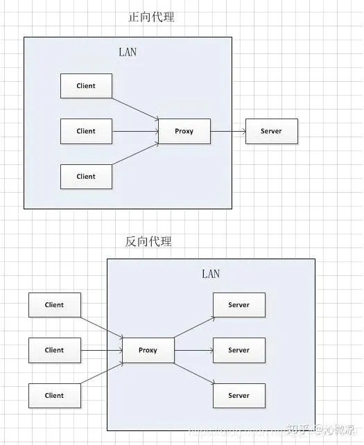

# 正向代理与反向代理

正向代理也叫前置代理。

- 正向代理即是客户端代理, 代理客户端, 服务端不知道实际发起请求的客户端.

- 反向代理即是服务端代理, 代理服务端, 客户端不知道实际提供服务的服务端.

联系:

1. 正向代理中，proxy 和 client 同属一个 LAN，对 server 透明；

2. 反向代理中，proxy 和 server 同属一个 LAN，对 client 透明。

正向代理的作用:

1. 访问原来无法访问的资源，如 google

2. 可以做缓存，加速访问资源

3. 对客户端访问授权，上网进行认证

4. 代理可以记录用户访问记录（上网行为管理），对外隐藏用户信息

反向代理的作用:

1. 保证内网的安全，阻止 web 攻击，大型网站，通常将反向代理作为公网访问地址，Web 服务器是内网。

2. 负载均衡，通过反向代理服务器来优化网站的负载。
